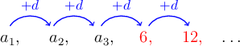
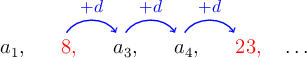
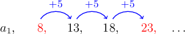

# Finding the Common Difference of an Arithmetic Sequence

Source: https://www.mathacademy.com/topics/669?courseId=127
Topic ID: 669

## Prerequisites

- [Arithmetic Sequences](../../../traditional/lessons/algebra-i/667-arithmetic-sequences.md)

## Lesson

### Introduction

Suppose that the fourth term of an arithmetic sequence is $6$ and the fifth term is $12.$ Can we use this information to compute the common difference of the sequence?

The first thing to note is that the sequence is *increasing*, and therefore we expect the common difference $d$ to be positive.

Now, let's take a look at the jumps:

Because $a_4 = 6$ and $a_5 = 12$ are **consecutive terms**, meaning that $a_5$ comes straight after $a_4$ in the sequence, we can easily compute the common difference $d$ by subtracting $a_4$ from $a_5\mathbin{:}$

$$

\begin{aligned}𝑑 & =𝑎_{5}−𝑎_{4} \\ & =12−6 \\ & =6\end{aligned}

$$

### Example: Finding the Common Difference Given Two Consecutive Terms

#### Question

An arithmetic sequence has $a_{11}=39$ and $a_{12}=34$. What is the common difference of the sequence?

#### Explanation

The first thing to note is that the terms are **, and therefore we expect the common difference $d$ to be **.

Since the two terms are consecutive ($a_{12}$ goes right after $a_{11}$ in the sequence), we can find the common difference by subtracting $a_{11}$ from $a_{12}\mathbin{:}$

$$

\begin{aligned}𝑑 & =𝑎_{12}−𝑎_{11} \\ & =34−39 \\ & =−5\end{aligned}

$$

Indeed, our result is negative, so we can be fairly confident that it is correct.

### Non-Consecutive Terms

Suppose that we're given the second and fifth terms only of an arithmetic sequence. For example, suppose that we know that

$$

a_2 = {\color{red}8}, \quad a_5 = {\color{red}23}

$$

These terms are not consecutive, and so how can we figure out the common difference $d?$

First, let's take a look at the jumps:

We see that between ${\color{red}8}$ and ${\color{red}23}$, there are a total of ${\color{blue}3}$ jumps. So, to find the value of a single jump, we can take the total difference and divide it by the number of jumps:

$$

d = \frac{{\color{red}23}\,-\,{\color{red}8}}{\color{blue}3} = \dfrac{15}{3} = 5

$$

We can check that our result $d=5$ is correct by using it to figure out the intermediate terms. Indeed, the common difference $d=5$ gets us from $a_2={\color{red}8}$ to $a_5={\color{red}23}$ in ${\color{blue}3}$ jumps:

In general, if we're given two terms $a_n$ and $a_m$ of an arithmetic sequence, then we can calculate the common difference using the following formula:

$$

d = \frac{a_n-a_m}{n-m}

$$

Using this formula to calculate the common difference between $a_{2}=8$ and $a_{5}=23,$ we get the same result:

$$

\begin{aligned}𝑑 & =\frac{𝑎_{5}−𝑎_{2}}{5−2} \\ & =\frac{23−8}{5−2} \\ & =\frac{15}{3} \\ & =5\end{aligned}

$$

### Example: Finding the Common Difference Given Two Non-Consecutive Terms

#### Question

Find the common difference of an arithmetic sequence if the $12$th term is $-56$ and the $20$th term is $-112.$

#### Explanation

The first thing to note is that the terms are **, and therefore we expect $d$ to be **.

We are given the terms

$$

a_{\color{black}12} = {\color{red}-56}, \quad a_{\color{black}20} = {\color{blue}-112}.

$$

To find $d,$ we apply the formula with $n=20$ and $m=12\mathbin{:}$

$$

\begin{aligned}𝑑 & =\frac{𝑎_{𝑛}−𝑎_{𝑚}}{𝑛−𝑚} \\ & =\frac{𝑎_{20}−𝑎_{12}}{20−12} \\ & =\frac{−112−(−56)}{20−12} \\ & =\frac{−112+56}{8} \\ & =\frac{−56}{8} \\ & =−7\end{aligned}

$$

Therefore, the common difference is $d=-7.$

Indeed, our result is negative, so we can be fairly confident that it is correct.
