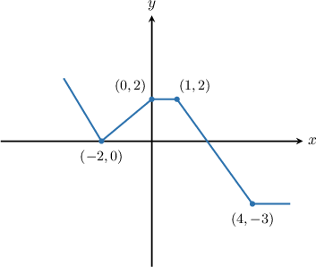
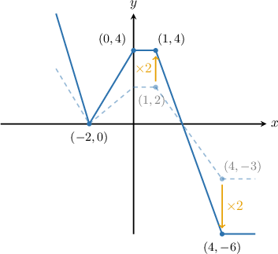
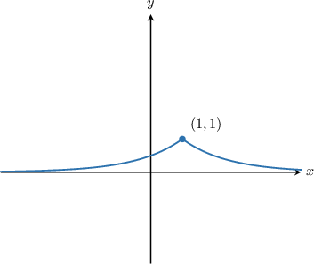
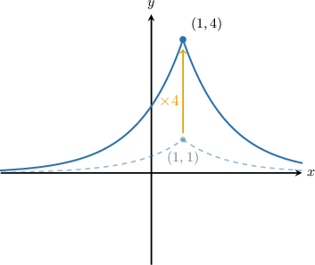
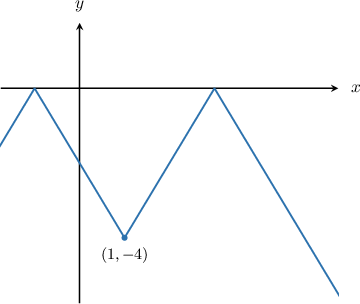
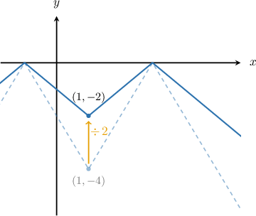

# Vertical Stretches of Functions

Source: https://www.mathacademy.com/topics/1252?courseId=128
Topic ID: 1252

## Prerequisites

- [Graphs of Functions](../../../traditional/lessons/algebra-i/3821-graphs-of-functions.md)

## Lesson

### Introduction

When we multiply a function by a constant, the graph either stretches out or compresses. Transforming a function in this way is called **scaling**.

To illustrate, consider the graph of $y=f(x)$ shown below.

The following table lists four sets of points. The set of points in the left-hand column correspond to the graph of $y=f(x),$ and the set on the right-hand side corresponds to $y=2f(x).$

$$

\begin{aligned}Points on y=f(x) & Points on y=2f(x) & \\ (1,2) & (1,4) & \\ (4,−3) & (4,−6) & \\ (0,2) & (0,4) & \\ (−2,0) & (−2,0) & \end{aligned}

$$

For each point on the graph of $y=f(x),$ there is a point on the graph of $y=2f(x)$ with the same $x$-value and *double* the $y$-value.

Now that we have four points on the graph of $y=2f(x),$ let's plot the full graph.

We say that the graph of $y=2f(x)$ is the graph of $y=f(x)$ **vertically stretched** by a **scale factor** of $2.$

We can also say that the graph of $y=2f(x)$ is the graph of $y=f(x)$ stretched by a factor of $2$ **parallel to the $\mathbf y$-axis.**

### Example: Plotting the Graph of a Vertically Stretched Function

#### Question

The graph of $y=f(x)$ is shown below. Sketch the graph of $y=4f(x).$

#### Explanation

To graph the function $y = 4f(x),$ we take the graph of $y = f(x)$ and stretch it by factor of $4$ parallel to the $y$-axis. This has the effect of multiplying the $y$-coordinates of all points on $y = f(x)$ by $4.$

The resulting graph is the solid blue curve shown below.

### Example: Plotting the Graph of a Vertically Compressed Function

#### Question

The graph of $y=f(x)$ is shown above. Sketch the graph of $y = \dfrac{1}{2}f(x).$

#### Explanation

To graph the function $y = \dfrac{1}{2}f(x),$ we take the graph of $y = f(x)$ and compress it by factor of $2$ parallel to the $y$-axis. This has the effect of dividing the $y$-coordinates of all points on $y = f(x)$ by $2.$

The resulting graph is the solid blue curve shown below.

### Example: Finding a Point that Lies on a Vertically Scaled Function

#### Question

The point $P$ with coordinates $(-2, 2)$ lies on the curve $y=f(x).$ Find a point that must lie on the graph of $y= 7f(x).$

#### Explanation

The function $y = 7f(x)$ represents a stretch of the function $y = f(x)$ by a factor of $7$ parallel to the $y$-axis. This has the effect of multiplying the $y$-coordinates of all points on $y=f(x)$ by $7.$

Therefore, the point $(-2,2)$ on $f(x)$ is mapped to the point $\left(-2, 7 \cdot 2\right) = (-2, 14),$ and this point must lie on the graph of $y = 7f(x).$
