# Proving Properties of Parallelograms

Source: https://www.mathacademy.com/topics/1398?courseId=128
Topic ID: 1398

## Prerequisites

- [Properties of Parallelograms](../../../traditional/lessons/geometry/1354-properties-of-parallelograms.md)
- [Proving Congruence Statements](../../../traditional/lessons/geometry/1357-proving-congruence-statements.md)
- [Proving Consecutive Angle Theorems](../../../traditional/lessons/geometry/5137-proving-consecutive-angle-theorems.md)
- [Further Proving Alternate Angle Theorems](../../../traditional/lessons/geometry/5271-further-proving-alternate-angle-theorems.md)

## Lesson

### Introduction

In this lesson, we will learn how to prove general statements about parallelograms. First, let's recall the definition of a parallelogram.

*A parallelogram is a quadrilateral where the opposite sides are parallel.*

Next, recall the following property of parallelograms:

*In a parallelogram, the opposite sides are congruent.*

To prove this statement, consider the parallelogram shown below.

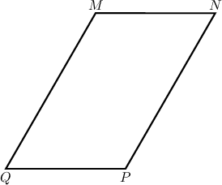

Let's prove the following statement:

*$\overline{MN} \cong \overline{PQ}$*

Our strategy is to show that a diagonal splits the parallelogram into two congruent triangles and then use the properties of congruent triangles (CPCTC) to prove the desired result.

We proceed as follows:

- **Step 1**: We are *given* that $MNPQ$ is a parallelogram.

- **Step 2**: By the *definition of a parallelogram*, $\overline{MN} \parallel \overline{PQ}$ and $\overline{MQ} \parallel \overline{NP}.$ Let's add this information to our diagram.

- **Step 3**: Now, let's construct the diagonal $\overline{QN}.$ The transversal (diagonal) $\overline{QN}$ crosses the parallel segments $\overline{MN}$ and $\overline{PQ},$ forming alternate interior angles $\angle{MNQ}$ and $\angle{PQN}.$ Also $\overline{QN}$ crosses the parallel segments $\overline{MQ}$ and $\overline{NP},$ forming alternate interior angles $\angle{MQN}$ and $\angle{PNQ}.$ Therefore, by the *alternate interior angles theorem*, as shown.

- **Step 4**: The *reflexive property of congruence* of segments states that every segment is congruent to itself. Therefore, $\overline{QN} \cong \overline{QN}.$

- **Step 5**: In steps 3 and 4, we showed that $\triangle{QMN}$ and $\triangle{NPQ}$ have a common side $\overline{QN}$ and two pairs of congruent angles adjacent to it. Therefore, by the *ASA criterion*.

- **Step 6**: Since corresponding parts of congruent triangles are congruent (*CPCTC*), we conclude that as required.

**Note**: CPCTC can be used to show that $\overline{MQ} \cong \overline{NP},$ thus proving that *both* sets of opposite sides are parallel.

### Stating the Full Proof Using the Two-Column Format

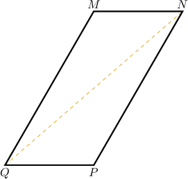

The table below shows the proof that opposite sides of a parallelogram are congruent in a two-column format.

### More Properties of Parallelograms

We can use a similar approach to prove the following property:

*The opposite angles of a parallelogram are congruent.*

We also have the following.

*The adjacent (or consecutive) angles of a parallelogram are supplementary.*

Let's see a proof of the consecutive angles property.

### Example: Proving Side and Angle Theorems

#### Question

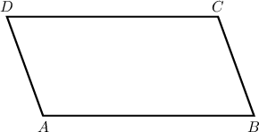

In the diagram above, $ABCD$ is a parallelogram.

Consider the following statement:

**

The table below gives the proof of the statement. Complete the proof by filling in the empty boxes.

#### Explanation

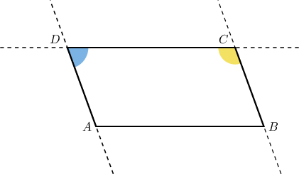

The correct proof is shown below.

Let's examine each row in turn.

- Consider row 2. By the definition of a parallelogram, its opposite sides are parallel. This means that $\overset{\longleftrightarrow}{AD} \parallel \overset{\longleftrightarrow}{BC}.$

- Consider row 4. From row 3, we know that $\angle C$ and $\angle D$ are consecutive interior angles. Therefore, by the consecutive interior angles theorem, $\angle C$ and $\angle D$ are supplementary.

- Consider row 5. From row 4, we have that $\angle C$ and $\angle D$ are supplementary angles. Therefore, by the definition of supplementary angles, we have

### Proving the Diagonals of a Parallelogram Bisect Each Other

Let's remind ourselves of another important property of parallelograms.

*The diagonals of a parallelogram bisect each other.*

To prove this theorem, consider the following parallelogram. Note that the diagonals are already constructed.

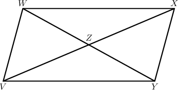

We wish to prove the following statement:

*$VZ = XZ$ and $WZ = YZ.$*

We can complete the proof of this theorem using congruent triangles, as follows:

- **Step 1**: We are *given* that $VWXY$ is a parallelogram.

- **Step 2**: By the *definition of a parallelogram*, $\overline{VW} \parallel \overline{XY}.$

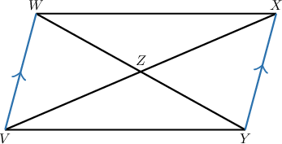

- **Step 3**: The transversal $\overline{WY}$ crosses the parallel segments $\overline{VW}$ and $\overline{XY},$ forming the pair of alternate interior angles. Therefore, by the *alternate interior angles theorem*, as shown below.

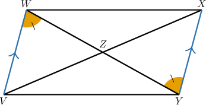

- **Step 4**: Note that $\angle{VZW}$ and $\angle{XZY}$ are vertical angles. Therefore, by the *vertical angles theorem*, as shown.

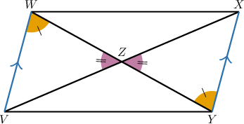

- **Step 5**: Since $VWXY$ is a parallelogram, its opposite sides are congruent by the *properties of parallelograms.* Therefore, as shown.

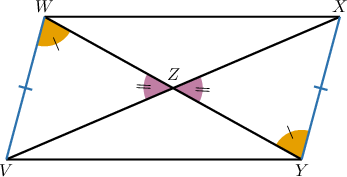

- **Step 6**: From steps 3, 4, and 5, we have Therefore, by the *AAS criterion* for triangle congruence.

- **Step 7**: Since corresponding parts of congruent triangles are congruent (*CPCTC*), we have

- **Step 8**: By the *definition of congruent segments*, we conclude that as required.

### Stating the Full Proof Using the Two-Column Format

The table below shows the proof that the diagonals of a parallelogram bisect each other in a two-column format.

Next, we'll consider a proof of the converse theorem:

*If the diagonals of a quadrilateral bisect each other, then it is a parallelogram.*

### Example: Proving the Diagonals of a Parallelogram Bisect Each Other, and Conversely

#### Question

In the diagram below, $L$ is the midpoint of $\overline{HJ}$ and $\overline{IK}.$

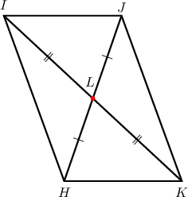

Consider the following statement:

**

The table below provides proof of the statement. Complete the proof by filling in the empty boxes.

#### Explanation

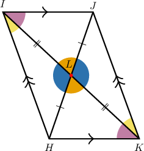

The correct proof is shown below.

Let's examine the rows of the table with missing parts in turn.

- Consider row 2. From row 1, $L$ is the midpoint of $\overline{HJ}$ and $\overline{IK}.$ Therefore, by the definition of a midpoint, $\overline{HL} \cong \overline{JL}$ and $\overline{IL} \cong \overline{KL}.$

- Consider row 3. Notice that $\angle{ILJ}$ and $\angle{KLH}$ are vertical angles. Therefore, by the vertical angles theorem, $\angle{ILJ}\cong\angle{KLH}.$

- Consider row 10. Notice that the transversal $\overline{IK}$ crosses the lines $\overline{HI}$ and $\overline{JK},$ forming the alternate interior angles $\angle{HIL}$ and $\angle{JKL}.$ From row 9, we know that $\angle{HIL} \cong \angle{JKL}.$ Therefore, by the converse alternate interior angles theorem,

### Example: Constructing Completed Proofs of Parallelogram Properties

#### Question

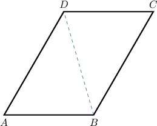

In the diagram above, $ABCD$ is a parallelogram.

Consider the following statement:

**

The table below provides proof of the statement. Fill in the blanks to complete the proof.

#### Explanation

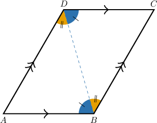

The correct proof is shown below.

Let's examine each row in turn.

1. We are given that $ABCD$ is a parallelogram.

2. By the definition of a parallelogram, its opposite sides are parallel. Therefore, $\overline{AB} \parallel \overline{CD}.$

3. From row 2, $\overline{AB} \parallel \overline{CD}.$ Note that the transversal $\overline{BD}$ crosses the parallel lines $\overline{AB}$ and $\overline{CD},$ forming the alternate interior angles $\angle{ABD}$ and $\angle{CDB}.$ Therefore, by the alternate interior angles theorem,

4. By the definition of a parallelogram, its opposite sides are parallel. Therefore, $\overline{AD} \parallel \overline{BC}.$

5. From row 4, $\overline{AD} \parallel \overline{BC}.$ Note that the transversal $\overline{BD}$ crosses parallel lines $\overline{AD}$ and $\overline{BC},$ forming the alternate interior angles $\angle{ADB}$ and $\angle{CBD}.$ Therefore, by the alternate interior angles theorem,

6. By the reflexive property of congruence, every segment is congruent to itself. Therefore, $\overline{BD} \cong \overline{BD}.$

7. Notice that $\triangle{ABD}$ and $\triangle{CDB}$ have a common side $\overline{BD}$ and two pairs of congruent angles adjacent to it, namely, $\angle{ABD} \cong \angle{CDB}$ and $\angle{ADB} \cong \angle{CBD}.$ Therefore, by the ASA criterion,

8. From row 7, $\triangle{{\color{red}A}{\color{blue}B}D} \cong \triangle{{\color{red}C}{\color{blue}D}B}.$ Therefore, we get $\angle{{\color{red}A}} \cong \angle{{\color{red}C}}$ by CPCTC.

9. From row 8, $\angle{A} \cong \angle{C}.$ Therefore, $m\angle{A} = m\angle{C}$ by the definition of congruent angles.
