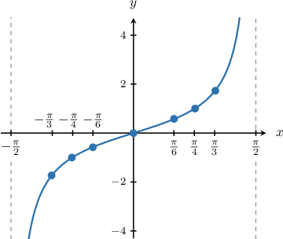
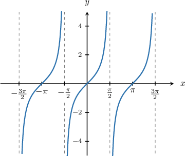
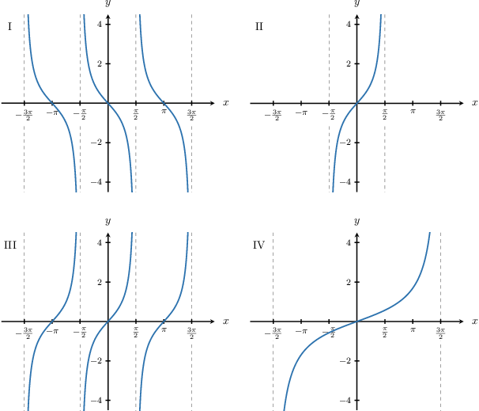
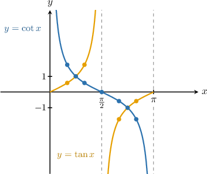
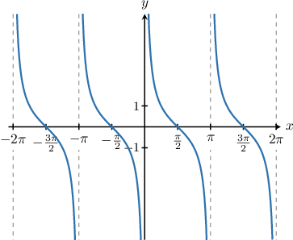
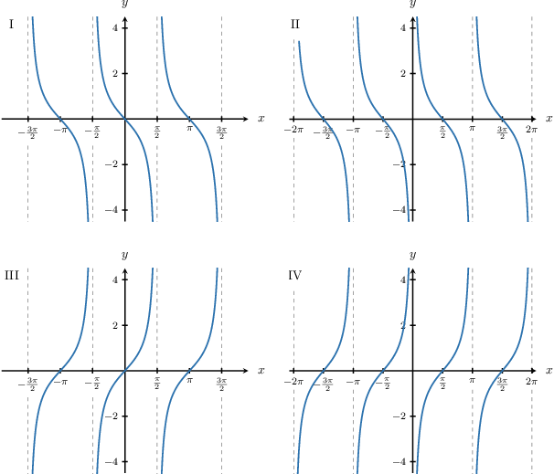
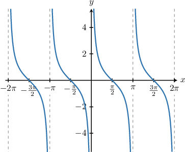

# Graphing Tangent and Cotangent

Source: https://www.mathacademy.com/topics/1493?courseId=128
Topic ID: 1493

## Prerequisites

- [Further Extensions of the Special Trigonometric Ratios](../../../traditional/lessons/algebra-ii/1844-further-extensions-of-the-special-trigonometric-ratios.md)
- [The Roots of a Function](../../../traditional/lessons/algebra-i/2022-the-roots-of-a-function.md)
- [Unbounded Behavior of Functions Near a Point](../../../traditional/lessons/algebra-ii/2046-unbounded-behavior-of-functions-near-a-point.md)
- [Periodic Functions](../../../traditional/lessons/algebra-ii/2148-periodic-functions.md)
- [The Range of a Function: Advanced Cases](../../../traditional/lessons/algebra-i/3728-the-range-of-a-function-advanced-cases.md)

## Lesson

### Introduction

Let's now plot the graph of $y=\tan x,$ with $x$ in radians.

First, let's create a table for some of the values that we know:

Now, let's plot these points to estimate the graph of $y=\tan x.$

If we inspect the unit circle carefully, we see that the function $y=\tan x$ repeats itself every $\pi$ radians. Therefore, we can extend our plot using this periodicity property:

Some key characteristics of the graph of $y=\tan x$ are as follows:

- The domain of the function is almost $x\in (-\infty,\infty)$ except for the points where the function is undefined, namely

- The range of the function is $y\in (-\infty, \infty).$

- The period of the function is $\pi.$

- There is no minimum or maximum value.

- The zeros occur at

- The graph has vertical asymptotes at the points not in the domain: At each asymptote, the graph tends to $\infty$ from the left and $-\infty$ from the right.

### Example: Plotting the Graph of the Tangent Function

#### Question

Which of the following plots is the graph of $y=\tan(x)?$

#### Explanation

Let's recall some of the basic properties of $y=\tan x\mathbin{:}$

- The domain of the function is almost $x\in (-\infty,\infty)$ except for the points where the function is undefined, namely $x=\pm\dfrac{\pi}{2},\pm\dfrac{3\pi}{2},\dots$

- The range of the function is $y\in (-\infty, \infty).$

- The period of the function is $\pi.$

- There is no minimum or maximum value.

- The zeros occur at $x=0,\pm\pi,\pm2\pi,\dots$

- The graph has vertical asymptotes at the points not in the domain: $x=\pm\dfrac{\pi}{2},\pm\dfrac{3\pi}{2},\dots.$ At each asymptote, the graph tends to $\infty$ from the left and $-\infty$ from the right.

Of the given plots, the only one that has all of these properties is III.

### Example: Identifying Characteristics of the Tangent Function

#### Question

Which of the following $x$-values is **** in the domain of $y=\tan x?$

$$

0, \quad \dfrac{\pi}{2}, \quad \dfrac{\pi}{3}, \quad \dfrac{\pi}{4}

$$

#### Explanation

Let's recall the graph of $y=\tan x.$

The domain of the function contains all real numbers except for $x= \pm\dfrac{\pi}{2}, \pm\dfrac{3\pi}{2},\dots$

Of the given values, the only one that is **** in the domain is $x=\dfrac{\pi}{2}.$

### Graphing the Cotangent Function

The **cotangent** is the reciprocal of the tangent:

$$

\cot x = \dfrac{1}{\tan x}.

$$

To plot the graph of $y=\cot x,$ with $x$ in radians, we create a table with some known values:

Plotting these points gives the following graph:

Notice that:

- a zero on the graph of $y=\tan x$ corresponds to a vertical asymptote on the graph of $y=\cot x,$ and

- a vertical asymptote on the graph of $y=\tan x$ corresponds to a zero on the graph of $y=\cot x.$

The cotangent inherits its periodicity from the tangent, so the period of the cotangent is $\pi.$ Using this periodicity property, we can extend our plot of the cotangent function:

Some key characteristics of the function $y=\cot x$ are:

- The domain is all real numbers except at the integer multiples of $\pi,$ namely $x= 0,\pm\pi,\pm 2\pi,\dots$

- The range of the function is $y\in (-\infty, \infty).$

- The period of the function is $\pi.$

- There is no minimum or maximum value.

- The zeros occur at $x=\pm\dfrac{\pi}{2},\pm\dfrac{3\pi}{2},\dots$

- The graph has vertical asymptotes at the points that are not in the domain: $x=0, \pm\pi,\pm 2\pi,\dots,$ and at each asymptote, the graph tends to $-\infty$ from the left and $\infty$ from the right.

### Example: Plotting the Graph of the Cotangent Function

#### Question

Which of the following plots is the graph of $y=\cot x?$

#### Explanation

Let's recall some of the basic properties of $y=\cot x\mathbin{:}$

- The domain is all real numbers except at the integer multiples of $\pi$: $x= 0,\pm\pi,\pm 2\pi,\dots$

- The range of the function is $y\in (-\infty, \infty).$

- The period of the function is $\pi.$

- There is no minimum or maximum value.

- The zeros occur at $x=\pm\dfrac{\pi}{2},\pm\dfrac{3\pi}{2},\dots$

- The graph has vertical asymptotes at the points that are not in the domain: $x=0, \pm\pi,\pm 2\pi,\dots,$ and at each asymptote, the graph tends to $-\infty$ from the left and $\infty$ from the right.

Of the given plots, the only one that has all of these properties is II.

### Example: Identifying Characteristics of the Cotangent Function

#### Question

Which of the following is the equation of a vertical asymptote of the function $y=\cot x?$

$$

x=\dfrac{\pi}{2}, \quad x=2\pi, \quad x=-\dfrac{3\pi}{2}, \quad x=\dfrac{5\pi}{4}

$$

#### Explanation

Let's recall the graph of $y=\cot x.$

The graph has vertical asymptotes at the points that are not in the domain:

$\qquad$ $x=0, \pm\pi,\pm 2\pi,\dots$

At each asymptote, the graph tends to $-\infty$ from the left and $\infty$ from the right.

Of the given equations, the only one that corresponds to an asymptote of the function is $x=2\pi.$
