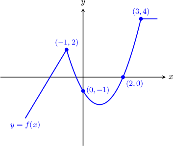
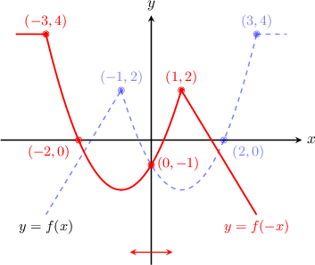
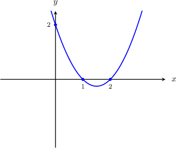
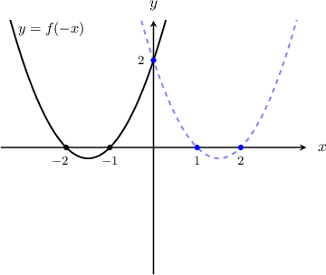
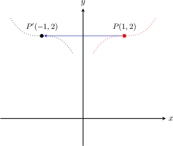

# Horizontal Reflections of Functions

Source: https://www.mathacademy.com/topics/1585?courseId=128
Topic ID: 1585

## Prerequisites

- [Graphs of Functions](../../../traditional/lessons/algebra-i/3821-graphs-of-functions.md)

## Lesson

### Introduction

Consider the function $y=f(x)$ whose graph is shown below. How can we plot the graph of $y=f(-x)?$

We can use some points on the graph of $y=f(x)$ to find the corresponding points on the graphs of $y=f(-x).$

For example, let's take the point $(3,4)$. The fact that it's on the graph of $y=f(x)$ means $f(3)=4.$ Then, if $x={\color{red}-3},$ we have

$$

f(-x) = f\left(-({\color{red}-3})\right) = f(3) = 4.

$$

This means the point $({\color{red}3},4)$ that lies on $y=f(x)$ has a corresponding point $({\color{red}-3},4)$ that lies on $y=f(-x).$

So, for each point on the graph of $y=f(x),$ there will be a point on the graph of $y=f(-x)$ with the *same* $y$-value and the *opposite* $x$-value:

$$

\begin{aligned}Points on y=f(x) & Points on y=f(-x) \\ (−1,2) & (1,2) \\ (0,−1) & (0,−1) \\ (2,0) & (−2,0) \\ (3,4) & (−3,4)\end{aligned}

$$

Finally, we can plot the points and draw the graph of $y = f(-x){:}$

Looking back at the graph, we see that every point on the graph of $y=f(-x)$ is the **reflection across the $y$-axis** of a point on the graph of $y=f(x).$

So, the graph of $y=f(-x)$ can be obtained by reflecting the graph of $y=f(x)$ over the $y$-axis. This result holds in general.

### Example: Sketching the Graph of a Horizontally Reflected Function

#### Question

The graph of $y=f(x)$ is shown below. Sketch the graph of $y=f(-x).$

#### Explanation

To obtain the graph of $y=f(-x)$ from $y=f(x),$ we need to reflect the graph over the $y$-axis. The resulting graph is shown below.

### Example: Finding a Point that Lies on a Transformed Function

#### Question

The point $P$ with coordinates $(1, 2)$ lies on the curve $y=f(x).$ Find a point that must lie on the graph of $y= f(-x).$

#### Explanation

The transformation $y=f(-x)$ reflects the curve $y=f(x)$ in the $y$-axis.

First, notice that the point $P(1, 2)$ lies $1$ unit to the ** of the $y$-axis. So, after the transformation is applied and the point is reflected across the $y$-axis, this point will lie $1$ unit to the ** of the $y$-axis.

Therefore, the point $P'(-1, 2)$ must lie on the graph of $y=f(-x).$

