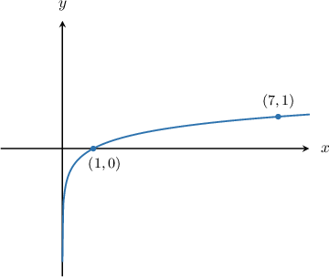
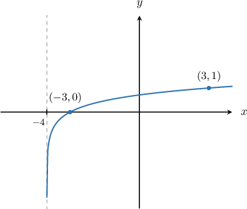
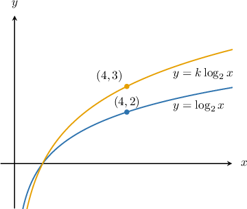
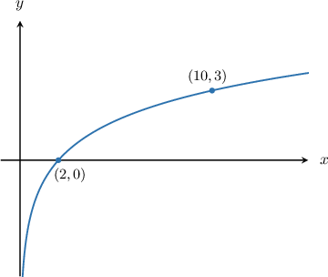

# Combining Graph Transformations of Logarithmic Functions

Source: https://www.mathacademy.com/topics/1707?courseId=128
Topic ID: 1707

## Prerequisites

- [Combining Graph Transformations: Two Operations](../../../traditional/lessons/algebra-ii/1254-combining-graph-transformations-two-operations.md)
- [Graphing Logarithmic Functions](../../../traditional/lessons/algebra-ii/1532-graphing-logarithmic-functions.md)

## Lesson

### Introduction

Suppose we are given the function

$$

y=5\log_6(x-2).

$$

How do we plot its graph?

As usual, we can do this by combining transformations of the curve $y=\log_6 x.$

- We start with the graph of $y=\log_6 x{:}$

- Translate it by $2$ units to the right to get the graph of $y=\log_6{(x-2)}.$ Notice that points $(1,0)$ and $(6,1)$ on the graph of $y=\log_6 x$ map to the points $(3,0)$ and $(8,1)$ on the graph of $y=\log_6 (x-2),$ respectively.

- Then, stretch the result by a scale factor of $5$ parallel to the $y$-axis to get the graph of $y=5\log_6{(x-2)}.$

So, to plot the curve of a transformed logarithmic function, we apply subsequent transformations presented in the given function, as usual.

### Example: Graphing a Translated or Stretched Logarithmic Function

#### Question

Plot the curve of $y=\log_7 (x+4).$

#### Explanation

To plot $y=\log_7 {(x+4)},$ we apply the following steps:

- Take the curve $y=\log_7 {x}.$

- Translate it by $4$ units to the left to get the graph of $y=\log_7 {(x+4)}.$

### Example: Finding Unknown Parameters Given a Stretched Logarithmic Function

#### Question

Given the diagram above, what is the value of $k?$

#### Explanation

The graph of $y=k\log_2 {x}$ can be obtained from $y=\log_2 {x}$ by a vertical stretch of scale factor $k.$

From the diagram, we deduce that under such a transformation, the point $(4,2)$ that lies on $y=\log_2 {x}$ becomes

$$

(4,k \cdot 2)=\left(4,3\right)

$$

which lies on $y=k\log_2 {x}.$

Therefore, $k=\dfrac 32.$

### Example: Combining Translations and Stretches of Logarithmic Functions

#### Question

Plot the graph of

#### Explanation

To plot we apply the following steps:

- Take the curve

- Translate it by units to the right to get the graph of

- Then, stretch the result by a scale factor of parallel to the -axis to get the graph of

- Finally, translate the result by unit up to get the graph of

### Example: Finding Unknown Parameters Given a Transformed Logarithmic Function

#### Question

The diagram below shows the graph of $y=k \log_5 (bx).$ Find the value of $b\cdot k.$

#### Explanation

Clearly, $b \neq 0.$ Substituting $x=\dfrac1b$ into the equation of the curve, we get

$$

\begin{aligned}𝑦 & =𝑘log_{5}⁡(𝑏⋅\frac{1}{𝑏}) \\ & =𝑘log_{5}⁡1 \\ & =0.\end{aligned}

$$

So, the point $\left(\dfrac1b, 0\right)$ lies on the curve. But from the diagram, we know that $(2,0)$ lies on the curve. Hence,

$$

(2,0) = \left(\dfrac1b,0\right)\quad\Rightarrow\quad b=\dfrac12.

$$

Now, we substitute coordinates of the point $(10,3)$ into the equation:

$$

\begin{aligned}𝑘log_{5}⁡(𝑏𝑥) & =𝑦 \\ 𝑘log_{5}⁡(\frac{1}{2}𝑥) & =𝑦 \\ 𝑘log_{5}⁡(\frac{1}{2}⋅10) & =3 \\ 𝑘log_{5}⁡5 & =3 \\ 𝑘 & =3\end{aligned}

$$

Finally,

$$

b\cdot k = \dfrac12 \cdot 3 = \dfrac32.

$$
