# Diagonals of Rectangular Solids

Source: https://www.mathacademy.com/topics/1752?courseId=128
Topic ID: 1752

## Prerequisites

- [Solving Radical Equations](../../../traditional/lessons/algebra-i/116-solving-radical-equations.md)
- [Diagonals of Cubes](../../../traditional/lessons/geometry/3622-diagonals-of-cubes.md)

## Lesson

### Introduction

A **face diagonal** of a rectangular solid is any line segment that joins two opposite vertices on a particular face.

Consider the rectangular solid with face diagonal $d$ on the prism's left face, shown below. What is the length of this face diagonal?

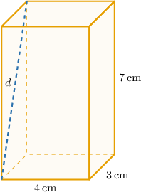

According to our diagram, the left face is a rectangle whose dimensions correspond to the width $w$ and height $h$ of the prism, as shown below.

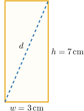

Now, using the Pythagorean theorem, we obtain

$$

\begin{aligned}𝑑 & =\sqrt{𝑤^{2}+ℎ^{2}} \\ & =\sqrt{3^{2}+7^{2}} \\ & =\sqrt{9+49} \\ & =\sqrt{58}\,cm.\end{aligned}

$$

### Counting the Face Diagonals of a Rectangular Solid

Every rectangular solid has $12$ face diagonals ($2$ for each face).

Suppose that we have a rectangular prism with length $l,$ width $w,$ and height $h.$ Then, we have the following sets of congruent face diagonals.

- The *top* and *bottom* faces, made up of rectangles with side lengths $l$ and $w$, give four face diagonals of the same length.

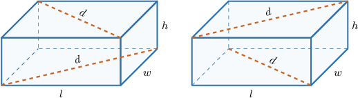

- The *left* and *right* faces, made up of rectangles with side lengths $w$ and $h$, give four face diagonals of the same length.

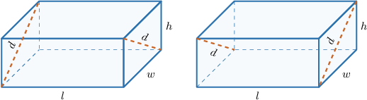

- The *front* and *back* faces, made up of rectangles with side lengths $l$ and $h$, give four face diagonals of the same length.

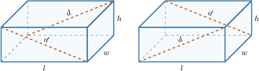

### Example: Finding the Length of a Face Diagonal in a Rectangular Solid

#### Question

Find the measure of the face diagonal $d$ of the rectangular solid below.

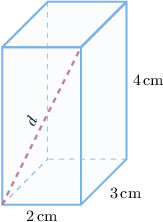

#### Explanation

According to the diagram, $d$ is a diagonal of the solid's front face. The front face is a rectangle whose dimensions correspond to the length $l$ and the height $h$ of the prism, as shown below.

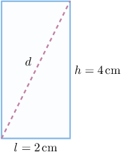

Now, using the Pythagorean theorem, we obtain

$$

\begin{aligned}𝑑 & =\sqrt{𝑙^{2}+ℎ^{2}} \\ & =\sqrt{2^{2}+4^{2}} \\ & =\sqrt{4+16} \\ & =\sqrt{20} \\ & =2\sqrt{5}\,cm.\end{aligned}

$$

### Diagonals of Rectangular Solids

A **diagonal** of a rectangular solid is any line segment that joins two opposite vertices. It is the longest line segment that we can draw inside the solid.

The diagram below shows a rectangular solid with length $l=12\,\text{cm},$ width $w=4\,\text{cm},$ and height $h=3\,\text{cm}.$ Let's denote the length of the diagonal as $d.$

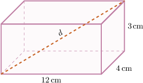

The formula that relates the measures of the diagonals to the length, width, and height is given by

$$

d = \sqrt{l^2 + w^2 + h^2}.

$$

We'll see how to derive this formula later. For now, let's use it to find the measure of the diagonal of this rectangular solid.

Applying our formula, we get

$$

\begin{aligned}𝑑 & =\sqrt{12^{2}+4^{2}+3^{2}} \\ & =\sqrt{144+16+9} \\ & =\sqrt{169} \\ & =13\,cm.\end{aligned}

$$

Finally, note that there are precisely $4$ diagonals for every rectangular solid, and they are all congruent. All four diagonals for this rectangular solid are shown below.

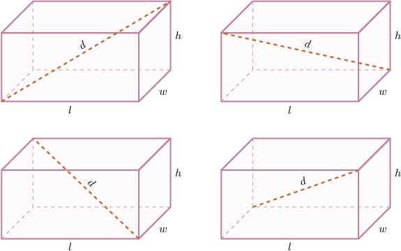

### Example: Finding the Length of a Diagonal in a Rectangular Solid

#### Question

A rectangular prism is $6\,\text{in}$ long, $2\,\text{in}$ wide, and $4\,\text{in}$ high. What is the length of a diagonal of the solid?

#### Explanation

First, let's sketch the rectangular solid.

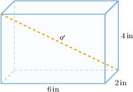

We can find the length of a diagonal $d$ in a rectangular solid using the formula

$$

d = \sqrt{l^2 + w^2 + h^2},

$$

where $l$ is the length, $w$ is the width, and $h$ is the height of the solid.

Substituting the values

$$

l=6\,\text{in}, \qquad w=2\,\text{in}, \qquad h=4\,\text{in}

$$

into the formula for $d,$ we get

$$

\begin{aligned}𝑑 & =\sqrt{6^{2}+2^{2}+4^{2}} \\ & =\sqrt{36+4+16} \\ & =\sqrt{56} \\ & =2\sqrt{14}\,in.\end{aligned}

$$

### Example: Finding a Dimension of a Rectangular Solid Given a Diagonal Length

#### Question

Consider the rectangular solid below. Calculate the value of $h.$

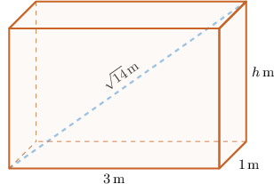

#### Explanation

We can find the length of a diagonal $d$ in a rectangular solid using the formula

$$

d = \sqrt{l^2 + w^2 + h^2},

$$

where $l$ is the length, $w$ is the width, and $h$ is the height of the solid.

Substituting the values

$$

d = \sqrt{14}, \qquad l=3\,\text{m}, \qquad w=1\,\text{m}

$$

into the formula for $d,$ we get

$$

\begin{aligned}\sqrt{14} & =\sqrt{3^{2}+1^{2}+ℎ^{2}} \\ & =\sqrt{9+1+ℎ^{2}} \\ & =\sqrt{10+ℎ^{2}}.\end{aligned}

$$

Therefore, solving for $h,$ we get the following:

$$

\begin{aligned}(\sqrt{14})^{2} & =(\sqrt{10+ℎ^{2}})^{2} \\ 14 & =10+ℎ^{2} \\ 4 & =ℎ^{2} \\ ℎ & =2.\end{aligned}

$$

### Deriving the Diagonal Length Formula

In this section, we will derive the formula

$$

d = \sqrt{l^2 + w^2 + h^2}.

$$

First, consider a rectangular solid with length $l,$ width $w$ and height $h,$ as shown below.

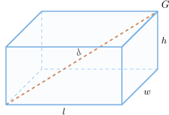

Let's draw the face diagonal corresponding to the base face.

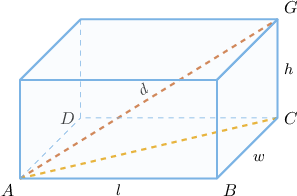

First, notice that $\triangle{ABC}$ is a right triangle with legs $AB$ and $BC$ and hypotenuse $AC.$ So, using the Pythagorean theorem, we obtain

$$

\begin{aligned}𝐴𝐶^{2} & =𝐴𝐵^{2}+𝐵𝐶^{2} \\ & =𝑙^{2}+𝑤^{2}.\end{aligned}

$$

Next, notice that $\triangle{ACG}$ is a right triangle with legs $AC$ and $CG$ and hypotenuse $AG.$ Using the Pythagorean theorem again, we obtain

$$

\begin{aligned}𝑑 & =\sqrt{𝐴𝐶^{2}+𝐶𝐺^{2}} \\ & =\sqrt{(𝑙^{2}+𝑤^{2})+ℎ^{2}} \\ & =\sqrt{𝑙^{2}+𝑤^{2}+ℎ^{2}}.\end{aligned}

$$
