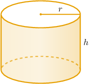
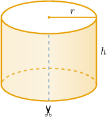
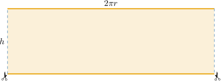
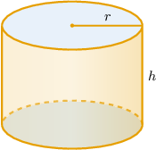
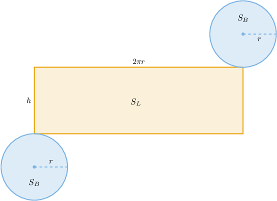
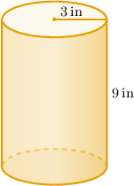

# Surface Areas of Cylinders

Source: https://www.mathacademy.com/topics/1762?courseId=128
Topic ID: 1762

## Prerequisites

- [The Circumference of a Circle](../../../traditional/lessons/geometry/460-the-circumference-of-a-circle.md)
- [Areas of Circles](../../../traditional/lessons/geometry/1745-areas-of-circles.md)
- [Finding Surface Areas Using Nets](../../../traditional/lessons/geometry/2469-finding-surface-areas-using-nets.md)

## Lesson

### Introduction

A cylinder's **lateral surface area** is the surface area that does not include the bases.

Suppose we want to calculate the lateral surface area of the right cylinder shown below.

Since we're considering only the lateral surface area, let's assume that the cylinder has no bases (i.e., no top or bottom).

Now, imagine cutting the cylinder along a vertical line and "unfolding" the lateral part.

Doing this, we get a rectangle, as follows:

Notice the following:

- the length of our rectangle is $2\pi r$ since it must be equal to the circumference of the bases

- the height of our rectangle is $h$

Therefore, the area of the rectangle, and thus the cylinder's lateral surface area $S_L$, is given by

$$

S_L = 2\pi r\cdot h = 2\pi r h.

$$

For example, if the radius of a cylinder is $r=3 \,\text{cm}$ and its height is $h=5\,\text{cm},$ the lateral surface area will be

$$

\begin{aligned}𝑆_{𝐿} & =2𝜋(3)(5)=30𝜋\,cm^{2}.\end{aligned}

$$

### Example: Finding the Lateral Surface Area of a Cylinder

#### Question

The radius of the base of a right cylinder is $3 \: \text{m}$ and its height is $6 \: \text{m}.$ Find the lateral surface area of the cylinder.

#### Explanation

We can calculate the lateral surface area of a cylinder using the formula

$$

S_L = 2\pi r h,

$$

where $r$ is the radius and $h$ is the height of the cylinder.

Substituting $r=3 \,\text{m}$ and $h=6 \,\text{m}$ into the formula, we get

$$

\begin{aligned}𝑆_{𝐿} & =2𝜋(3)(6)=36𝜋\,m^{2}.\end{aligned}

$$

### Deriving the Formula for the Full Surface Area of a Cylinder

We now wish to find a formula for the total surface area of a right cylinder. To do this, let's consider a right cylinder of radius $r$ and height $h,$ as shown below. This time, we include the bases.

The net of the cylinder is constructed from the lateral surface plus two congruent circular bases.

Let $S_L$ be the lateral surface area of the cylinder, and let $S_B$ be the area of the bases. The surface area $S$ of the cylinder can be expressed

$$

\begin{aligned}𝑆 & =2𝑆_{𝐵}+𝑆_{𝐿} \\ & =2(𝜋𝑟^{2})+2𝜋𝑟⋅ℎ \\ & =2𝜋𝑟^{2}+2𝜋𝑟ℎ.\end{aligned}

$$

### Example: Finding the Surface Area of a Cylinder

#### Question

Determine the surface area of the above cylinder.

#### Explanation

We can calculate the surface area of a cylinder using the formula

$$

S = 2\pi r^2 + 2\pi rh,

$$

where $r$ is the radius and $h$ is the height of the cylinder.

Substituting $r=3 \,\text{in}$ and $h=9\,\text{in}$ into the formula, we get

$$

\begin{aligned}𝑆 & =2𝜋(3)^{2}+2𝜋(3)(9) \\ & =18𝜋+54𝜋 \\ & =72𝜋\,in^{2}.\end{aligned}

$$

### Example: Finding a Dimension of a Cylinder Given Its Surface Area or Lateral Surface Area

#### Question

The lateral surface area of a cylinder is $900\pi \: \text{in}^2$ and the ratio of its height to its radius is $2.$ Calculate the radius of the cylinder.

#### Explanation

Let $r$ and $h$ be the radius and height of the cylinder, respectively.

We are given that

$$

\dfrac{h}{r}=2 \qquad\Longrightarrow\qquad h=2r.

$$

We can find the lateral surface area of a cylinder using the formula

$$

S_L = 2\pi rh.

$$

Substituting the values

$$

S_L=900\pi, \qquad h=2r

$$

into the formula for $S_L,$ we obtain the following:

$$

\begin{aligned}𝑆_{𝐿} & =2𝜋𝑟ℎ \\ 900𝜋 & =2𝜋𝑟(2𝑟) \\ 900𝜋 & =4𝜋𝑟^{2} \\ 𝑟^{2} & =\frac{900𝜋}{4𝜋} \\ 𝑟^{2} & =225 \\ 𝑟 & =15\,in\end{aligned}

$$

Notice that we disregard the negative solution since length must be positive.
