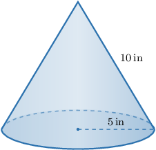
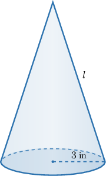
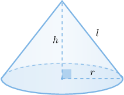
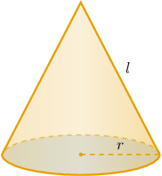
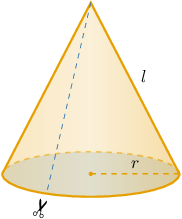
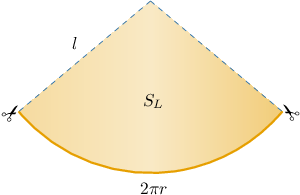
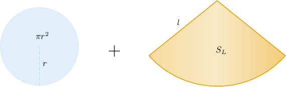

# Surface Areas of Right Cones

Source: https://www.mathacademy.com/topics/1763?courseId=128
Topic ID: 1763

## Prerequisites

- [Areas of Circles](../../../traditional/lessons/geometry/1745-areas-of-circles.md)
- [Slant Heights of Right Cones](../../../traditional/lessons/geometry/1778-slant-heights-of-right-cones.md)
- [Finding Surface Areas Using Nets](../../../traditional/lessons/geometry/2469-finding-surface-areas-using-nets.md)

## Lesson

### Introduction

Consider the right cone shown below.

A cone's **lateral surface area** is the surface area that does not include the area of the base.

We can show that the lateral surface area $S_L$ of a right cone is given by

$$

S_L = \pi r l,

$$

where $r$ is the radius of the base and $l$ is the slant height of the cone.

If we want the entire surface area $S$ of the cone, then we need to include the area of the base, $S_B.$ Then,

$$

S = S_L + S_B .

$$

Since the base of the cone is a circle of radius $r$, we have $S_B = \pi r^2.$ Therefore,

$$

\begin{aligned}𝑆 & =𝜋𝑟𝑙+𝜋𝑟^{2}.\end{aligned}

$$

### Example: Finding the Lateral Surface Area or Surface Area of a Right Cone

#### Question

Calculate the surface area of the right cone shown above.

#### Explanation

We can find the surface area $S$ of a right cone using the formula

$$

S = \pi r l + \pi r^2,

$$

where $r$ is the radius of the base and $l$ is the slant height of the cone.

Substituting $r=5\,\textrm{in}$ and $l=10\,\textrm{in}$ into the formula, we get

$$

\begin{aligned}𝑆 & =𝜋(5)(10)+𝜋(5)^{2} \\ & =50𝜋+25𝜋 \\ & =75𝜋\,in^{2}.\end{aligned}

$$

### Example: Finding a Dimension of a Right Cone Given Its Full Surface Area or Lateral Surface Area

#### Question

The surface area of the right cone above is $39 \pi \: \textrm{in}^2.$ What is the slant height of the cone?

#### Explanation

We can find the surface area $S$ of a right cone using the formula

$$

S = \pi r l + \pi r^2,

$$

where $r$ is the radius of the base and $l$ is the slant height of the cone.

Substituting

$$

S= 39 \pi, \qquad r=3

$$

into the formula, we obtain the following:

$$

\begin{aligned}𝑆 & =𝜋𝑟𝑙+𝜋𝑟^{2} \\ 39𝜋 & =𝜋(3)𝑙+𝜋(3)^{2} \\ 39𝜋 & =3𝜋𝑙+9𝜋 \\ 30𝜋 & =3𝜋𝑙 \\ 𝑙 & =\frac{30𝜋}{3𝜋} \\ 𝑙 & =10\,in\end{aligned}

$$

### Example: Using the Pythagorean Theorem to Compute a Surface Area

#### Question

The height of a right cone is $\sqrt7 \: \textrm{in}$ and the radius of its base is $3 \: \textrm{in}.$ Find the surface area of the cone.

#### Explanation

First, let's sketch a typical right cone and label its key features.

Here, $r$ is the radius of the base, $l$ is the slant height, and $h$ is the height of the cone.

In our case, we have $r=3\:\textrm{in}$ and $h = \sqrt7 \: \textrm{in}.$

Using the Pythagorean theorem in the right triangle above, we obtain

$$

\begin{aligned}𝑙 & =\sqrt{√ℎ^{2}+𝑟^{2}} \\ & =\sqrt{√(\sqrt{√7})^{2}+(3)^{2}} \\ & =\sqrt{√7+9} \\ & =\sqrt{√16} \\ & =4.\end{aligned}

$$

We can calculate the surface area of a right cone using the formula

$$

S = \pi r l + \pi r^2.

$$

Substituting our values into the formula, we get

$$

\begin{aligned}𝑆 & =𝜋(3)(4)+𝜋(3)^{2} \\ & =12𝜋+9𝜋 \\ & =21𝜋\,in^{2}.\end{aligned}

$$

### Derivation of the Lateral Surface Area Formula

Consider the right cone shown below. We wish to derive the formula for the lateral surface area of this cone.

Imagine cutting the cone along one of the slant heights and "unfolding" the lateral part.

Doing this, we get a circular sector, as follows:

Note that

- the radius of our sector is $l$ since it must be equal to the slant height of the cone, and

- the arc length of our sector is $2\pi r$ since it must be equal to the circumference of the base of the cone.

The *full circle* corresponding to this sector is a circle of radius $l.$ Therefore,

- the circumference of the full circle corresponding to this sector is $2\pi l,$ and

- the area of the full circle corresponding to this sector is $\pi l^2.$

The ratio of the sector's arc length to the full circle's circumference must equal the ratio of the sector's area to the full circle's area. This gives the equation

$$

\dfrac{S_L}{\pi l^2} = \dfrac{2\pi r}{2\pi l}.

$$

Simplifying this equation gives the lateral surface area of the cone.

$$

S_L= \pi r l

$$

The full surface area $S$ of a cone follows immediately. The surface area of a cone comprises the two areas shown below.

Therefore, the full surface area of the cone is given by

$$

\begin{aligned}𝑆 & =𝑆_{𝐿}+𝑆_{𝐵} \\ & =𝜋𝑟𝑙+𝜋𝑟^{2}.\end{aligned}

$$
