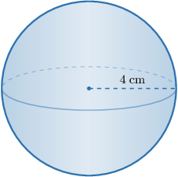

# Surface Areas of Spheres

Source: https://www.mathacademy.com/topics/1765?courseId=128
Topic ID: 1765

## Prerequisites

- [Surface Areas of Cubes](../../../traditional/lessons/geometry/681-surface-areas-of-cubes.md)
- [Volumes of Spheres](../../../traditional/lessons/geometry/1146-volumes-of-spheres.md)
- [Combining the Rules of Exponents](../../../../middle-school/lessons/grade-8/1457-combining-the-rules-of-exponents.md)

## Lesson

### Introduction

Given a sphere with radius $r=4\:\text{cm},$ how do we calculate its surface area?

We can calculate the surface area $S$ of a sphere using the formula

$$

S = 4\pi r^2,

$$

where $r$ is the radius of the sphere.

Substituting $r=4\:\text{cm}$ into the formula, we obtain

$$

S = 4 \pi (4)^2 = 64\pi \:\text{cm}^2.

$$

We often express the surface area of a sphere as a multiple of $\pi.$ We can also get a numerical approximation using a calculator. In this case, we have

$$

S \approx 201.06 \:\text{cm}^2

$$

rounded to two decimal places.

### Example: Finding the Surface Area of a Sphere Given Its Radius or Diameter

#### Question

A sphere has a diameter of $3 \: \text{in}.$ Find the surface area of the sphere.

#### Explanation

We can calculate the surface area of a sphere using the formula

$$

S = 4 \pi r^2,

$$

where $r$ is the radius of the sphere.

Substituting $r=\dfrac{3}{2} \: \text{in}$ into the formula, we obtain

$$

S = 4 \pi \left(\dfrac {3} {2} \right)^2 = 9\pi \: \text{in}^2.

$$

### Example: Finding the Radius or Diameter of a Sphere Given Its Surface Area

#### Question

Calculate the radius of a sphere given that its surface area is $50\pi \: \text{cm}^2.$

#### Explanation

We can calculate the surface area of a sphere using the formula

$$

S = 4 \pi r^2,

$$

where $r$ is the radius of the sphere.

Substituting $S=50\pi \: \text{cm}^2$ into the formula, we can solve for $r$ as follows:

$$

\begin{aligned}𝑆 & =4𝜋𝑟^{2} \\ 50𝜋 & =4𝜋𝑟^{2} \\ \frac{50𝜋}{4𝜋} & =𝑟^{2} \\ 𝑟^{2} & =\frac{25}{2} \\ 𝑟 & =\sqrt{\frac{25}{2}} \\ & =\frac{5}{\sqrt{2}} \\ & =\frac{5\sqrt{2}}{2}\,cm\end{aligned}

$$

### Example: Relating the Surface Area and Volume of a Sphere

#### Question

The volume of the sphere is $\dfrac{500}{3}\pi \: \text{in}^3.$ Calculate the surface area of the sphere.

#### Explanation

We can find the volume of a sphere using the formula

$$

V = \dfrac 4 3 \pi r^3,

$$

where $r$ is the radius of the sphere.

Substituting $V=\dfrac{500}{3}\pi \: \text{in}^3$ into the formula, we can solve for $r$ as follows:

$$

\begin{aligned}𝑉 & =\frac{4}{3}𝜋𝑟^{3} \\ \frac{500}{3}𝜋 & =\frac{4}{3}𝜋𝑟^{3} \\ \frac{500𝜋⋅3}{3⋅4𝜋} & =𝑟^{3} \\ 𝑟^{3} & =125 \\ 𝑟 & =5\,in\end{aligned}

$$

Finally, the surface area of ​​the sphere is

$$

\begin{aligned}𝑆 & =4𝜋𝑟^{2} \\ & =4𝜋(5)^{2} \\ & =100𝜋\,in^{2}.\end{aligned}

$$
