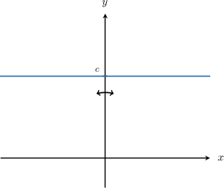

# Products of Even and Odd Functions

Source: https://www.mathacademy.com/topics/1827?courseId=128
Topic ID: 1827

## Prerequisites

- [Describing Properties of the Sine Function](../../../traditional/lessons/algebra-ii/3540-describing-properties-of-the-sine-function.md)
- [Describing Properties of the Cosine Function](../../../traditional/lessons/algebra-ii/3557-describing-properties-of-the-cosine-function.md)

## Lesson

### Introduction

Let $f(x)$ and $g(x)$ be the non-zero functions. We have the following results concerning their products.

- If $f(x)$ and $g(x)$ are *both* even, then $f(x)\cdot g(x)$ is even.

- If $f(x)$ and $g(x)$ are *both* odd, then $f(x)\cdot g(x)$ is even.

- If $f(x)$ is even and $g(x)$ is odd, then $f(x)\cdot g(x)$ is odd.

- If $f(x)$ is odd and $g(x)$ is even, then $f(x)\cdot g(x)$ is odd.

We will prove these results at the end of the lesson. However, notice the similarity with the rules for multiplying positive and negative numbers:

- If $a$ and $b$ are *both* positive, then $a\cdot b$ is positive.

- If $a$ and $b$ are *both* negative, then $a\cdot b$ is positive.

- If $a$ is positive and $b$ is negative, then $a\cdot b$ is negative.

- If $a$ is negative and $b$ is positive, then $a\cdot b$ is negative.

### Parity of Constant Functions

First, notice that any non-zero constant function $c(x) \equiv c \neq 0$ is even. Indeed, for every real $x,$ we have

$$

c(-x) = c = c(x)

$$

which aligns with the definition of an even function. Furthermore, the graph of the constant function is symmetric about the $y$-axis.

Finally, what about the zero constant $c(x) \equiv 0?$

This function is *both* even and odd!

- The proof that it's even is the same as for any non-zero constant above (the graph of the zero constant function is still symmetric about the $y$-axis).

- Now, notice that since $c(x) \equiv 0,$ for any real $x$ we have which aligns with the definition of an odd function.

### Example: Classifying Products of Functions As Even or Odd

#### Question

Let $f(x)$ be a non-zero odd function, $g(x)$ be a non-zero even function, and $h(x)$ be a non-zero odd function. Is the function $f(x) \cdot g(x) \cdot h(x)$ even, odd, or neither?

#### Explanation

First, let's recall the following rules regarding the products of even and odd functions:

$$

\begin{aligned} & even\,⋅even=even \\ & odd\,⋅odd=even \\ & even\,⋅odd=odd \\ & odd\,⋅even=odd\end{aligned}

$$

In our case, we have

$$

\begin{aligned}𝑓(𝑥)⋅𝑔(𝑥)⋅ℎ(𝑥) & =odd⋅even⋅odd \\ & =(odd⋅even)⋅odd \\ & =odd⋅odd \\ & =even.\end{aligned}

$$

Therefore, $f(x) \cdot g(x) \cdot h(x)$ is an even function.

### Example: Classifying a Product Containing Particular Even and Odd Functions

#### Question

Which of the following statements are true?

1. $x^3-x^5$ is an even function

2. $\sin^2 x$ is an even function

3. $(x^3-x^5) \sin^2 x$ is an odd function

#### Explanation

First, let's recall the following rules regarding the products of even and odd functions:

$$

\begin{aligned} & even\,⋅even=even \\ & odd\,⋅odd=even \\ & even\,⋅odd=odd \\ & odd\,⋅even=odd\end{aligned}

$$

With that in mind, let's examine our functions in turn.

- Statement I is false. Let $f(x) = x^3-x^5.$ Then, $f(x)$ is odd since for all $x \in (-\infty,\infty).$

- Statement II is true. Let $g(x) = \sin^2 x.$ Then, $g(x)$ is even since for all $x \in (-\infty,\infty).$

- Statement III is true. Notice that

Therefore, the correct answer is "II and III only."

### Finding the Parity of a Factor

Now, suppose we know that

$$

f(x) \cdot (x^2 + 1)

$$

is an odd function. What can we say about the function $f(x)?$

First, let's recall the following rules regarding the products of even and odd functions:

$$

\begin{aligned} & even\,⋅even=even \\ & odd\,⋅odd=even \\ & even\,⋅odd=odd \\ & odd\,⋅even=odd\end{aligned}

$$

Notice that $x^2 + 1$ is an even function since

$$

(-x)^2 + 1 = x^2 + 1

$$

for all $x \in (-\infty,\infty).$

Now, since $f(x) \cdot (x^2 + 1)$ is odd and $x^2 + 1$ is even, we have that $f(x)$ must be an odd function:

$$

\underbrace{\color{blue}\text{odd}}_{f(x)} \quad \cdot \quad \underbrace{\text{even}}_{x^2 + 1} \quad = \quad \underbrace{\text{odd}}_{f(x) \,\cdot \,(x^2 + 1)}

$$

Let's see another example.

### Example: Classifying Functions in a Product as Even or Odd

#### Question

Let $f(x) \cdot x^3$ be an odd function. Is the non-zero function $f(x)$ even, odd, or neither?

#### Explanation

First, let's recall the following rules regarding the products of the non-zero even and odd functions:

$$

\begin{aligned} & even\,⋅even=even \\ & odd\,⋅odd=even \\ & even\,⋅odd=odd \\ & odd\,⋅even=odd\end{aligned}

$$

Notice that $x^3$ is an odd function since

$$

(-x)^3 = -x^3

$$

for all $x \in (-\infty,\infty).$

Now, since $f(x) \cdot x^3$ and $x^3$ are odd, we have that $f(x)$ must be an even function:

$$

\underbrace{\color{blue}\text{even}}_{f(x)} \quad \cdot \quad \underbrace{\text{odd}}_{ {\large x^3} } \quad = \quad \underbrace{\text{odd}}_{f(x) \,\cdot \,{\large x^3} }

$$

### Proof of the Results

Let's prove the results using this lesson by considering all possible cases for products of even and odd functions:

- Case I: Let $f(x)$ and $g(x)$ be non-zero even functions. Then, we have that Now define $h(x) = f(x)\cdot g(x)$. Therefore, Since $h(x)$ is even, we conclude that $f(x)\cdot g(x)$ is even.

- Case II: Let $f(x)$ and $g(x)$ be non-zero odd functions. Then, we have that Now define $h(x) = f(x)\cdot g(x)$. Therefore, Since $h(x)$ is even, we conclude that $f(x)\cdot g(x)$ is even.

- Case III: Let $f(x)$ be non-zero even and $g(x)$ be non-zero odd. Then, we have that Now define $h(x) = f(x)\cdot g(x)$. Therefore, Since $h(x)$ is odd, we conclude that $f(x)\cdot g(x)$ is odd.

- Case IV: Let $f(x)$ be non-zero odd and $g(x)$ be non-zero even. Then, we have that Now define $h(x) = f(x)\cdot g(x)$. Therefore, Since $h(x)$ is odd, we conclude that $f(x)\cdot g(x)$ is odd.
