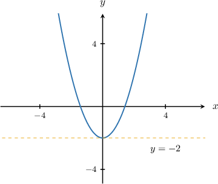
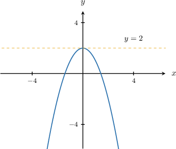
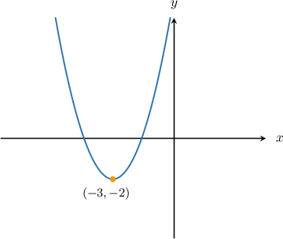
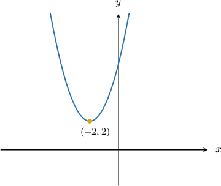
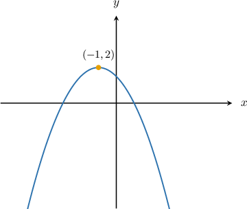

# Domain and Range of Quadratic Functions

Source: https://www.mathacademy.com/topics/1882?courseId=128
Topic ID: 1882

## Prerequisites

- [The Range of a Function](../../../traditional/lessons/algebra-i/754-the-range-of-a-function.md)
- [The Vertex Form of a Parabola](../../../traditional/lessons/algebra-i/814-the-vertex-form-of-a-parabola.md)
- [The Average of the Roots Formula](../../../traditional/lessons/algebra-i/1451-the-average-of-the-roots-formula.md)

## Lesson

### Introduction

In this lesson, we will discuss the properties of quadratic functions. Specifically, we learn how to determine the domain and range of a quadratic function.

Remember that a quadratic function takes the form

$$

f(x) = ax^2 + bx + c,

$$

where $a,b,$ and $c$ are constants.

The first thing to note is that the domain of *any* quadratic function is $x\in (-\infty, \infty)$ because it is defined for all values of $x.$

Determining the range of a quadratic function is slightly more involved, as we'll see shortly.

### Example: Finding the Domain of a Quadratic Function

#### Question

What is the domain of the function $g(x)=\dfrac{4}{3}x^2+5x -12?$

#### Explanation

A quadratic function is defined for all real numbers.

Therefore, the domain of $g(x)$ is $x\in(-\infty,\infty).$

### The Range of an Upward-Opening Parabola

The range of a quadratic function depends on the direction in which its graph opens. Regardless of whether the equation is written in standard form,

$$

y = ax^2 + bx + c,

$$

vertex form,

$$

y = a(x-h)^2 + k,

$$

or factored form,

$$

y = a(x-x_1)(x-x_2),

$$

it opens upwards if the leading coefficient $a$ is positive and downwards if $a$ is negative.

Now, consider a parabola that opens upwards ($a>0$). In this case, the minimum output corresponds to the $y$-coordinate of the vertex, while there is no maximum output. Therefore, if the vertex is $(h,k),$ then the range is $y \geq k.$

For example, in the graph below, the $y$-value of the vertex is $y=-2$, so the range of the function is $y \geq -2.$

### The Range of a Downward-Opening Parabola

Now consider a parabola that opens downwards ($a<0$). In this case, there is no minimum output, but the maximum output corresponds to the $y$-coordinate of the vertex. Therefore, if the vertex is $(h,k),$ then the range is $y \leq k.$

For example, in the graph below, the $y$-value of the vertex is $y=2$, so the range of the function is $y \leq 2.$

### Example: Finding the Range of a Parabola Given in Vertex Form

#### Question

What is the range of the function $f(x) = (x+3)^2-2?$

#### Explanation

The parabola is written in vertex form,

$$

y = a(x-h)^2 + k,

$$

where $a$ is the leading coefficient and $(h,k)$ is the vertex.

- Since $h=-3$ and $k=-2,$ the vertex is $(-3,-2).$

- Since $a=1>0,$ the parabola opens upwards.

Because the parabola opens upwards, the vertex corresponds to the minimum output, while there is no maximum output.

Therefore, the range is $[-2,\infty).$

The corresponding diagram is shown below.

### Example: Finding the Range of a Parabola Given in Standard Form

#### Question

What is the range of the function $f(x)=x^2+4x+6?$

#### Explanation

The given parabola is written in standard form,

$$

y = ax^2+bx+c,

$$

with $a=1>0,$ $b=4,$ and $c=6.$

Because the leading coefficient is positive, the parabola opens upward. Consequently, there is no maximum output, and the vertex corresponds to the minimum output.

The $x$-coordinate of the vertex is given by

$$

x= -\dfrac{b}{2a} = -\dfrac{4}{2 \cdot 1} = -2.

$$

Now, we substitute $x=-2$ back into the function to find the $y$-value of the vertex:

$$

\begin{aligned}𝑦 & =𝑥^{2}+4𝑥+6 \\ & =(−2)^{2}+4(−2)+6 \\ & =4−8+6 \\ & =2\end{aligned}

$$

Therefore, the vertex is $(-2,2),$ and the range of the function is $[2,\infty).$

### Example: Finding the Range of a Parabola Given in Factored Form

#### Question

What is the range of the function $f(x) = -\dfrac{1}{2}(x+3)(x-1)?$

#### Explanation

The given parabola is written in factored form,

$$

y = a(x-x_1)(x-x_2),

$$

with $a = -\dfrac{1}{2} < 0.$

Because the leading coefficient is negative, the parabola opens downward. Consequently, there is no minimum output, and the vertex corresponds to the maximum output.

The two roots of the parabola are $x_1=-3$ and $x_2=1,$ and we can find the $x$-coordinate of the vertex by taking the average of the roots:

$$

\begin{aligned}𝑥 & =\frac{𝑥_{1}+𝑥_{2}}{2}=\frac{−3+1}{2}=−1\end{aligned}

$$

Then, we substitute $x=-1$ back into the function to find the $y$-value of the vertex:

$$

\begin{aligned}𝑦 & =−\frac{1}{2}(𝑥+3)(𝑥−1) \\ & =−\frac{1}{2}(−1+3)(−1−1) \\ & =−\frac{1}{2}⋅2⋅(−2) \\ & =2\end{aligned}

$$

Therefore, the vertex is $(-1,2),$ and the range of the function is $(-\infty,2].$

