# Vertical Translations of Trigonometric Functions

Source: https://www.mathacademy.com/topics/206?courseId=128
Topic ID: 206

## Prerequisites

- [Vertical Translations of Functions](../../../traditional/lessons/algebra-ii/1251-vertical-translations-of-functions.md)
- [Graphing Sine and Cosine](../../../traditional/lessons/algebra-ii/1491-graphing-sine-and-cosine.md)
- [Graphing Tangent and Cotangent](../../../traditional/lessons/algebra-ii/1493-graphing-tangent-and-cotangent.md)
- [Further Solving Linear Inequalities](../../../../middle-school/lessons/grade-7/4034-further-solving-linear-inequalities.md)

## Lesson

### Introduction

Recall the graph of the function $y=\sin{x},$ shown below.

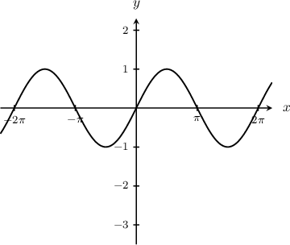

We can move the graph of $y=\sin x$ up (or down) by adding (or subtracting) a number to the right-hand-side of the function. These are known as **vertical translations**.

For example, the graph of $y=\sin x +{\color{blue}1}$ moves the original sine curve up by $\color{blue}1$ unit:

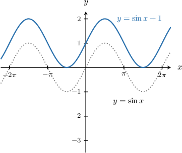

Similarly, the graph of $y=\sin x {\color{red}\,-\,2}$ moves the original sine curve down by $\color{red}2$ units:

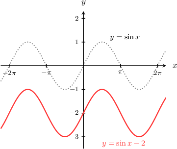

We can apply a vertical translation to any trigonometric function in the same way.

### Example: Determining the Equation of a Vertically Translated Sine Function

#### Question

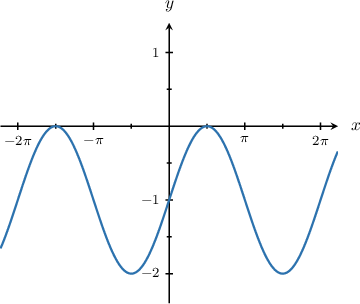

What is the equation of the graph shown above?

#### Explanation

Let's add $y=\sin x$ to the plot.

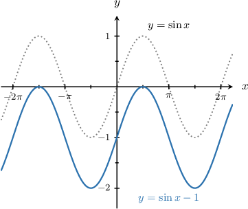

To plot the given curve, we follow these steps:

- Start with the graph of $y = \sin x.$

- Then, shift it by $1$ unit ****.

Therefore, the given curve is the graph of $y = \sin{x} - 1.$

### Vertical Translations of the Cosine Function

Now, recall the graph of the function $y=\cos x\mathbin{:}$

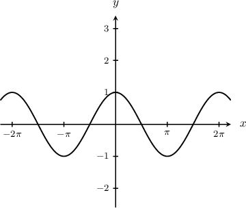

We can apply vertical translations to the cosine function. For instance, the graphs of $y=\cos x{\color{blue}\,+\,2}$ and $y=\cos x {\color{red}\,-\,1}$ are as follows:

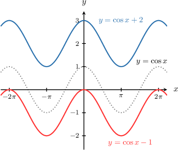

The $\color{blue}+\,2$ moves the curve up by two units, and the $\color{red}-\,1$ moves it down by one unit.

### Example: Determining the Equation of a Vertically Translated Cosine Function

#### Question

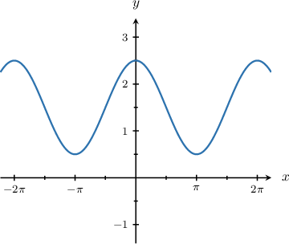

What is the equation of the graph shown above?

#### Explanation

Let's add $y=\cos x$ to the plot.

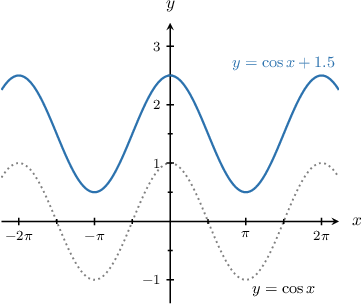

To plot the given curve, we follow these steps:

- Start with the graph of $y=\cos x.$

- Then, shift it by $1.5$ units ****.

Therefore, the given curve is the graph of $y = \cos x + 1.5.$

### Example: Finding the Maximum and Minimum Values of a Vertically Translated Sine or Cosine Function

#### Question

What is the minimum value of $y=\sin x + 2?$

#### Explanation

****

To plot the given curve, we follow these steps:

- Start with the graph of $y = \sin x.$

- Then, shift it by $2$ units ****

The resulting graph is shown below.

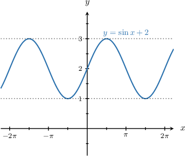

From the graph, we see that the minimum value is $y = 1.$

****

We know that $y = \sin{x}$ has a minimum value of $-1.$ So, we have

$$

-1 \leq \sin x.

$$

Adding $2$ to both sides of the above inequality gives

$$

\begin{aligned}−1+2 & ≤sin⁡𝑥+2 \\ 1 & ≤sin⁡𝑥+2.\end{aligned}

$$

Therefore, the minimum value of $\sin{x} + 2$ is $1.$

### Vertical Translations of the Tangent Function

Finally, let's recall the graph of the function $y=\tan{x}\mathbin{:}$

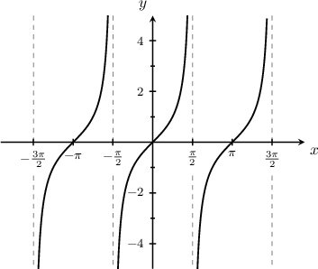

We can also apply vertical translations to the tangent function. For example, we plot graph of $y=\tan x{\color{blue}\,+\,2}$ by moving the tangent function $\color{blue}2$ units up:

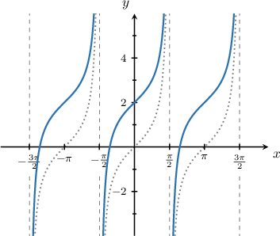

### Example: The Equation of a Vertically Translated Tangent Function

#### Question

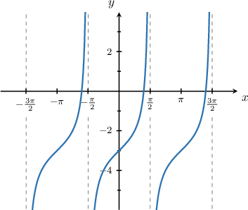

The graph above shows $y=\tan{x}+D.$ What is the value of $D?$

#### Explanation

To plot the given curve, we follow these steps:

- Start with the graph of $y = \tan x.$

- Then, shift it by $3$ units ****

Therefore, the given curve is the graph of $y = \tan x - 3.$

So, we conclude that $D = -3.$
