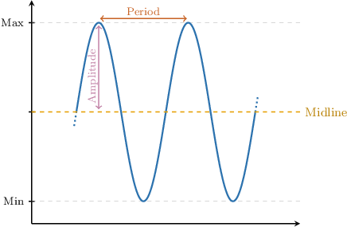
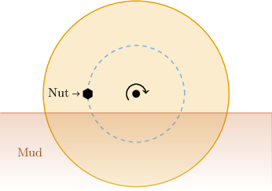
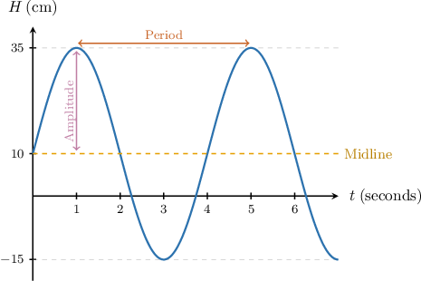
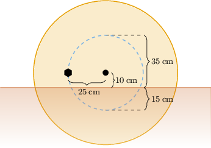
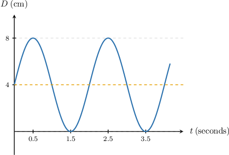
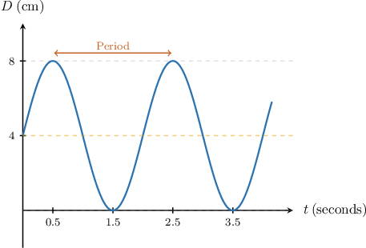
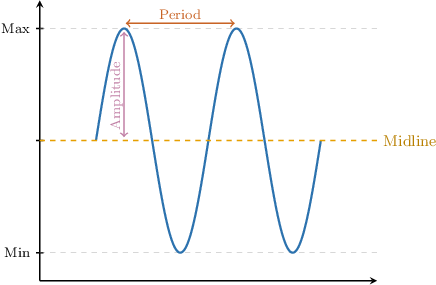

# Interpreting Trigonometric Models

Source: https://www.mathacademy.com/topics/2566?courseId=128
Topic ID: 2566

## Prerequisites

- [Properties of Transformed Sine and Cosine Functions](../../../traditional/lessons/algebra-ii/2062-properties-of-transformed-sine-and-cosine-functions.md)

## Lesson

### Introduction

Trigonometric functions, or more precisely, **sinusoidal curves** of the form

$$

F(t) = A \sin(Bt) + C

$$

or

$$

G(t) = A \cos(Bt) + C

$$

can be used to model real-world processes that are periodic in time $t.$

We use the word "sinusoidal" to refer to either sine or cosine. A sketch of a typical sinusoidal curve is shown below.

Now, let's recall some terminology related to sinusoidal functions:

- The horizontal line that splits the graph in half is called the **midline**. It corresponds to the vertical shift $C$ of the function.

- The distance from the midline to the highest (or lowest) position is called the **amplitude**.

- The **period** tells us how much time must elapse before the process repeats. The period can be calculated using the formula

- The reciprocal of the period is called the **frequency**. It shows how many times the process repeats per unit of time.

### A Sinusoidal Model of a Rotating Wheel Nut

Let's consider a concrete example of sinusoidal motion in context.

Suppose a nut is mounted on a vehicle's wheel, and the wheel is stuck in some mud, as shown below.

Let's assume that the wheel rotates at a constant rate. Then the distance from the nut to the ground, in inches, can be modeled by a sinusoidal function $H(t),$ where $t$ is the time in seconds. The graph of $H(t)$ is shown below.

Note that negative values of $H$ mean the nut is under the mud.

We can obtain the following information from the graph:

- The midline is given by the line $H=10.$ This means the center of the wheel is located $10\:\textrm{cm}$ above the ground.

- The nut reaches a distance of $35 \: \textrm{cm}$ above the ground at its highest point and $15 \: \textrm{cm}$ into the mud at its lowest point.

- The amplitude is $35-10 = 25 \: \textrm{cm},$ and it represents the distance from the nut to the center of the wheel.

- The period is $5 - 1 = 4 \: \textrm{s},$ and it tells us that the wheel makes one full rotation every $4$ seconds.

### Example: Interpreting a Sinusoidal Model From Its Graph

#### Question

An object attached to the end of a spring is sliding back and forth on a frictionless surface so that its distance, in centimeters, from its starting position, can be modeled by the sinusoidal function $D(t),$ where $t$ is the time in seconds.

How often does the object return to its starting position?

#### Explanation

Let's recall the general terminology for sinusoidal curves:

The highlighted element on the graph below corresponds to the period. It represents the time difference between two consecutive maximum values:

From the graph, we see that the distance between the peaks (i.e., the period) is

$$

\textrm{period} = 2.5 - 0.5 = 2\,\textrm{seconds}.

$$

Therefore, the object returns to its starting position every $2$ seconds.

### Example: Interpreting a Cosine Function

#### Question

The daily tide level in a coastal city, in feet, is modeled by the function

$$

H(t)=6\cos\left(\dfrac{\pi t}{6}\right)+ 8,

$$

where $t$ is the time in hours. How long does it take for the tide to transition from its lowest to highest level, and what is the maximum height of the tide?

#### Explanation

Let's recall the general terminology for sinusoidal curves:

If $F(t) = A \cos\left(B t \right) + C,$ then

- $|A|$ is the **,

- $\dfrac{|B|}{2\pi}$ is the ** $\dfrac{2\pi}{|B|}$ is the **, and

- $C$ is the ** (vertical shift).

We'll answer each part of the question in turn.

- For the first part, we are interested in the time difference between the highest and lowest tides (i.e., ** the period of the function). Now, we have So, the period is The time between the lowest and highest tides is ** the period. Therefore, it takes $6$ hours for the tide to transition from its lowest to highest level.

- For the second part, we're interested in the maximum value of the function. This is given by the amplitude plus the midline. Now, we have Therefore, Therefore, the maximum height of the tide is $14\,\textrm{ft}.$

### Example: Interpreting a Sine Function

#### Question

The altitude of a satellite $t$ minutes after an astronomer starts observing it, in kilometers, is given by a function

$$

A(t)=8\sin\left(\dfrac{\pi t}{50}\right)+400,

$$

where $t$ is the time in minutes. What is the difference in the satellite's altitude between the points of highest and lowest altitude?

#### Explanation

Let's recall the general terminology for sinusoidal curves:

If $F(t) = A \sin\left(B t \right) + C,$ then

- $|A|$ is the **,

- $\dfrac{|B|}{2\pi}$ is the ** $\dfrac{2\pi}{|B|}$ is the **, and

- $C$ is the ** (vertical shift).

In our case, we are interested in the altitude difference between the highest and lowest altitude points, i.e., twice the amplitude.

Now, we have

$$

\text{amplitude}=|A|=8.

$$

Therefore, we conclude that the altitude difference is equal to

$$

2\cdot {\color{black}8} = 16\,\textrm{km}.

$$
