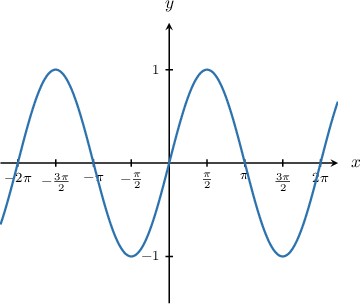
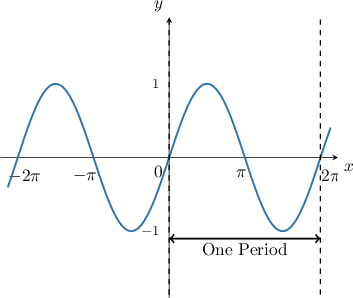
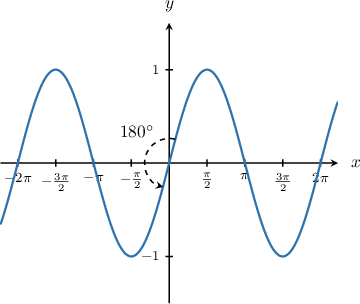
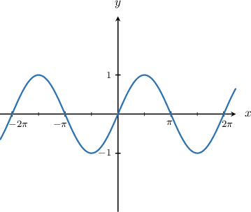

# Describing Properties of the Sine Function

Source: https://www.mathacademy.com/topics/3540?courseId=128
Topic ID: 3540

## Prerequisites

- [Even and Odd Functions](../../../traditional/lessons/algebra-ii/725-even-and-odd-functions.md)
- [Graphing Sine and Cosine](../../../traditional/lessons/algebra-ii/1491-graphing-sine-and-cosine.md)
- [Local Extrema of Functions](../../../traditional/lessons/algebra-ii/2707-local-extrema-of-functions.md)

## Lesson

### Introduction

Let's recall the graph of $y=\sin{x}$ once again.

The graph has infinitely many zeros, and there are an infinite number of points where the function reaches its maximum and minimum values. Let's see how to write down general expressions for these properties.

We'll assume that $n$ represents any integer throughout this discussion.

**The Zeros of the Function**

From the graph, we see that the zeros of the function are $x=0,\pm\pi, \pm 2\pi\dots.$

We can write down a general expression for the zeros as follows:

$$

x = n\pi.

$$

**The Maxima of the Function**

The function has a maximum when $x=\dfrac\pi 2$ and the function is periodic with period $2\pi.$ Therefore, a general expression for the values of $x$ that maximize sine is

$$

x = \dfrac{\pi}{2} + 2n\pi.

$$

**The Minima of the Function**

The function has a minimum when $x=-\dfrac\pi 2$ and the function is periodic with period $2\pi.$ Therefore, a general expression for the values of $x$ that minimize sine is

$$

x = -\dfrac{\pi}{2} + 2n\pi.

$$

### Example: Describing Properties of the Sine Function

#### Question

Which of the following statements are true regarding the function $y=\sin{x}?$ Assume that $n$ is an integer.

1. The zeros of the function are $x=2n\pi.$

2. The function has minimum values at $x=-\dfrac{\pi}{2}+2n\pi.$

3. The function has maximum values at $x=\dfrac{\pi}{2}+2n\pi.$

#### Explanation

Let's plot the graph of $y=\sin{x}.$

Let's go through each statement.

- Statement I is false. The zeros occur at $x=0, \pm \pi, \pm 2\pi,\ldots,$ which can be written as $x=n\pi.$

- Statement II is true. The function has a minimum at $x=-\dfrac{\pi}{2},$ and the period is $2\pi.$ Therefore, the minimum values occur at $-\dfrac{\pi}{2}+2n\pi.$

- Statement III is true. The function has a maximum at $x=\dfrac{\pi}{2},$ and the period is $2\pi.$ Therefore, the maximum values occur at $\dfrac{\pi}{2}+2n\pi.$

### The Periodicity Property of the Sine Function

Let's recall the graph of the function $y=\sin x.$

As we've already mentioned, the function $y=\sin x$ is periodic, which means it repeats itself. The period, or horizontal distance needed to complete one of the repeated cycles, is $2\pi.$

The periodicity of $y=\sin x$ means that $\sin\left(x+2n\pi\right) = \sin\left(x\right)$ for any number $x$ and $n$ is any integer.

### Example: Utilizing the Periodicity Property of the Sine Function

#### Question

If $\sin x = \dfrac{1}2,$ then what is $-2\sin(x+6\pi)-3?$

#### Explanation

The period of $y = \sin x$ is $2\pi.$ Therefore, for any integer $n$ we have

$$

\sin{x} = \sin{(x+2n\pi)} .

$$

Substituting $n=3$ into the above gives

$$

\begin{aligned}sin⁡𝑥 & =sin⁡(𝑥+2⋅3⋅𝜋) \\ & =sin⁡(𝑥+6𝜋).\end{aligned}

$$

Therefore, if $\sin{x} = \dfrac{1}{2},$ then $\sin{(x+6\pi)} = \dfrac{1}{2}.$

Finally, then:

$$

\begin{aligned}−2sin⁡(𝑥+6𝜋)−3 & =−2(\frac{1}{2})−3 \\ & =−1−3 \\ & =−4.\end{aligned}

$$

### The Oddness Property of the Sine Function

Recall that a function $f(x)$ is *odd* if it satisfies the property

$$

f(-x) = -f(x).

$$

As it turns out, sine is an odd function! So, for any value of $x,$ we have

$$

\sin(-x) = -\sin(x).

$$

Odd functions always have rotational symmetry of order $2$ about the origin. This is indeed true of the sine function, as we can see from the diagram below.

We can use the oddness property of sine in conjunction with its periodicity property to simplify trigonometric expressions. Let's see an example.

### Example: Utilizing the Oddness Property of the Sine Function

#### Question

If $\sin{x} = -\dfrac{4}{7},$ then what is the value of $\sin(-x + 16 \pi)?$

#### Explanation

First, let's recall the graph of $y = \sin{x}.$

From the graph, we note the following:

- The period of $\sin{x}$ is $2\pi.$

- Our graph has rotational symmetry of order $2$ about the origin. This means that $\sin{x}$ is an ** function, and we have

Let's now evaluate our expression:

- Firstly, using the periodicity of $\sin{x},$ we have

- Secondly, using the oddness of $\sin{x},$ we have

Therefore, $\sin(-x + 16\pi) = \dfrac{4}{7}.$
