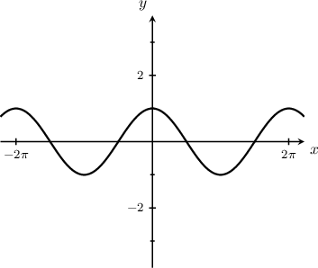
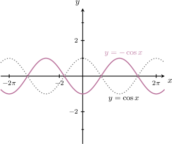
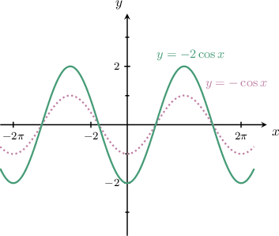
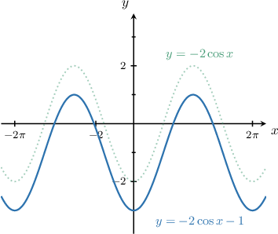
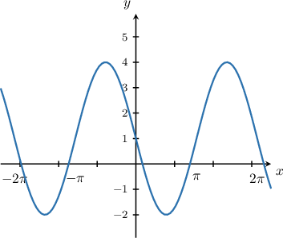
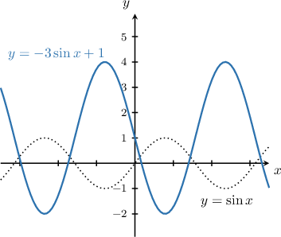
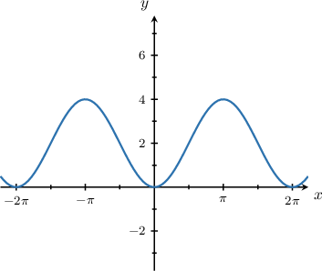
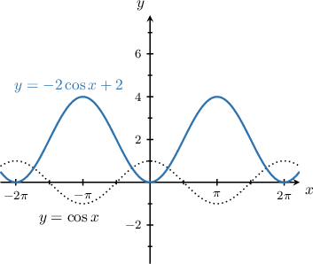

# Graphing Reflections of Trigonometric Functions: Three or More Transformations

Source: https://www.mathacademy.com/topics/3553?courseId=128
Topic ID: 3553

## Prerequisites

- [Graphing Reflections of Trigonometric Functions](../../../traditional/lessons/algebra-ii/259-graphing-reflections-of-trigonometric-functions.md)

## Lesson

### Introduction

We can combine vertical reflections, stretches, and shifts to get new transformed trigonometric curves. For example, using transformations, let's draw the graph of the curve

$$

y = -2 \cos x - 1.

$$

To plot this curve, we follow these steps:

- Start with the graph of $y=\cos{x}.$

- Reflect it in the $x$-axis to give $y=-\cos x.$

- Vertically stretch the result by a scale factor of $2$ to give $y=-2\cos x.$

- Finally, shift the result down by $1$ unit to give $y=-2\cos x - 1.$

### Example: Identifying the Reflection, Amplification, and Shifting of a Sine Curve

#### Question

Identify the equation that generated the graph above.

#### Explanation

From the graph, we see that the maximum value is $y_{\textrm{max}} = 4$ and the minimum value is $y_{\textrm{min}} =-2.$ Therefore, the amplitude is

$$

A = \dfrac{y_{\textrm{max}} - y_{\textrm{min}}}{2} = \dfrac{4-(-2)}{2} = 3.

$$

Therefore, to plot the given curve, we follow these steps:

- Start with the graph of $y=\sin x.$

- Reflect it in the $x$-axis to give $y=-\sin x.$

- Vertically stretch it by a scale factor of $3$ to give $y=-3\sin x.$

- Finally, translate it by $1$ unit **** to give $y=-3\sin x+1.$

Therefore, the given curve is the graph of $y=-3\sin x+1.$

### Example: Identifying the Reflection, Amplification, and Shifting of a Cosine Curve

#### Question

Identify the equation that generated the graph above.

#### Explanation

From the graph, we see that the maximum value is $y_{\textrm{max}} = 4$ and the minimum value is $y_{\textrm{min}} = 0.$ Therefore, the amplitude is

$$

A = \dfrac{y_{\textrm{max}} - y_{\textrm{min}}}{2} = \dfrac{4-0}{2} = 2 .

$$

Therefore, to plot the given curve, we follow these steps:

- Start with the graph of $y=\cos x.$

- Reflect it in the $x$-axis to give $y=-\cos x.$

- Vertically stretch it by a scale factor of $2$ to give $y=-2\cos x$

- Finally, translate it by $2$ units **** to give $y=-2\cos x+2$

Therefore, the given curve is the graph of $y=-2\cos x+2.$
