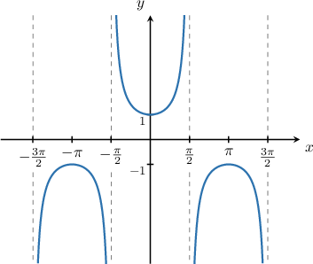
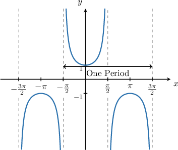
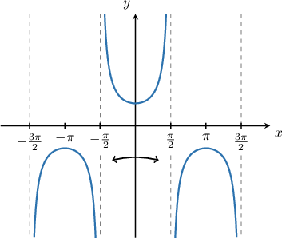
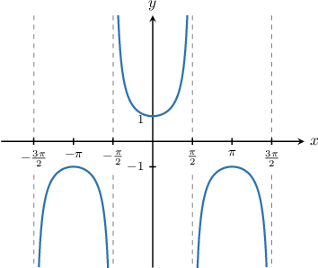

# Describing Properties of the Secant Function

Source: https://www.mathacademy.com/topics/3563?courseId=128
Topic ID: 3563

## Prerequisites

- [Graphing Secant and Cosecant](../../../traditional/lessons/algebra-ii/1573-graphing-secant-and-cosecant.md)
- [Describing Properties of the Cosine Function](../../../traditional/lessons/algebra-ii/3557-describing-properties-of-the-cosine-function.md)

## Lesson

### Introduction

Let's recall the graph of $y=\sec x$ once again.

The graph has infinitely many asymptotes, and there is an infinite number of points where the function takes values of $1$ and $-1.$ We can write down general expressions for these properties, by assuming $n$ represents an integer.

**The Asymptotes of the Function**

The function has asymptotes when $x=\pm \dfrac{\pi}{2}, \pm \dfrac{3\pi}{2},\ldots,$ etc. Therefore, a general equation for the asymptotes of the graph is

$$

x = \dfrac{\pi}{2} + n\pi.

$$

**The Points Where the Function Takes a Value of $\mathbf{1}$**

From the graph, we see that the function takes a value of $1$ when $x=0.$ Since the function has a period of $2\pi,$ a general expression for the values of $x$ for which $\sec x = 1$ is

$$

x = 2n\pi.

$$

**The Points Where the Function Takes a Value of $\mathbf{-1}$**

Similarly, from the graph, we see that the function takes a value of $-1$ when $x=\pi.$ Since the function has a period $2\pi,$ a general expression for the values of $x$ for which $\sec x = -1$ is

$$

x = \pi +2n\pi.

$$

### Example: Describing Properties of the Secant Function

#### Question

Which of the following statements regarding the graph of $y=\sec x$ are true?

1. The function takes the value $1$ at $x = 2n\pi,$ where $n$ is an integer

2. The range of the function is $(-\infty,+\infty)$

3. The function has zeros at $x = 0, \pm \pi, \pm 2 \pi,\dots$

#### Explanation

Let's have a look at the graph of $y=\sec x.$

Let's go through each statement.

- The secant takes the value $1$ at $x = 2 n\pi.$ Therefore, statement I is true.

- The range of $f(x) = \sec x$ is $(-\infty,-1] \cup [1, \infty)$. Therefore, statement II is false.

- The secant graph does not intersect the $x$-axis. Therefore, statement III is false.

In conclusion, only statement I is true.

### The Periodicity Property of the Secant Function

Let's recall the graph of the function $y=\sec x\mathbin{:}$

As we've stated before, the secant function inherits its periodicity from the cosine function, so the period is $2\pi.$

The periodicity of $y=\sec x$ means that

$$

\sec (x+2n\pi ) = \sec x

$$

for any integer $n.$

### Example: Utilizing the Periodicity Property of the Secant Function

#### Question

If $\sec x =2 \sqrt 2$ then what is $\sec(x+8\pi)?$

#### Explanation

The period of $y = \sec x$ is $2\pi.$ Therefore, for integer $n$ we have

$$

\sec{x} = \sec{(x+2n\pi)} .

$$

Substituting $n=4$ into the above gives

$$

\begin{aligned}sec⁡𝑥 & =sec⁡(𝑥+2⋅4⋅𝜋) \\ & =sec⁡(𝑥+8𝜋).\end{aligned}

$$

Therefore, if $\sec{x} = 2\sqrt 2,$ then $\sec{(x+8\pi)} = 2\sqrt 2.$

### The Evenness Property of the Secant Function

Recall that a function $f(x)$ is *even* if it satisfies the property

$$

f(-x) = f(x).

$$

As it turns out, secant is an even function! So, for any value of $x,$ we have

$$

\sec(-x) = \sec(x).

$$

Even functions are always symmetric about the $y$-axis. This is indeed true of the secant function, as we can see from the diagram below.

We can use the evenness property of secant in conjunction with its periodicity property to simplify trigonometric expressions. Let's see an example.

### Example: Utilizing the Evenness Property of the Secant Function

#### Question

If $\sec{x} = -\dfrac{11}{6},$ then $\sec(-x - 14\pi) =$

#### Explanation

First, let's recall the graph of $y = \sec{x}.$

From the graph, we note the following:

- The period of $\sec{x}$ is $2\pi.$

- Our graph is symmetric about the $y$-axis. This means that $\sec{x}$ is an ** function, and we have

Let's now evaluate our expression:

- Firstly, using the periodicity of $\sec{x},$ we have

- Secondly, using the evenness of $\sec{x},$ we have

Therefore, $\sec(-x - 14\pi) = -\dfrac{11}{6}.$
