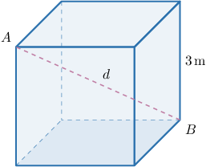
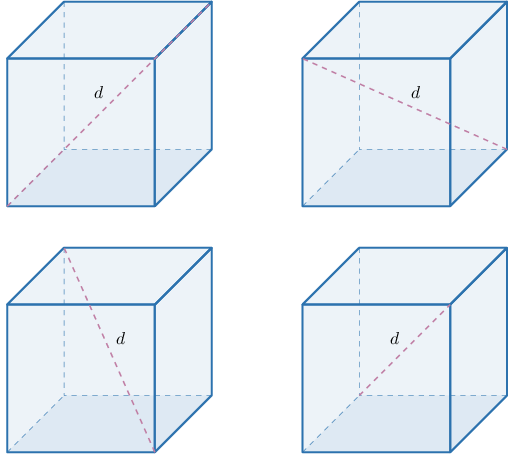
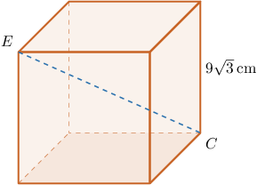
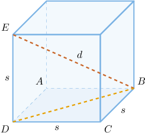
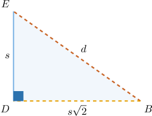

# Diagonals of Cubes

Source: https://www.mathacademy.com/topics/3622?courseId=128
Topic ID: 3622

## Prerequisites

- [Face Diagonals of Cubes](../../../traditional/lessons/geometry/1466-face-diagonals-of-cubes.md)

## Lesson

### Introduction

A **diagonal** of a cube is any line segment that joins two opposite vertices. Thus, the diagonal of a cube is the longest line segment that we can draw inside a cube.

The diagram below shows a cube with side length $s=3\,\textrm{m},$ as well as the diagonal $\overline{AB}.$ Let's denote the length of the diagonal as $d.$

The formula that relates the lengths of the diagonal and sides is given by

$$

d = s\sqrt{3}.

$$

We'll derive this formula at the end of the lesson.

For the cube above, the length of the diagonal is

$$

\begin{aligned}𝑑 & =𝑠\sqrt{√3}=3\sqrt{√3}\,m.\end{aligned}

$$

### Counting the Diagonals of a Cube

For every cube, there are precisely $4$ diagonals, and they are all congruent. The four diagonals of a cube are shown below.

### Example: Finding the Length of the Diagonals of a Cube

#### Question

What is the length of the segment $\overline{CE}$ in the cube below?

#### Explanation

Notice that $\overline{CE}$ is a diagonal of the cube.

The length of a diagonal $d$ of a cube can be found using the formula

$$

d = s\sqrt{3},

$$

where $s$ is the side length of the cube.

Substituting $s = 9\sqrt 3\,\textrm{cm}$ into the formula, we get

$$

\begin{aligned}𝑑 & =9\sqrt{√3}⋅\sqrt{√3} \\ & =9⋅(\sqrt{√3})^{2} \\ & =9⋅3 \\ & =27\,cm.\end{aligned}

$$

### Example: Finding the Side Length of a Cube Given the Length of Its Diagonal

#### Question

The diagonal of a cube is $9\, \textrm{in}.$ Find the length of the edges of the cube.

#### Explanation

Since the length of a diagonal $d$ of a cube can be found using the formula

$$

d = s \sqrt{3},

$$

where $s$ is the length of an edge, we can find $s$ as follows:

$$

s = \dfrac{d}{\sqrt{3}} = \dfrac{9}{\sqrt{3}}.

$$

Finally, we rationalize the denominator, giving

$$

\begin{aligned}𝑠 & =\frac{9}{\sqrt{√3}}⋅\frac{\sqrt{√3}}{\sqrt{√3}} \\ & =\frac{9\sqrt{√3}}{(\sqrt{√3})^{2}} \\ & =\frac{9\sqrt{√3}}{3} \\ & =3\sqrt{√3}\,in.\end{aligned}

$$

Therefore, the length of the edges is $3\sqrt{3}\,\textrm{in}.$

### Deriving the Diagonal Length Formula

Here, we will derive the formula $d=s\sqrt{3}$ that we have been using throughout this lesson.

Consider a cube of side length $s$ and diagonal length $d,$ like the one shown below.

Notice that $\triangle BDE$ is a right triangle with legs $\overline{DE}$ and $\overline{BD}$ and hypotenuse $\overline{BE}.$ From the diagram, we know that $DE = s,$ and from the face diagonal formula we know that $BD = s\sqrt 2.$

Let's draw $\triangle BDE$ and include the known information.

Finally, applying the Pythagorean theorem to this triangle, we arrive at an expression for the diagonal length $d$ in terms of $s\mathbin{:}$

$$

\begin{aligned}(𝑠\sqrt{√2})^{2}+𝑠^{2} & =𝑑^{2} \\ 2𝑠^{2}+𝑠^{2} & =𝑑^{2} \\ 3𝑠^{2} & =𝑑^{2} \\ 𝑑 & =\sqrt{√3𝑠^{2}} \\ 𝑑 & =\sqrt{√3}⋅\sqrt{√𝑠^{2}} \\ 𝑑 & =\sqrt{√3}⋅𝑠 \\ 𝑑 & =𝑠\sqrt{√3}\end{aligned}

$$

Notice that we only consider the positive square root since the diagonal length $d$ must be positive.
