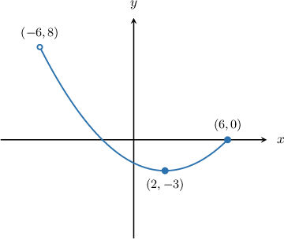
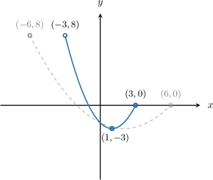
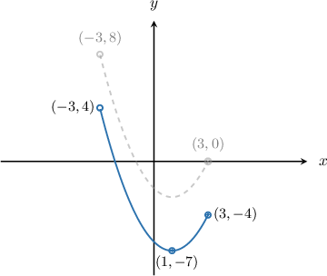
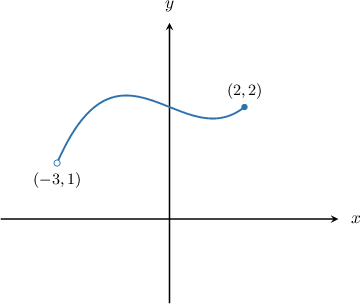
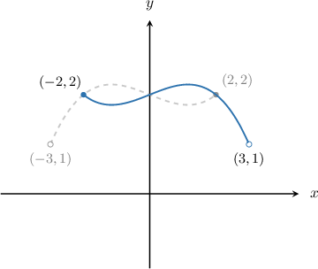
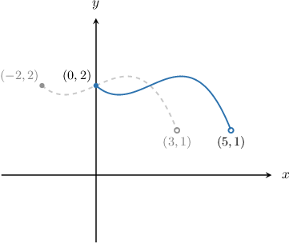
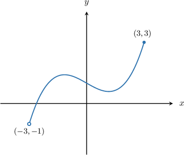
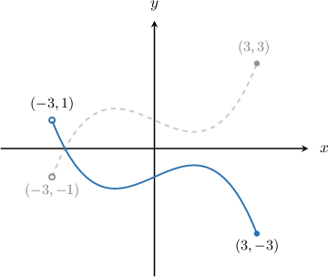
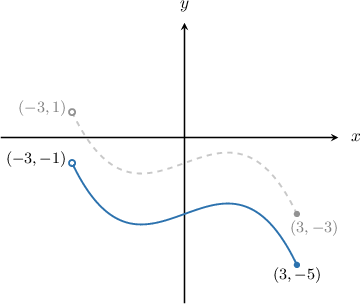

# The Domain and Range of Transformed Functions

Source: https://www.mathacademy.com/topics/3683?courseId=128
Topic ID: 3683

## Prerequisites

- [Finding Points on Transformed Curves](../../../traditional/lessons/algebra-ii/141-finding-points-on-transformed-curves.md)
- [The Range of a Function: Advanced Cases](../../../traditional/lessons/algebra-i/3728-the-range-of-a-function-advanced-cases.md)

## Lesson

### Introduction

The diagram below shows the function $y=f(x).$

Suppose we want to calculate the domain and range of $y = f(2x) -4.$ To do this, we first sketch it by applying graph transformations, and then we read the domain and range from the graph of the transformed function.

To plot the graph of $y = f(2x) -4,$ we apply the following steps:

- Take the curve $y=f(x).$

- Then, stretch the graph by a scale factor of $\dfrac{1}{2}$ parallel to the $x$-axis and get the graph of $y = f(2x).$

- Finally, we shift the result by $4$ units down and obtain the graph of $y = f(2x) -4.$

From here, we may deduce the following about the function $y=f(2x) -4\mathbin{:}$

- Its domain is $x\in (-3, 3].$

- For the range, we note the following: The minimum value is indicated by the $y$-coordinate of the point $(1, -7),$ and this value is included in the range (since this point has a filled circle). The maximum value is indicated by the $y$-coordinate of the point $(-3,4),$ and this value is *not* included in the range (since this point has an open circle). Therefore, the range is $y\in [-7, 4).$

### Example: Finding the Domain of a Transformed Function

#### Question

The diagram above shows the graph of $y=f(x).$ What is the domain of $y = f(2-x)?$

#### Explanation

First, let's write the function in a form that is convenient for transformations:

$$

y = f(2-x) = f(-(x-2))

$$

When performing graph transformations, we must remember the following rule:

1. First, we perform the transformations ** the argument of $f.$ We first carry out horizontal stretches and reflections, followed by horizontal translations.

2. Then, we perform the transformations ** the argument of $f.$ We first carry out vertical stretches and reflections, followed by vertical translations.

So, to plot the graph of $y = f(-(x-2)),$ we apply the following steps:

- Take the curve $y=f(x).$

- Then, reflect the graph across the $y$-axis and get the graph of $y = f(-x).$

- Finally, we shift the result horizontally by $2$ units to the right and obtain the graph of $y = f(-(x-2)).$

Therefore, the domain of $f(2-x)$ is $[0,5).$

### Example: Finding the Range of a Transformed Function

#### Question

The diagram above shows the graph of $y=f(x).$ What is the range of $y = -2-f(x)?$

#### Explanation

First, let's write the function in a form that is convenient for transformations:

$$

y = -2 - f(x) = - f(x) - 2.

$$

1. First, we perform the transformations ** the argument of $f.$ We first carry out horizontal stretches and reflections, followed by horizontal translations.

2. Then, we perform the transformations ** the argument of $f.$ We first carry out vertical stretches and reflections, followed by vertical translations.

So, to plot the graph of $y = -f(x) -2,$ we apply the following steps:

- Take the curve $y=f(x).$

- Then, reflect the graph across the $x$-axis and get the graph of $y = -f(x).$

- Finally, we shift the result by $2$ units down and obtain the graph of $y = -f(x) -2.$

Therefore, the range of $-f(x) -2$ is $[-5,-1).$
