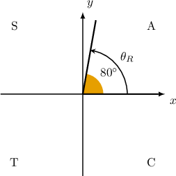
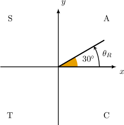
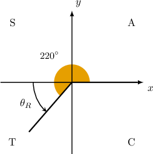
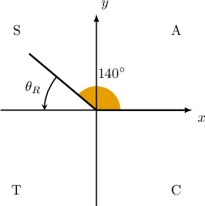
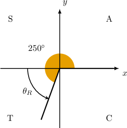
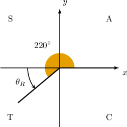

# Extending the Trigonometric Ratios to Large Angles

Source: https://www.mathacademy.com/topics/3829?courseId=128
Topic ID: 3829

## Prerequisites

- [Coterminal Angles](../../../traditional/lessons/algebra-ii/261-coterminal-angles.md)
- [Extending the Trigonometric Ratios Using Angles in Radians](../../../traditional/lessons/algebra-ii/4037-extending-the-trigonometric-ratios-using-angles-in-radians.md)

## Lesson

### Introduction

Recall that the **reference angle** $\theta_R$ of a given angle $\theta$ is the positive acute angle $\theta$ makes with the $x$-axis.

Reference angles can be used to evaluate trigonometric functions for large angles. In this lesson, we'll learn how to express trigonometric ratios of large angles in terms of reference angles.

As an example, let's write the following trigonometric ratio in terms of a reference angle:

$$

\sin{440^\circ}

$$

To express this trigonometric ratio in terms of a reference angle, we first find the corresponding *coterminal angle* that lies in the range $[0^\circ, 360^\circ).$ We do this by subtracting integer multiples of $360^\circ$ as many times as necessary until we get our coterminal angle:

$$

440^\circ - 360^\circ = 80^\circ \quad{\color{green}{\checkmark}}

$$

Now, notice that our coterminal angle is acute and lies in the first quadrant. Therefore, $\theta_R = 80^\circ,$ and we conclude that

$$

\sin 440^\circ = \sin 80^\circ .

$$

### Example: Expressing Large Angles in the First Quadrant in Terms of Reference Angles

#### Question

What is $\cos 750^\circ$ expressed in terms of a reference angle?

#### Explanation

We wish to express $\cos 750^\circ$ in terms of $\cos\theta_R,$ where $\theta_R$ is the reference angle corresponding to the angle $\theta = 750^\circ.$

First, we find an angle that's coterminal with $750^\circ$ that lies in the range $[0, 360^\circ).$ We do this by subtracting integer multiples of $360^\circ$ until we get our desired angle:

$$

\begin{aligned}750^{∘}−360^{∘} & =390^{∘} \\ 750^{∘}−2⋅360^{∘} & =30^{∘}\,✓\end{aligned}

$$

Notice that our coterminal angle is acute and lies in the first quadrant. Therefore, $\theta_R = 30^\circ,$ and we conclude that

$$

\cos 750^\circ = \cos 30^\circ.

$$

### Large Angles Outside the First Quadrant

Suppose we're given a large angle $\theta$ that does *not* lie in the first quadrant. In these cases, the procedure for expressing a trigonometric ratio evaluated at $\theta$ in terms of $\theta_R$ is similar to what we saw previously. However, we also need to consider the *sign* of the trigonometric ratio in the quadrant where $\theta$ lies.

As an example, let's express the following trigonometric ratio in terms of a reference angle:

$$

\sin{940^\circ}

$$

To do this, we follow three steps:

- **Step 1**: Find an angle that's coterminal with $940^\circ$ and lies in the range $[0^\circ, 360^\circ).$ We do this by subtracting integer multiples of $360^\circ$ until we get our desired angle: Therefore, A sketch of our angle and its corresponding reference angle is shown below.

- **Step 2**: Compute the reference angle. Since $\theta = 220^\circ$ is in the $3$rd quadrant, the reference angle is

- **Step 3**: Determine the correct sign. The sine function is negative $({\color{red}{-}})$ in the third quadrant. Therefore,

So, we conclude that

$$

\sin 940^\circ = -\sin{40^\circ}.

$$

### Example: Expressing the Sine of a Large Angle in Terms of a Reference Angle

#### Question

What is $\sin 860^\circ$ expressed in terms of a reference angle?

#### Explanation

We wish to express $\sin 860^\circ$ in terms of $\sin\theta_R,$ where $\theta_R$ is the reference angle corresponding to the angle $\theta = 860^\circ.$

To express $\sin 860^\circ$ in terms of $\sin\theta_R,$ we proceed as follows:

- **** Find an angle that's coterminal with $860^\circ$ that lies in the range $[0, 360^\circ).$ We do this by subtracting integer multiples of $360^\circ$ until we get our desired angle: Therefore,

- ****: Compute the reference angle. Since $\theta = 140^\circ$ is in the $2$nd quadrant, the reference angle is

- ****: Determine the correct sign. The sine function is positive $({\color{blue}{+}})$ in the second quadrant. Therefore,

So, we conclude that

$$

\sin 860^\circ = \sin 40^\circ.

$$

### Example: Expressing the Cosine of a Large Angle in Terms of a Reference Angle

#### Question

What is $\cos 970^\circ$ expressed in terms of a reference angle?

#### Explanation

We wish to express $\cos 970^\circ$ in terms of $\cos \theta_R,$ where $\theta_R$ is the reference angle corresponding to the angle $\theta = 970^\circ.$

To express $\cos 970^\circ$ in terms of $\cos\theta_R,$ we proceed as follows:

- ****: Find the corresponding coterminal angle that lies in the range $[0^\circ, 360^\circ).$ We do this by subtracting integer multiples of $360^\circ$ until we get our desired angle. Therefore,

- ****: Compute the reference angle. Since $\theta = 250^\circ$ is in the $3$rd quadrant, the reference angle is

$$

\theta_R = 250^\circ - 180^\circ= 70^\circ

$$

- ****: Determine the correct sign. The cosine function is negative $({\color{red}{-}})$ in the third quadrant. Therefore,

So, we conclude that

$$

\cos 970^\circ = -\cos 70^\circ.

$$

### Example: Expressing the Tangent of a Large Angle in Terms of a Reference Angle

#### Question

What is $\tan 580^\circ$ expressed in terms of a reference angle?

#### Explanation

We wish to express $\tan 580^\circ$ in terms of $\tan\theta_R,$ where $\theta_R$ is the reference angle corresponding to the angle $\theta = 580^\circ.$

To express $\tan 580^\circ$ in terms of $\tan\theta_R,$ we proceed as follows:

- ****: Find the corresponding coterminal angle that lies in the range $[0^\circ, 360^\circ).$ We do this by subtracting integer multiples of $360^\circ$ until we get our desired angle. Therefore,

- ****: Compute the reference angle. Since $\theta = 220^\circ$ is in the $3$rd quadrant, the reference angle is

- ****: Determine the correct sign. The tangent function is positive $({\color{blue}{+}})$ in the third quadrant. Therefore,

So, we conclude that

$$

\tan 580^\circ = \tan 40^\circ.

$$
