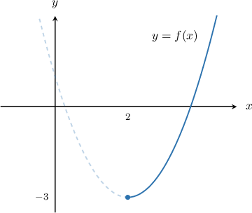

# Inverses of Quadratic Functions

Source: https://www.mathacademy.com/topics/3830?courseId=128
Topic ID: 3830

## Prerequisites

- [Calculating the Inverse of a Function](../../../traditional/lessons/algebra-ii/627-calculating-the-inverse-of-a-function.md)
- [Domain and Range of Quadratic Functions](../../../traditional/lessons/algebra-i/1882-domain-and-range-of-quadratic-functions.md)
- [Domain and Range of Inverse Functions](../../../traditional/lessons/algebra-ii/3734-domain-and-range-of-inverse-functions.md)
- [Completing the Square With Leading Coefficients](../../../traditional/lessons/algebra-i/3824-completing-the-square-with-leading-coefficients.md)

## Lesson

### Introduction

Recall that for a function to be invertible on an interval, it must be one-to-one on the interval. So, to calculate the inverse of a quadratic function, we must first restrict its domain.

As an example, let's consider the following quadratic function:

$$

f(x)=(x-2)^2-3

$$

Since the function is in vertex form, we can immediately see that the vertex of the corresponding parabola $y=f(x)$ is located at $(2,-3).$ Therefore, the function $f(x)$ will be one-to-one if we restrict its domain to either $x\leq 2$ or $x\geq 2.$

Let's restrict the domain to $x\geq 2.$ The graph of $y=f(x)$ for $x\geq 2$ is shown below.

Now that $f(x)$ is one-to-one, we can calculate its inverse. We follow the four usual steps:

**Step 1:** Replace $f(x)$ with $y.$

$$

y = (x-2)^2 - 3

$$

**Step 2:** Swap $x$ and $y.$

$$

x = (y-2)^2 - 3

$$

**Step 3:** Solve for $y.$

$$

\begin{aligned}𝑥 & =(𝑦−2)^{2}−3 \\ 𝑥+3 & =(𝑦−2)^{2} \\ \sqrt{√𝑥+3} & =𝑦−2 \\ \sqrt{√𝑥+3}+2 & =𝑦\end{aligned}

$$

**Watch out!** The *domain* of the original function is the *range* of the inverse function. In our case, since the domain of $f$ is $x \geq 2,$ the range of the inverse must be $f^{-1} \geq 2.$ Therefore, we select the positive square root in the third step above. Indeed, notice that $\sqrt{x + 3} +2 \geq 2.$

**Step 4:** Replace $y$ with $f^{-1}(x).$

$$

f^{-1}(x) = \sqrt{x + 3} +2

$$

We're done!

### Example: Quadratic Functions Containing an Isolated Perfect Square

#### Question

What is the inverse of $f(x) = (x+4)^2 -3$ for $x\geq -4?$

#### Explanation

To find the inverse of a function, we follow these steps:

**** Replace $f(x)$ with $y$:

$$

y = (x+4)^2 -3

$$

**** Swap $x$ and $y$:

$$

x = (y+4)^2 -3

$$

**** Solve for $y$:

$$

\begin{aligned}𝑥 & =(𝑦+4)^{2}−3 \\ 𝑥+3 & =(𝑦+4)^{2} \\ \sqrt{√𝑥+3} & =𝑦+4 \\ \sqrt{√𝑥+3}−4 & =𝑦\end{aligned}

$$

Notice that we take the positive square root because if $x \geq -4$ is the domain of $f,$ then the range of the inverse is $f^{-1} \geq -4.$

**** Replace $y$ with $f^{-1}(x)$:

$$

f^{-1}(x) = \sqrt{x + 3} - 4

$$

### Example: Finding the Inverse by Completing the Square

#### Question

What is the inverse of $f(x) = -x^2 + 2x + 6$ for $x\geq 1?$

#### Explanation

First, we complete the square:

$$

\begin{aligned}𝑓(𝑥) & =−𝑥^{2}+2𝑥+6 \\ & =−(𝑥^{2}−2𝑥)+6 \\ & =−(𝑥^{2}−2⋅𝑥+1^{2}−1^{2})+6 \\ & =−((𝑥−1)^{2}−1)+6 \\ & =−(𝑥−1)^{2}+1+6 \\ & =−(𝑥−1)^{2}+7\end{aligned}

$$

To find the inverse of a function, we follow these steps:

**** Replace $f(x)$ with $y.$

$$

y = -(x-1)^2+ 7

$$

**** Swap $x$ and $y.$

$$

x = -(y-1)^2+ 7

$$

**** Solve for $y.$

$$

\begin{aligned}𝑥 & =−(𝑦−1)^{2}+7 \\ 𝑥−7 & =−(𝑦−1)^{2} \\ 7−𝑥 & =(𝑦−1)^{2} \\ \sqrt{√7−𝑥} & =𝑦−1 \\ \sqrt{√7−𝑥}+1 & =𝑦\end{aligned}

$$

Note that we selected the positive square root because if the domain of $f(x)$ is $x \geq 1,$ then the range of $f^{-1}(x)$ is $f^{-1} \geq 1.$

**** Replace $y$ with $f^{-1}(x).$

$$

f^{-1}(x) = \sqrt{7-x } +1

$$

### Example: The Negative Square Root Case

#### Question

Find the inverse of the function $f(x) = (x - 3)^2 - 2$ for $x \leq 3.$

#### Explanation

To find the inverse of a function, we follow these steps:

**** Replace $f(x)$ with $y{:}$

$$

y = (x-3)^2 - 2

$$

**** Swap $x$ and $y{:}$

$$

x = (y - 3)^2 - 2

$$

**** Solve for $y{:}$

$$

\begin{aligned}𝑥 & =(𝑦−3)^{2}−2 \\ 𝑥+2 & =(𝑦−3)^{2} \\ −\sqrt{√𝑥+2} & =𝑦−3 \\ 3−\sqrt{√𝑥+2} & =𝑦\end{aligned}

$$

Notice that we take the negative square root because if $x \leq 3$ is the domain of $f,$ then the range of the inverse is $f^{-1} \leq 3.$

**** Replace $y$ with $f^{-1}(x){:}$

$$

f^{-1}(x) = 3 - \sqrt{x + 2}

$$
