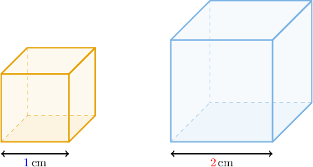
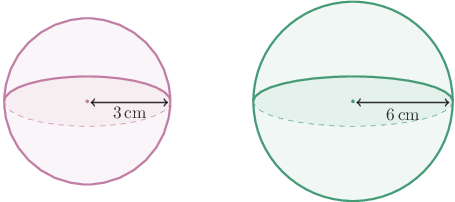
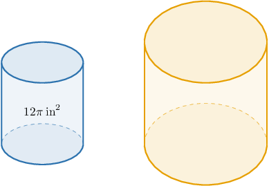
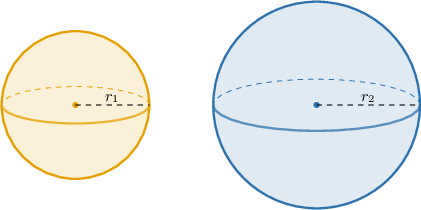
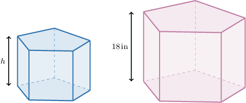

# Surface Areas and Volumes of Similar Solids

Source: https://www.mathacademy.com/topics/504?courseId=128
Topic ID: 504

## Prerequisites

- [Surface Areas of Cubes](../../../traditional/lessons/geometry/681-surface-areas-of-cubes.md)
- [Volumes of Cubes](../../../traditional/lessons/geometry/1467-volumes-of-cubes.md)
- [Working With Areas of Similar Polygons](../../../traditional/lessons/geometry/2941-working-with-areas-of-similar-polygons.md)

## Lesson

### Introduction

In this lesson, we'll explore the relationship between surface areas and volumes of similar three-dimensional objects.

We start by stating the relationship between the surface areas of similar shapes:

*If the lengths of a three-dimensional object are enlarged by a scale factor of $k,$ then the surface area of the new shape will be enlarged by a scale factor of $k^2.$*

Consider the following (similar) cubes.

For the smaller cube, the area of each face is $1\,\text{cm}\cdot 1\,\text{cm} = 1\,\text{cm}^2,$ so the total surface area $\mathcal A_S$ is

$$

\mathcal A_{S} = 6\cdot 1\,\text{cm}^2 = 6\,\text{cm}^2.

$$

The scale factor is

$$

k = \dfrac{{\color{red}{2}}\,\text{cm}}{{\color{blue}{1}}\,\text{cm}} = 2.

$$

Therefore, using the fact that $k=2,$ we can compute the surface area of the larger cube as follows:

$$

\begin{aligned}A_{𝐿} & =𝑘^{2}⋅A_{𝑆} \\ & =2^{2}⋅6\,cm^{2} \\ & =4⋅6\,cm^{2} \\ & =24\,cm^{2}\end{aligned}

$$

We can verify that this is correct by computing the surface area of the larger cube directly. Since the area of each face is $2\,\text{cm}\cdot 2\,\text{cm} = 4\,\text{cm}^2,$ the total surface area $\mathcal A_L$ is

$$

\mathcal A_{L} = 6\cdot 4\,\text{cm}^2 = 24\,\text{cm}^2

$$

which agrees with our previous calculation.

### Volumes of Similar Solids

We now move on to the relationship between the *volumes* of similar shapes:

*If the lengths of a three-dimensional object are enlarged by a scale factor of $k,$ then the volume of the new shape will be enlarged by a scale factor of $k^3.$*

Let's consider our cubes once more.

The total volume of the smaller cube $V_S$ is

$$

V_{S} = (1\,\text{cm})^3 = 1\,\text{cm}^3.

$$

The scale factor is

$$

k = \dfrac{{\color{red}{2}}\,\text{cm}}{{\color{blue}{1}}\,\text{cm}} = 2.

$$

Using the fact that $k=2,$ we can compute the volume of the larger cube as follows:

$$

\begin{aligned}𝑉_{𝐿} & =𝑘^{3}⋅𝑉_{𝑆} \\ & =2^{3}⋅1\,cm^{3} \\ & =8⋅1\,cm^{3} \\ & =8\,cm^{3}\end{aligned}

$$

We can verify that this is correct by computing the volume of the larger cube directly.

$$

V_{L} = (2\,\text{cm})^3 = 8\,\text{cm}^3

$$

which agrees with our previous calculation.

### Important Similar Solids

Before we move on, we should note the following important results.

- All spheres are similar.

- By extension, all hemispheres are similar, all quarter-spheres are similar, and all one-eighth spheres are similar.

- All cubes are similar.

### Example: Computing a Ratio of Two Surface Areas or Volumes

#### Question

Consider the two spheres above (picture not to scale). What is the ratio of the larger sphere's volume to the smaller one's?

#### Explanation

Recall that all spheres are similar.

If two solids are similar with scale factor $k,$ then the ratio of the corresponding volumes equals $k^3.$

Here, the larger solid is similar to the smaller one with a scale factor of

$$

k = \dfrac{6\,\text{cm}}{3\,\text{cm}} = 2.

$$

Thus, the volume of the larger solid is

$$

k^3=2^3=8

$$

times bigger than the volume of the smaller one.

Therefore, the ratio of the larger volume to the smaller is $8:1.$

### Example: Computing Surface Areas and Volumes

#### Question

The two right cylinders above are similar with a scale factor $k=2$ (not drawn to scale). What is the surface area of the larger cylinder if the surface area of the smaller one is $12\pi \: \text{in}^2?$

**

#### Explanation

If two solids are similar with scale factor $k,$ then the ratio of the corresponding surface areas equals $k^2.$

Therefore, $k^2 = 2^2 = 4,$ and we have

$$

\dfrac{\mathcal{A}_{\text{larger}}}{\mathcal{A}_{\text{smaller}}} = 4.

$$

Solving for $\mathcal{A}_{\text{larger}}$ and substituting $\mathcal{A}_{\text{smaller}} = 12\pi\,\text{in}^2,$ we have

$$

\begin{aligned}A_{larger} & =4⋅A_{smaller} \\ & =4⋅12𝜋\,in^{2} \\ & =48𝜋\,in^{2}.\end{aligned}

$$

### Example: Computing Scale Factors Given Surface Areas and Volumes

#### Question

Consider the two spheres above (picture not to scale). If the volume of the smaller sphere is equal to and the volume of the larger sphere is what is the ratio of the radii and for these solids? Round your answer to one decimal place.

#### Explanation

Recall that all spheres are similar.

If two solids are similar with scale factor then the ratio of the corresponding volumes equals

Computing the ratio of the volumes, we have

This means that the solids are similar with a scale factor of

Thus, the radius is times larger than the radius Therefore,

### Example: Working With Surface Areas and Volumes of Similar Solids

#### Question

The height of the larger pentagonal prism is $18\, \text{in}.$ The ratio of the surface area of the smaller prism to the surface area of the larger prism is $49:81$ (not drawn to scale). Given that the two prisms are similar, what is the height of the smaller prism?

#### Explanation

If two solids are similar with scale factor $k$, then the ratio of the corresponding surface areas equals $k^2.$

We are told that

$$

\dfrac{\mathcal{A}_{\text{smaller}}}{\mathcal{A}_{\text{larger}}} = \dfrac{49}{81}.

$$

So, we have that

$$

k^2 = \dfrac{49}{81}\quad\Rightarrow\quad k = \sqrt{\dfrac{49}{81}} = \dfrac{7}{9}.

$$

Thus, the height of the smaller prism is $\dfrac{7}{9}$ times the height of the larger prism. Therefore, the height of the smaller prism is

$$

h = 18 \cdot \dfrac{7}{9} = 14 \,\text{in}.

$$
