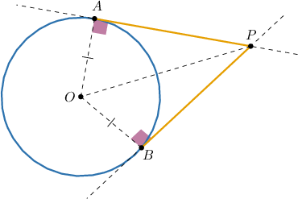
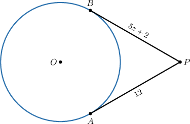
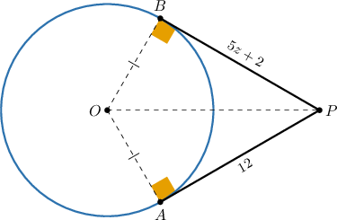
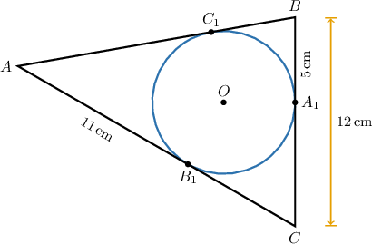
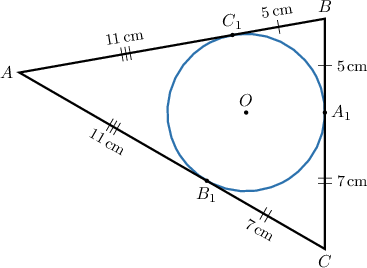
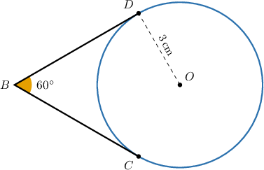
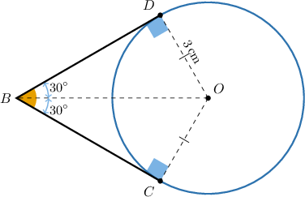

# Tangent-Tangent Lines to Circles

Source: https://www.mathacademy.com/topics/514?courseId=128
Topic ID: 514

## Prerequisites

- [30-60-90 Triangles](../../../traditional/lessons/geometry/262-30-60-90-triangles.md)
- [Isosceles Right Triangles](../../../traditional/lessons/geometry/263-isosceles-right-triangles.md)
- [Tangent Lines to Circles](../../../traditional/lessons/geometry/578-tangent-lines-to-circles.md)
- [The HL Congruence Criterion](../../../traditional/lessons/geometry/1521-the-hl-congruence-criterion.md)

## Lesson

### Introduction

In the diagram above, two tangents to the circle meet at the point $P.$ The segments $\overline{AP}$ and $\overline{BP}$ are called **tangent segments** to the circle.

Note the following:

- Since $\overline{AP}$ and $\overline{BP}$ are tangent segments, we have that $\angle OAP$ and $\angle OBP$ are right angles.

- $\overline{OA}$ and $\overline{OB}$ are congruent because they are radii of the circle.

- $OP$ is a common hypotenuse of $\triangle OAP$ and $\triangle OBP.$

Therefore, $\triangle{OAP}$ and $\triangle{OBP}$ are also congruent by the HL (Hypotenuse-Leg) criterion.

$$

\triangle OAP \cong \triangle OBP

$$

As a consequence, we obtain

$$

AP = BP.

$$

To summarize, we have the following important property:

Two tangent segments with a common endpoint in a circle's exterior are congruent.

### Example: Applying the Tangent-Tangent Theorem

#### Question

Given that $\overset{\longleftrightarrow}{PA}$ and $\overset{\longleftrightarrow}{PB}$ are tangents to the circle at $A$ and $B,$ respectively, what is the value of $z?$

#### Explanation

Since $\overset{\longleftrightarrow}{PA}$ and $\overset{\longleftrightarrow}{PB}$ are tangent to the circle, we have that

- $m\angle{OAP}=m\angle{OBP}=90^\circ,$ and

- $\overline{OA} \cong \overline{OB}$ are radii of the circle.

Therefore, $\triangle{OAP}$ and $\triangle{OBP}$ are congruent by HL (Hypotenuse-Leg):

$$

\triangle OAP \cong \triangle OBP .

$$

As a consequence, the tangent segments $\overline{PB}$ and $\overline{PA}$ are congruent, and we obtain

$$

\begin{aligned}𝑃𝐵 & =𝑃𝐴 \\ 5𝑧+2 & =12 \\ 5𝑧 & =10 \\ 𝑧 & =2.\end{aligned}

$$

### Example: Finding Side Lengths of Triangles With Sides Tangent to a Circle

#### Question

The circle above touches the sides of the triangle at the points $A_1,$ $B_1,$ and $C_1.$ Find the perimeter of $\triangle{ABC}.$

#### Explanation

First, notice that

$$

CA_1 = CB - BA_1 = 12 - 5 = 7\,\text{cm}.

$$

Now, since $\overset{\longleftrightarrow}{AB},$ $\overset{\longleftrightarrow}{BC},$ and $\overset{\longleftrightarrow}{AC}$ are tangent to the circle, then we get three pairs of congruent tangent segments:

$$

AB_1 \cong AC_1, \quad BA_1 \cong BC_1, \quad CA_1 \cong CB_1.

$$

As a consequence,

$$

\begin{aligned}𝐴𝐵 & =𝐴𝐶_{1}+𝐵𝐶_{1} \\ & =11+5 \\ & =16\,cm, \\ 𝐴𝐶 & =𝐴𝐵_{1}+𝐶𝐵_{1} \\ & =11+7 \\ & =18\,cm.\end{aligned}

$$

Finally, the required perimeter is

$$

\begin{aligned}𝑝 & =𝐴𝐵+𝐵𝐶+𝐶𝐴 \\ & =16+12+18 \\ & =46\,cm.\end{aligned}

$$

### Example: The Distance Between a Circle's Center and the Intersection of Two Tangents

#### Question

In the picture above, $\overset{\longleftrightarrow}{BC}$ and $\overset{\longleftrightarrow}{BD}$ are tangents to the circle at $C$ and $D,$ respectively. If $OD=3\,\text{cm},$ what is the value of $OB?$

#### Explanation

Since $\overset{\longleftrightarrow}{BC}$ and $\overset{\longleftrightarrow}{BD}$ are tangent to the circle, then

- $m\angle{OCB}=m\angle{ODB}=90^\circ,$ and

- $\overline{OC} \cong \overline{OD}$ are radii of the circle.

Therefore, $\triangle{OCB}$ and $\triangle{ODB}$ are congruent by HL (Hypotenuse-Leg).

As a consequence, we obtain

$$

\begin{aligned}𝑚∠𝐷𝐵𝑂 & =𝑚∠𝐶𝐵𝑂 \\ & =\frac{𝑚∠𝐷𝐵𝐶}{2} \\ & =\frac{60^{∘}}{2} \\ & =30^{∘}.\end{aligned}

$$

So $\triangle{ODB}$ is a right $30^\circ$-$60^\circ$-$90^\circ$ triangle, and therefore its hypotenuse is twice the length of its shortest leg:

$$

OB = 2 \cdot OD = 2 \cdot 3 = 6 \,\text{cm}.

$$
