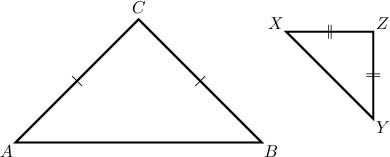
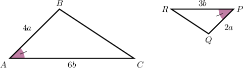
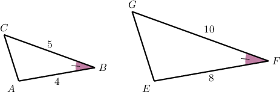
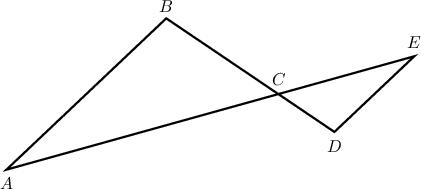
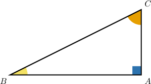
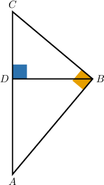

# Proving Similarity Statements

Source: https://www.mathacademy.com/topics/5188?courseId=128
Topic ID: 5188

## Prerequisites

- [Proving Triangle Theorems](../../../traditional/lessons/geometry/508-proving-triangle-theorems.md)
- [Combining Similarity Criteria for Triangles](../../../traditional/lessons/geometry/4065-combining-similarity-criteria-for-triangles.md)

## Lesson

### Introduction

In this lesson, we'll learn how to prove statements concerning similar triangles.

Consider the following diagram.

Suppose we're given that

$$

\dfrac{AB}{XY} = \dfrac{AC}{XZ}

$$

and we wish to prove the following statement:

$\triangle{ABC} \sim \triangle{XYZ}$

We can prove this statement using the SSS similarity criterion as follows:

- **Step 1**: We are *given* that $AC = BC.$

- **Step 2**: We are *given* that $XZ = YZ.$

- **Step 3**: By the multiplication principle, we can divide the equation from step 1 by the equation from step 2. This gives

- **Step 4**: We are *given* that

- **Step 5**: From steps 4 and 3, respectively, we have Therefore, by the *transitive property of equality*, we have

- **Step 6**: The equation in step 5 shows that the sides of $\triangle{ABC}$ are proportional to the sides of $\triangle{XYZ}.$ Therefore, by the *SSS criterion*, we conclude that as required.

### Stating the Full Proof Using the Two-Column Format

The table below shows our proof in a two-column format.

Let's now consider a proof that uses another similarity criterion.

### Example: Proving Two Triangles are Similar

#### Question

Given the diagram above, consider the following statement:

$$

\triangle{ABC} \sim \triangle{PQR}.

$$

The table below gives the proof of the statement. Fill in the table and thus complete the proof.

#### Explanation

The correct proof is shown below.

Let's examine the rows of the table with missing parts in turn.

- Consider row 1. From the diagram, we have $AB=4a$ and $PQ=2a.$ Thus, by substitution, we get that

- Consider row 3. From rows 1 and 2, we have Therefore, by the transitive property of equality

- Consider row 5. In rows 3 and 4, we are given that the angles $\angle{A}$ and $\angle{P}$ are congruent and that their corresponding sides are proportional. Therefore, $\triangle{ABC} \sim \triangle{PQR}$ by the SAS similarity criterion.

### CPSTP and Corresponding Angles in Similar Triangles

We must now discuss a theorem that's often abbreviated to **CPSTP**:

*Corresponding parts of similar triangles are proportional.*

When two triangles are shown to be similar using a similarity criterion, CPSTP allows us to conclude that all corresponding *sides* of those triangles are in proportion. This theorem is often used in the final step of a geometric proof after establishing triangle similarity.

To demonstrate, consider the following triangles.

We won't prove this formally, but it's easy to see that since

$$

\dfrac{EF}{AB} = \dfrac{FG}{BC} = 2, \qquad \angle ABC\cong\angle EFG

$$

we have that $\triangle ABC \sim \triangle EFG$ by the SAS similarity criterion.

Now that triangle similarity has been established, we can use CPSTP to give the relationship between the remaining sides. In this case, CPSTP tells us that

$$

\dfrac{EG}{AC} = 2.

$$

Another criterion, known as **corresponding angles in similar triangles,** tells us that the remaining pairs of *angles* are congruent. In this case, we have

$$

\angle A\cong \angle E, \qquad \angle C\cong \angle G.

$$

To summarize, when triangle similarity has been established, we use

- CPSTP to write down the relationship between the remaining *sides*, and

- *corresponding angles in similar triangles* to write down the relationship between the remaining *angles.*

### Example: Proving Statements About Similar Triangles

#### Question

In the diagram above, we have

$$

\overset{\longleftrightarrow}{AB} \parallel \overset{\longleftrightarrow}{DE}.

$$

Consider the following statement:

$$

\dfrac{AC}{EC} = \dfrac{BC}{DC}.

$$

The table below gives the proof of the statement. Fill in the table and thus complete the proof.

#### Explanation

The correct proof is shown below.

Let's examine the rows of the table with missing parts in turn.

- Consider row 2. We are given that the lines $\overset{\longleftrightarrow}{AB}$ and $\overset{\longleftrightarrow}{DE}$ are parallel. This means $\angle{A}$ and $\angle{E}$ are alternate interior angles, as are $\angle{B}$ and $\angle{D}.$ Therefore, $\angle{A} \cong \angle{E}$ and $\angle{B} \cong \angle{D}$ by the alternate interior angles theorem.

- Consider row 3. From row 2, we know that the triangles $\triangle{ABC}$ and $\triangle{EDC}$ have two pairs of congruent angles: $\angle{A} \cong \angle{E}$ and $\angle{D} \cong \angle{C}.$ Therefore, $\triangle{ABC} \sim \triangle{EDC}$ by the AA similarity criterion.

- Consider row 4. From row 3, we know that $\triangle{ABC} \sim \triangle{EDC}.$ So, the corresponding parts of these triangles are proportional (CPSTP). In particular, we have that

### Tools for Proving Similarity Statements

Finally, we'll prove some statements about similar *right* triangles. Before we do, let's state some tools we've seen before that will help us.

- The right angle postulate: *All right angles are congruent.*

- The definition of perpendicular lines. *Two lines are perpendicular if they form a right angle at their intersection point.*

We also have the following theorem:

*The acute angles in a right triangle sum to $90^\circ.$*

It's easy to see why this theorem is true. Suppose we have a right triangle $\triangle ABC,$ as shown below.

The sum of the interior angles in a triangle sum to $180^\circ{:}$

$$

m\angle A + m\angle B + m\angle C = 180^\circ

$$

However, since this triangle is right, we have $m\angle A = 90^\circ.$ Substituting this into the above, we get

$$

90^\circ + m\angle B + m\angle C = 180^\circ,

$$

which simplifies as

$$

m\angle B + m\angle C = 90^\circ.

$$

### Example: Proofs Using Similarity in Right Triangles

#### Question

In the diagram above, $\overline{AB} \perp \overline{BC}$ and $\overline{BD} \perp \overline{AC}.$

Consider the following statement:

**

The table below gives the proof of the statement. Fill in the table and thus complete the proof.

#### Explanation

The correct proof is shown below.

Let's examine the rows of the table with missing parts in turn.

- Consider row 1. We have that $\angle{C} \cong \angle{C}$ by the reflexive property of congruence.

- Consider row 4. From row 2, we have that $\overline{AB} \perp \overline{BC}.$ Therefore, by the definition of perpendicular lines, the angles formed by these lines have a measure of $90^\circ.$ So, $\angle{ABC}$ is a right angle.

- Consider row 5. From row 3, we have that $\overline{BD} \perp \overline{AC}.$ Therefore, by the definition of perpendicular lines, the angles formed by these lines have a measure of $90^\circ.$ So, $\angle{BDC}$ is a right angle.

- Consider row 7. From row 1, we know that $\angle{C} \cong \angle{C}.$ And from row 6, we know that $\angle{ABC} \cong \angle{BDC}.$ These are the corresponding pairs of congruent angles from $\triangle{ABC}$ and $\triangle{BDC}.$ Therefore, $\triangle{ABC} \sim \triangle{BDC}$ by the AA similarity criterion.
