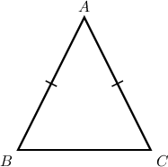
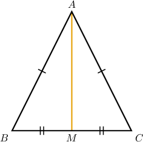
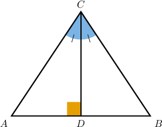
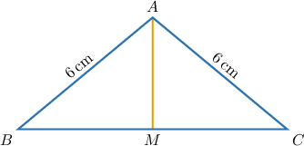
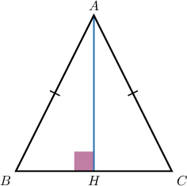

# Proofs Involving Isosceles Triangles

Source: https://www.mathacademy.com/topics/542?courseId=128
Topic ID: 542

## Prerequisites

- [The Isosceles Triangle Theorem](../../../../middle-school/lessons/grade-8/1403-the-isosceles-triangle-theorem.md)
- [Proving Perpendicular Line Theorems](../../../traditional/lessons/geometry/5135-proving-perpendicular-line-theorems.md)

## Lesson

### Introduction

In this lesson, we'll learn how to prove statements about isosceles triangles.

We begin by stating and proving the *isosceles triangle theorem*:

*If a triangle is isosceles, then the base angles are congruent.*

To prove this theorem, consider the isosceles $\triangle{ABC}$ below, where $\overline{AB} \cong \overline{AC}.$

Our goal is to prove the following:

$\angle B \cong \angle C$

Our strategy for proving this theorem is to split this isosceles triangle into two congruent triangles and then use CPCTC to show that the base angles are congruent.

We complete the proof as follows:

- **Step 1**: We start by *constructing* the median $\overline{AM}$ joining the vertex $A$ with the midpoint $M$ of the side $\overline{BC}.$

- **Step 2**: We're *given* that the segments $\overline{AB}$ and $\overline{AC}$ are congruent.

- **Step 3**: By the *definition of a median,* we have that $M$ is the midpoint of $\overline{BC}.$

- **Step 4**: By the *definition of a midpoint*, we have

- **Step 5**: By the *definition of congruent segments*, it follows that

- **Step 6**: By the *reflexive property of congruence*, $\overline{AM}$ is congruent to itself.

- **Step 7**: From steps 2 and 5, we have Also, the segment $\overline{AM}$ is a common side of $\triangle{ABM}$ and $\triangle{ACM},$ and $\overline{AM} \cong \overline{AM}$ from step 6. So, we have three pairs of congruent sides. Therefore, by the *SSS criterion*, we obtain that

- **Step 8**: Finally, we conclude that by *CPCTC*, as required.

### Stating the Full Proof Using the Two-Column Format

The table below shows the proof of the isosceles triangle theorem in a two-column format.

### Example: Partial Proofs Involving Isosceles Triangles

#### Question

In the diagram above, $\overline{CD} \perp \overline{AB}$ and $\angle{ACD} \cong \angle BCD.$

Consider the following statement:

**

The table below gives the proof of the statement. Fill in the empty rows of the table with the correct reasons and thus complete the proof.

#### Explanation

The correct proof is shown below.

Let's examine the rows of the table with missing parts in turn.

- Consider row 3. From row 2, we have that $\angle{CDA}$ and $\angle{CDB}$ are right angles. Therefore, $\angle{CDA}\cong \angle{CDB}$ by the right angle postulate.

- Consider row 6. From rows 3, 4, and 5, we have Therefore, $\triangle ACD \cong \triangle BCD$ by the ASA criterion.

- Consider row 8. From row 7, the segments $\overline{AC}$ and $\overline{BC}$ are congruent. Therefore, by definition of congruent segments, these segments have the same measure.

### Example: Partial Proofs Involving Isosceles Triangles, Midpoints and Bisectors

#### Question

Consider the following statement:

**

The table below gives the proof of the statement. Select the correct options in the table and thus complete the proof.

#### Explanation

Let's examine the rows of the table with missing parts in turn.

- Consider row 2. From row 1, we have that $BM=CM$ Therefore, $\overline{BM} \cong \overline{CM}$ by the definition of congruent segments.

- Consider row 5. From rows 3 and 4, we have that $AB=6\,\text{cm}=AC.$ Therefore, $AB=AC$ by the transitive property of equality.

- Consider row 7. Since every segment is congruent with itself, by the reflexive property of congruence, $\overline{AM} \cong \overline{AM}.$

- Consider row 8. From rows 2, 6, and 7, we have Therefore, $\triangle ABM \cong \triangle ACM$ by the SSS criterion.

### Example: Constructing Complete Proofs of Statements Involving Isosceles Triangles

#### Question

In the diagram above, $\overline{AH} \perp \overline{BC},$ and $\overline{AB} \cong \overline{AC}.$

Consider the following statement:

**

The table below gives the proof of the statement. Select the correct options in the table and thus complete the proof.

#### Explanation

Let's examine each row in turn.

1. We are given that $\overline{AH} \perp \overline{BC}.$ Therefore, $\angle{AHB}$ and $\angle{AHC}$ are right angles by the definition of perpendicular lines.

2. By the definition of a right triangle, we have from row 1 that $\triangle{AHB}$ and $\triangle{AHC}$ are right triangles.

3. We are given that $\overline{AB} \cong \overline{AC}$ in the question stem.

4. The reflexive property of congruence states that every segment is congruent to itself. Therefore, $\overline{AH} \cong \overline{AH}.$

5. From rows 2, 3, and 4, we have that $\triangle{ABH}$ and $\triangle{ACH}$ are right triangles, and Therefore, $\triangle{AHB} \cong \triangle{AHC}$ by the HL criterion.

6. From row 5, we have $\triangle AH{\color{blue}B} \cong \triangle AH{\color{blue}C}.$ Therefore, $\angle {\color{blue}B} \cong \angle {\color{blue}C}$ by CPCTC.
