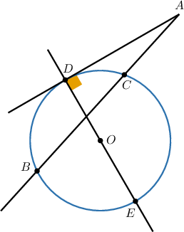
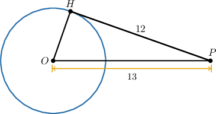
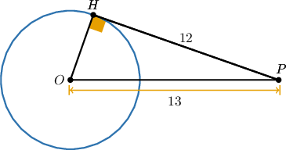
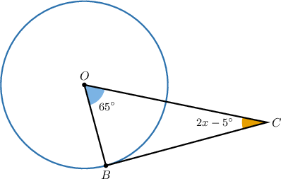
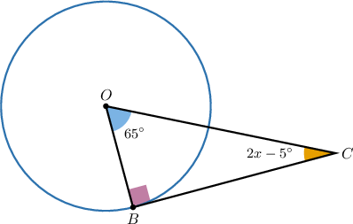

# Tangent Lines to Circles

Source: https://www.mathacademy.com/topics/578?courseId=128
Topic ID: 578

## Prerequisites

- [The Pythagorean Theorem](../../../traditional/lessons/geometry/433-the-pythagorean-theorem.md)
- [Circles](../../../traditional/lessons/geometry/1404-circles.md)

## Lesson

### Introduction

Given a line and a circle, only three relative positions between them are possible

1. The line and the circle have no points of intersection.

2. The line and the circle have two points of intersection. The line is then called a **secant** of the circle.

3. The line and the circle have exactly one point of intersection. The line is then called a **tangent** to the circle, meaning that it "touches" the circle at exactly one point. Notice that the radius $OH$ drawn to the **point of tangency** $H$ forms a right angle with the line. This is a fundamental property of tangent lines to circles.

Tangent lines and circles are related by the following theorem:

*A line is tangent to a circle if and only if it is perpendicular to the radius drawn to the point of tangency.*

### Example: Identifying Secant and Tangent Lines

#### Question

Consider the picture above. Which of the following statements are true?

1. $\overset{\longleftrightarrow}{AB}$ is a secant line to the circle

2. $\overset{\longleftrightarrow}{AD}$ is a tangent line to the circle

3. $\overset{\longleftrightarrow}{EO}$ is a tangent line to the circle

#### Explanation

Let's examine the statements one by one.

- Statement I is true. Indeed, $\overset{\longleftrightarrow}{AB}$ is a secant line since it intersects the circle at two points, $B$ and $C.$

- Statement II is true. Note that $\overset{\longleftrightarrow}{AD}$ touches the circle only at point $D.$ Moreover, the radius $\overline{OD}$ is perpendicular to $\overset{\longleftrightarrow}{AD}.$ So, $\overset{\longleftrightarrow}{AD}$ is a tangent line.

- Statement III is false. Here, $\overset{\longleftrightarrow}{EO}$ is not a tangent since it intersects the circle at two points, $D$ and $E.$

Therefore, the correct answer is "I and II only".

### Example: Calculating an Unknown Length Given a Circle With a Tangent Line

#### Question

In the diagram below, $OP=13$ and $HP=12.$ Find the length of the radius of the circle given that $\overset{\longleftrightarrow}{HP}$ is tangent to the circle at $H.$

#### Explanation

Since $\overset{\longleftrightarrow}{HP}$ is tangent to the circle at $H$, we have $m\angle{OHP=90^\circ},$ and $\overline{OH}$ is a radius of the circle.

Consequently, $\triangle{OHP}$ is a right triangle, and we can use the Pythagorean theorem to solve for $OH{:}$

$$

\begin{aligned}𝑂𝐻 & =\sqrt{√𝑂𝑃^{2}−𝐻𝑃^{2}} \\ & =\sqrt{√13^{2}−12^{2}} \\ & =\sqrt{√169−144} \\ & =\sqrt{√25} \\ & =5\end{aligned}

$$

Therefore, the length of the radius of the circle is $5.$

### Example: Calculating an Unknown Angle Given a Circle With a Tangent Line

#### Question

Find the value of $x$ given that $\overset{\longleftrightarrow}{BC}$ is tangent to the circle at $B$ and that $\overline{OB}$ is a radius.

#### Explanation

Since $\overset{\longleftrightarrow}{BC}$ is tangent to the circle, we have $m\angle OBC=90^\circ.$

Therefore, $\triangle{OBC}$ is a right triangle, and we conclude that

$$

\begin{aligned}𝑚∠𝑂+𝑚∠𝐶 & =90^{∘} \\ 65^{∘}+(2𝑥−5^{∘}) & =90^{∘} \\ 60^{∘}+2𝑥 & =90^{∘} \\ 2𝑥 & =30^{∘} \\ 𝑥 & =15^{∘}.\end{aligned}

$$
