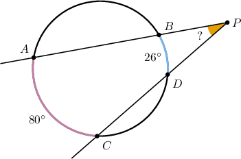
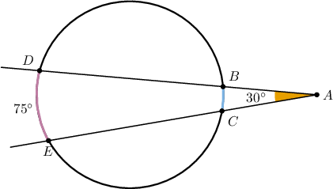
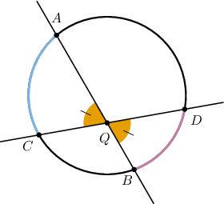
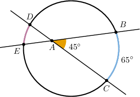
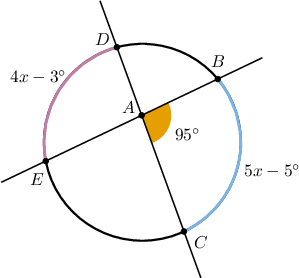
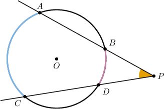
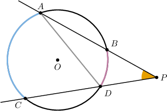
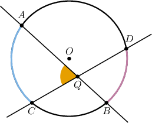
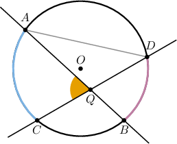

# Secant-Secant Angles to Circles

Source: https://www.mathacademy.com/topics/579?courseId=128
Topic ID: 579

## Prerequisites

- [Inscribed Angles](../../../traditional/lessons/geometry/497-inscribed-angles.md)

## Lesson

### Introduction

Consider the following diagram.

The points $A,B,C,$ and $D$ lie on the circle, and the secant lines $\overleftrightarrow{AB}$ and $\overleftrightarrow{CD}$ intersect at the point $P$ in the circle's exterior, as shown.

We're also given that

$$

m\overset{\frown}{AC} =80^\circ, \qquad m\overset{\frown}{BD} = 26^\circ.

$$

Note that $\angle P$ is called a **secant-secant angle** because it's the angle formed by the intersection of two secants.

It can be shown that the measure of $\angle P$ is half the *difference* between the measures of the larger and smaller intercepted arcs:

$$

\begin{aligned}𝑚∠𝑃=\frac{𝑚\overset{𝐴𝐶}{⌢}−𝑚\overset{𝐵𝐷}{⌢}}{2}\end{aligned}

$$

This is called the **secant-secant angle theorem**. We'll prove this theorem at the end of the lesson.

So, by substituting the numbers from above, we get

$$

\begin{aligned}𝑚∠𝑃 & =\frac{80^{∘}−26^{∘}}{2}=27^{∘}.\end{aligned}

$$

### Example: Applying the Secant-Secant Angle Theorem

#### Question

Given the above diagram, find the measure of $\overset{\frown}{BC}.$

#### Explanation

Notice that $\angle A$ is a secant-secant angle to the given circle whose vertex lies outside the circle. Thus, its measure is one-half the difference between the measures of the intercepted arcs.

$$

m\angle A = \dfrac{m\overset{\frown}{DE}-m\overset{\frown}{BC}}{2}

$$

Substituting the given values and solving for $m\overset{\frown}{BC},$ we have the following:

$$

\begin{aligned}30^{∘} & =\frac{75^{∘}−𝑚\overset{𝐵𝐶}{⌢}}{2} \\ 60^{∘} & =75^{∘}−𝑚\overset{𝐵𝐶}{⌢} \\ 𝑚\overset{𝐵𝐶}{⌢} & =75^{∘}−60^{∘} \\ 𝑚\overset{𝐵𝐶}{⌢} & =15^{∘}\end{aligned}

$$

### Secant-Secant Angles Within the Circles Interior

Sometimes, two secant lines intersect at a circle's *interior*. In such cases, we use a different method to calculate the measure of the secant-secant angle.

Consider the following diagram.

The points $A, B, C,$ and $D$ lie on the circle, and the secant lines $\overleftrightarrow{AB}$ and $\overleftrightarrow{CD}$ intersect at the point $Q$ in the circle's interior, as shown.

Note that since $\angle AQC$ and $\angle BQD$ are vertical angles, we have that

$$

m\angle AQC = m\angle BQD.

$$

It can be shown that the measure of the angles formed by these secant lines is half the *sum* of the measures of the intercepted arcs.

$$

\begin{aligned}𝑚∠𝐴𝑄𝐶=𝑚∠𝐵𝑄𝐷=\frac{𝑚\overset{𝐴𝐶}{⌢}+𝑚\overset{𝐵𝐷}{⌢}}{2}\end{aligned}

$$

In other words, the measure of the secant-secant angles is the *average* of the measures of the intercepted arcs.

We'll prove this formula at the end of the lesson.

### Example: Applying the Theorem When the Secant-Secant Angles Lie Inside the Circle

#### Question

Given the above diagram, find the measure of $\overset{\frown}{DE}.$

#### Explanation

Notice that $\angle A$ is a secant-secant angle to the given circle whose vertex lies inside the circle. Thus, its measure is the average of the measures of the intercepted arcs.

$$

m\angle A = \dfrac{m\overset{\frown}{DE}+m\overset{\frown}{BC}}{2}

$$

Substituting the given values and solving for $m\overset{\frown}{DE},$ we have the following:

$$

\begin{aligned}45^{∘} & =\frac{𝑚\overset{𝐷𝐸}{⌢}+65^{∘}}{2} \\ 90^{∘} & =𝑚\overset{𝐷𝐸}{⌢}+65^{∘} \\ 𝑚\overset{𝐷𝐸}{⌢} & =90^{∘}−65^{∘} \\ & =25^{∘}\end{aligned}

$$

### Example: Finding Unknowns in Secant-Secant Angle Problems

#### Question

Calculate the value of $x$.

#### Explanation

Notice that $\angle BAC$ is a secant-secant angle to the given circle whose vertex lies inside the circle. Thus, its measure is the average of the measures of the intercepted arcs.

$$

m\angle BAC = \dfrac{m\overset{\frown}{BC}+m\overset{\frown}{DE}}{2}

$$

Substituting the given expressions and solving for $x,$ we have the following:

$$

\begin{aligned}95^{∘} & =\frac{(5𝑥−5^{∘})+(4𝑥−3^{∘})}{2} \\ 95^{∘} & =\frac{9𝑥−8^{∘}}{2} \\ 190^{∘} & =9𝑥−8^{∘} \\ 198^{∘} & =9𝑥 \\ 𝑥 & =22^{∘}\end{aligned}

$$

### Proving the Secant-Secant Angles Theorem: Exterior Angle Case

We'll now prove the theorem in the case where the secant-secant angle lies in the circle's *exterior*.

Consider the following diagram.

We wish to prove that

$$

m\angle P = \frac{1}{2} (m\overset{\frown}{AC} -m\overset{\frown}{BD})\,.

$$

First, let's draw the segment $\overline{AD},$ as follows:

Now, consider the triangle $\triangle ADP.$ The angle $\angle ADC$ is an external angle of the triangle. So, by the exterior angles theorem, its measure equals the sum of the two non-adjacent interior angles.

$$

m\angle ADC = m\angle P + m\angle BAD\qquad\qquad (\ast)

$$

Also, since $\angle ADC$ and $\angle BAD$ are inscribed angles, we have that

$$

m\angle ADC = \frac{m\overset{\frown}{AC}}{2}, \qquad m\angle BAD = \frac{m\overset{\frown}{BD}}{2}\,.

$$

Finally, we substitute these expressions into $(\ast)$ above and solve for $m\angle P$ as follows:

$$

\begin{aligned}𝑚∠𝐴𝐷𝐶 & =𝑚∠𝑃+𝑚∠𝐵𝐴𝐷 \\ \frac{𝑚\overset{𝐴𝐶}{⌢}}{2} & =𝑚∠𝑃+\frac{𝑚\overset{𝐵𝐷}{⌢}}{2} \\ 𝑚∠𝑃 & =\frac{𝑚\overset{𝐴𝐶}{⌢}−𝑚\overset{𝐵𝐷}{⌢}}{2}\end{aligned}

$$

### Proving the Secant-Secant Angles Theorem: Interior Angle Case

We'll now prove the theorem in the case where the secant-secant angle lies in the circle's *interior*.

Consider the following diagram.

We need to prove that

$$

m\angle AQC = \frac{1}{2} (m\overset{\frown}{AC} + m\overset{\frown}{BD})\,.

$$

First, let's draw the segment $\overline{AD},$ as follows:

Now, consider the triangle $\triangle AQD.$ The angle $\angle AQC$ is an external angle of the triangle. So, by the exterior angles theorem, its measure equals the sum of the two non-adjacent interior angles.

$$

m\angle AQC = m\angle ADQ + m\angle DAQ\qquad\qquad (\ast)

$$

Also, since $\angle ADQ$ and $\angle DAQ$ are inscribed angles, we have

$$

m\angle ADQ = \frac{m\overset{\frown}{AC}}{2}, \qquad m\angle DAQ = \frac{m\overset{\frown}{BD}}{2}\,.

$$

Finally, we substitute these expressions into $(\ast)$ above and solve for $m\angle AQC$ as follows:

$$

\begin{aligned}𝑚∠𝐴𝑄𝐶 & =𝑚∠𝐴𝐷𝑄+𝑚∠𝐷𝐴𝑄 \\ 𝑚∠𝐴𝑄𝐶 & =\frac{𝑚\overset{𝐴𝐶}{⌢}}{2}+\frac{𝑚\overset{𝐵𝐷}{⌢}}{2} \\ 𝑚∠𝐴𝑄𝐶 & =\frac{𝑚\overset{𝐴𝐶}{⌢}+𝑚\overset{𝐵𝐷}{⌢}}{2}\end{aligned}

$$
