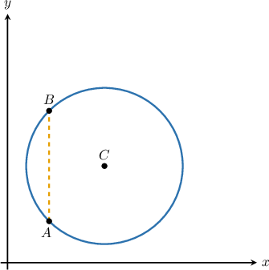
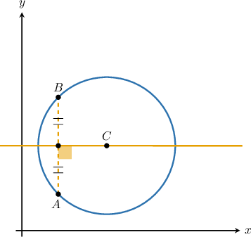
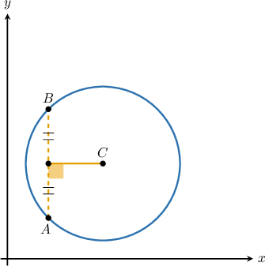
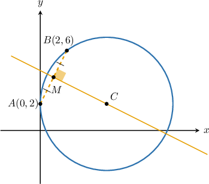
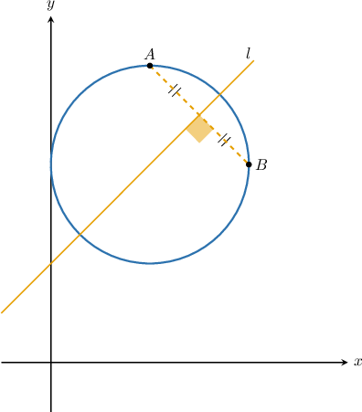
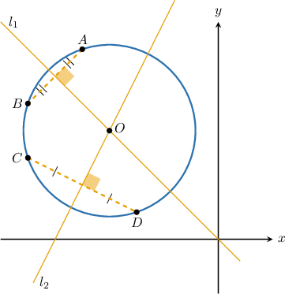

# Perpendicular Bisectors of Chords in the Coordinate Plane

Source: https://www.mathacademy.com/topics/6319?courseId=128
Topic ID: 6319

## Prerequisites

- [Calculating the Intersection of Two Lines](../../../traditional/lessons/algebra-i/408-calculating-the-intersection-of-two-lines.md)
- [Perpendicular Bisectors of Diameters in the Coordinate Plane](../../../traditional/lessons/geometry/1184-perpendicular-bisectors-of-diameters-in-the-coordinate-plane.md)
- [Perpendicular Bisectors of Chords](../../../traditional/lessons/geometry/1185-perpendicular-bisectors-of-chords.md)

## Lesson

### Introduction

In this lesson, we'll learn how to find the perpendicular bisector of a chord in the coordinate plane and how to use this to determine the center of the underlying circle.

Consider a circle with center $C,$ points $A$ and $B$ on the circle, and the chord $\overline{AB},$ as shown below.

For *any* chord $\overline{AB},$ its perpendicular bisector must pass through $C.$

Conversely, any line segment with one endpoint on $\overline{AB}$ and the other at $C$ that's perpendicular to $\overline{AB}$ must bisect $\overline{AB}.$

### Example: Finding a Perpendicular Bisector Given a Chord's Endpoints

#### Question

The points $A(0,2)$ and $B(2,6)$ lie on the circumference of a circle. What is the equation of the perpendicular bisector of the chord $\overline{AB}?$

#### Explanation

The perpendicular bisector of $\overline{AB}$ passes through the midpoint of $\overline{AB}$ and is perpendicular to $\overline{AB}.$

Let $M$ be the midpoint of the chord $\overline{AB},$ as shown in the following figure.

First, let's calculate the coordinates of $M$ using the midpoint formula:

$$

\begin{aligned} M = \left(\dfrac{0+2}{2},\dfrac{2+6}{2}\right) = (1,4) \end{aligned}

$$

Next, we calculate the slope $m_1$ of the chord $\overline{AB}\mathbin{:}$

$$

\begin{aligned} m_1 = \dfrac{6-2}{2-0} = 2. \end{aligned}

$$

The slope $m_2$ of the perpendicular bisector of $\overline{AB}$ is the negative reciprocal of the slope of $\overline{AB}.$ Therefore,

$$

m_2 = -\dfrac{1}{m_1} = -\dfrac12.

$$

Since the perpendicular bisector passes through the midpoint $M(1, 4)$ and has slope $m_2 = -\dfrac12,$ we can use the point-slope formula to write the equation of the line, as follows:

$$

\begin{aligned} y-4 &= -\dfrac12(x-1)\\[5pt] y-4 &= -\dfrac12x+\dfrac12\\[5pt] y &= -\dfrac12x+\dfrac92\\[5pt] \end{aligned}

$$

### Example: Finding a Perpendicular Bisector Given a Chord's Slope

#### Question

The circle shown above has its center at $(1,2)$ and the slope of the chord $\overline{AB}$ is $-1.$ If $l$ is the perpendicular bisector of $\overline{AB},$ what is the equation of $l?$

#### Explanation

Let $m_1$ and $m_2$ be the slopes of $\overline{AB}$ and $l$, respectively.

We're told that $m_1 = -1.$ Since $l$ is the perpendicular bisector of $\overline{AB},$ then the slope of $l$ is the negative reciprocal of the slope of $\overline{AB}.$ So, the slope of $l$ is

$$

m_2 = -\dfrac{1}{m_1}= -\dfrac{1}{(-1)} = 1.

$$

Since $l$ is the perpendicular bisector of the chord $\overline{AB},$ it must pass through the center of the circle. So, we can find the equation of the line $l$ using the point-slope formula, as follows:

$$

\begin{aligned}𝑦−𝑦_{1} & =𝑚_{2}(𝑥−𝑥_{1}) \\ 𝑦−2 & =1⋅(𝑥−1) \\ 𝑦−2 & =𝑥−1 \\ 𝑦 & =𝑥+1\end{aligned}

$$

### Finding the Center of a Circle Using Two Chords

The perpendicular bisector of a chord of a circle always passes through the circle's center. Therefore, the perpendicular bisectors of two different chords must intersect at the circle's center.

In the diagram, the lines $l_1$ and $l_2$ are the perpendicular bisectors of the chords $\overline{AB}$ and $\overline{CD},$ respectively. So, the point where they intersect (point $O$ in the diagram) is the circle's center.

### Example: Finding a Circle's Center Given Two Chords

#### Question

The lines and with equations and are perpendicular bisectors of the chords and of a circle, respectively. Find the coordinates of the center of the circle.

#### Explanation

The perpendicular bisector of the chord must pass through the circle's center. Therefore, the perpendicular bisectors of two different chords of the same circle must intersect at the center.

So, to find the center of the circle, we need to find where the perpendicular bisectors and intersect.

The equations of the lines are

Setting the equations equal to each other, we get

Finally, we substitute into the first equation, and we get

Therefore, the circle's center is at
