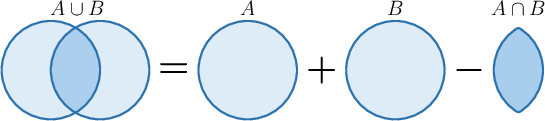
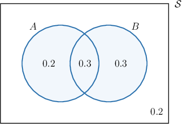
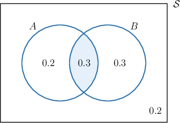

# The Addition Law of Probability

Source: https://www.mathacademy.com/topics/740?courseId=128
Topic ID: 740

## Prerequisites

- [Independent Events](../../../traditional/lessons/geometry/183-independent-events.md)

## Lesson

### Introduction

The **addition law for probability** states that if we have two events $A$ and $B,$ the probability of their union equals the sum of their individual probabilities minus the probability of their intersection.

We can state the addition law mathematically as follows:

$$

P(A\cup B)= P(A)+P(B)-P(A\cap B)

$$

There's some nice intuition behind this law.

- By adding $P(A)$ to $P(B)$ to work out $P(A \cup B),$ we count the intersection $P(A \cap B)$ twice.

- So, to get the correct formula for $P(A\cup B),$ we need to subtract *one* of the intersections.

Let's look at a concrete example.

### Example: Computing the Probability of a Union Using the Addition Law

#### Question

Suppose we have the events $A$ and $B$ with the following probabilities:

$$

P(A)=0.5,\qquad P(B)=0.6,\qquad P(A\cap B)=0.3

$$

Calculate $P(A\cup B).$

#### Explanation

The addition law for probability states that

$$

P(A\cup B) = P(A) + P(B) - P(A\cap B).

$$

So, to calculate $P(A\cup B),$ we apply the addition law:

$$

\begin{aligned}𝑃(𝐴∪𝐵) & =𝑃(𝐴)+𝑃(𝐵)−𝑃(𝐴∩𝐵) \\ & =0.5+0.6−0.3 \\ & =0.8\end{aligned}

$$

The Venn diagram corresponding to this situation is as follows:

### Example: Computing a Probability Using the Addition Law

#### Question

Suppose that $A$ and $B$ are two events such that $P(A)=0.5,$ $P(B)=0.6,$ and $P(A\cup B)=0.8.$ Find $P(A\cap B).$

#### Explanation

We apply the addition law:

$$

\begin{aligned}𝑃(𝐴∪𝐵) & =𝑃(𝐴)+𝑃(𝐵)−𝑃(𝐴∩𝐵) \\ 0.8 & =0.5+0.6−𝑃(𝐴∩𝐵) \\ 𝑃(𝐴∩𝐵) & =0.5+0.6−0.8 \\ 𝑃(𝐴∩𝐵) & =0.3\end{aligned}

$$

To check our answer, we can construct the corresponding Venn diagram:

### Example: Applying the Addition Law in Context

#### Question

An icosahedral ($20$-sided) die is rolled. What is the probability of getting a prime number or an even number?

#### Explanation

Let us call $R$ the event "We get a prime number", and $E$ the event "We get an even number". Then the probability of getting a prime number or an even number is $P(R \cup E),$ and we can apply the addition law:

$$

\begin{aligned}𝑃(𝑅∪𝐸) & =𝑃(𝑅)+𝑃(𝐸)−𝑃(𝑅∩𝐸)\end{aligned}

$$

First, let's find $P(R),$ $P(E),$ and $P(R \cap E).$

- There are $8$ prime numbers among the $20$ faces of the die ($2, 3, 5, 7, 11, 13, 17, 19$), so we have

- There are $10$ even numbers among the $20$ faces of the die, so we have

- There is only a single number, $2,$ that is both prime and even. So, we have

Therefore, applying the addition law, we have

$$

\begin{aligned}𝑃(𝑅∪𝐸) & =𝑃(𝑅)+𝑃(𝐸)−𝑃(𝑅∩𝐸) \\ & =\frac{8}{20}+\frac{10}{20}−\frac{1}{20} \\ & =\frac{17}{20}.\end{aligned}

$$

### Example: Experiments With Playing Cards

#### Question

A card is drawn at random from a standard $52$-card deck. What is the probability of drawing a card labeled with an odd number or a black card?

**

#### Explanation

Let's call $O$ the event "a card labeled with an odd number is selected" and $B$ the event "a black card is selected."

The required probability is $P(O \cup B),$ which we can find using the addition law:

$$

P(O \cup B) = P(O) + P(B) - P(O \cap B)

$$

Let's find $P(O)$ and $P(B).$

- There are $4$ odd-numbered cards in each suit in a standard deck ($3,5,7,9$), and there are $4$ suits in total. So, we have

- There are $26$ black cards in a standard deck. So, we have

Moreover, since $O$ and $B$ are independent, we have

$$

\begin{aligned}𝑃(𝑂∩𝐵) & =𝑃(𝑂)⋅𝑃(𝐵) \\ & =\frac{4}{13}⋅\frac{1}{2} \\ & =\frac{2}{13}.\end{aligned}

$$

Finally, substituting all of the known information into the addition law, we get

$$

\begin{aligned}𝑃(𝑂∪𝐵) & =𝑃(𝑂)+𝑃(𝐵)−𝑃(𝑂∩𝐵) \\ & =\frac{4}{13}+\frac{1}{2}−\frac{2}{13} \\ & =\frac{17}{26}.\end{aligned}

$$
