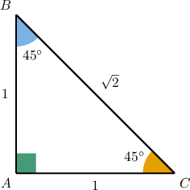
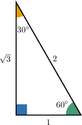
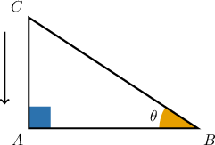
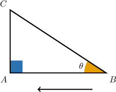

# Special Trigonometric Ratios

Source: https://www.mathacademy.com/topics/765?courseId=128
Topic ID: 765

## Prerequisites

- [30-60-90 Triangles](../../../traditional/lessons/geometry/262-30-60-90-triangles.md)
- [Isosceles Right Triangles](../../../traditional/lessons/geometry/263-isosceles-right-triangles.md)
- [The Reciprocal Trigonometric Ratios](../../../traditional/lessons/geometry/611-the-reciprocal-trigonometric-ratios.md)

## Lesson

### Introduction

Let's take a look at the isosceles right triangle whose legs are both equal to $1,$ as shown below.

By considering either of the $45^\circ$ angles in this triangle, we find that

$$

\begin{aligned} \sin 45^\circ &= \dfrac{\textrm{opp.}}{\textrm{hyp.}} = \dfrac{1}{\sqrt{2}} = \dfrac{\sqrt{2}}{2}, \\\[5pt] \cos 45^\circ &= \dfrac{\textrm{adj.}}{\textrm{hyp.}} = \dfrac{1}{\sqrt{2}} = \dfrac{\sqrt{2}}{2}, \\\[5pt] \tan 45^\circ &= \dfrac{\textrm{opp.}}{\textrm{adj.}} = \dfrac{1}{1} = 1. \end{aligned}

$$

Isosceles right triangles are very common, so the values above occur a lot in trigonometry. It's a good idea to remember them.

### Example: Evaluating Trigonometric Expressions With 45 Degree Angles

#### Question

Evaluate $2 \tan{45^\circ} - 4 \sin{45^\circ}.$

#### Explanation

The angle $45^\circ$ is special, and its trigonometric ratios have the values

$$

\sin{45^\circ} = \dfrac{\sqrt 2}{2}, \qquad \tan{45^\circ} = 1.

$$

Therefore,

$$

\begin{aligned}2tan⁡45^{∘}−4sin⁡45^{∘} & = \\ 2(1)−4(\frac{\sqrt{√2}}{2}) & = \\ 2−2\sqrt{√2} & = \\ 2(1−\sqrt{√2}) & .\end{aligned}

$$

### Trigonometric Ratios for 30-60-90 Triangles

Let's now consider the $30$-$60$-$90$ triangle whose shortest leg has a length equal to $1,$ shown below.

Now, we can calculate some trigonometric ratios without a calculator. Let's start with the $30^\circ$-angle. By the definition of sine, cosine, and tangent, we have

$$

\begin{aligned}sin⁡30^{∘} & =\frac{opp.}{hyp.}=\frac{1}{2}, \\ cos⁡30^{∘} & =\frac{adj.}{hyp.}=\frac{\sqrt{√3}}{2}, \\ tan⁡30^{∘} & =\frac{opp.}{adj.}=\frac{1}{\sqrt{√3}}=\frac{\sqrt{√3}}{3}.\end{aligned}

$$

Similarly, by considering the $60^\circ$-angle, we find that

$$

\begin{aligned}sin⁡60^{∘} & =\frac{opp.}{hyp.}=\frac{\sqrt{√3}}{2}, \\ cos⁡60^{∘} & =\frac{adj.}{hyp.}=\frac{1}{2}, \\ tan⁡60^{∘} & =\frac{opp.}{adj.}=\frac{\sqrt{√3}}{1}=\sqrt{√3}.\end{aligned}

$$

### Example: Evaluating Trigonometric Expressions With 30 and 60 Degree Angles

#### Question

Evaluate $\sin{30^\circ} + \cos{60^\circ} + \tan^2{30^\circ}.$

#### Explanation

The angles $30^\circ$ and $60^\circ$ are special angles, and their trigonometric ratios have the particular values

$$

\sin{30^\circ} = \dfrac{1}{2}, \qquad \cos 60^\circ = \dfrac{1}{2} , \qquad \tan{30^\circ} = \dfrac{\sqrt{3}}{3}.

$$

Also, note that $\tan^2{30^\circ}$ simply means $(\tan{30^\circ})^2.$

Therefore,

$$

\begin{aligned}sin⁡30^{∘}+cos⁡60^{∘}+tan^{2}⁡30^{∘} & = \\ sin⁡30^{∘}+cos⁡60^{∘}+(tan⁡30^{∘})^{2} & = \\ \frac{1}{2}+\frac{1}{2}+(\frac{\sqrt{√3}}{3})^{2} & = \\ 1+\frac{3}{9} & = \\ 1+\frac{1}{3} & = \\ \frac{4}{3} & .\end{aligned}

$$

### Special Values of the Zero Degree Angle

The values of the trigonometric ratios for $0^\circ$ angles are the following:

Why is this so? If we look at the right triangle below, we can imagine making the angle $\theta$ smaller by moving the vertex $C$ towards $A.$

As the angle $\theta$ gets closer and closer to zero, the opposite side $AC$ also approaches zero. Also, the hypotenuse $BC$ and the adjacent side $AB$ become nearly the same length.

So, as $\theta$ approaches zero (which we can write as $\theta \rightarrow 0^\circ$) we have

$$

AC \approx 0 \quad \text{and} \quad BC \approx AB.

$$

Therefore, when $\theta = 0^\circ$ we have:

$$

\begin{aligned}sin⁡(0^{∘}) & =\frac{𝐴𝐶}{𝐵𝐶}=0, \\ cos⁡(0^{∘}) & =\frac{𝐴𝐵}{𝐵𝐶}=1, \\ tan⁡(0^{∘}) & =\frac{𝐴𝐶}{𝐴𝐵}=0.\end{aligned}

$$

### Example: Evaluating Trigonometric Expressions With 0 Degree Angles

#### Question

Find $\sin {0^\circ} + 4 \cos {0^\circ}.$

#### Explanation

The angle $0^\circ$ is special, and its trigonometric ratios have the particular values

$$

\sin{0^\circ} = 0, \qquad \cos{0^\circ} = 1.

$$

Therefore,

$$

\begin{aligned}sin⁡0^{∘}+4cos⁡0^{∘} & = \\ 0+4(1) & = \\ 4. & \end{aligned}

$$

### Special Values of the 90 Degree Angle

The values of the trigonometric ratios for $90^\circ$ angles are the following:

To understand where the values come from, this time, we can imagine increasing the value of the angle $\theta$ by moving the vertex $B$ towards $A.$

As $B$ moves towards $A,$ the adjacent side $AB$ gets very close to zero, and the angle $\theta$ gets very close to $90^\circ.$ Also, the hypotenuse $BC$ and the opposite side $AC$ become nearly the same length.

So, as $\theta$ approaches $90^\circ$ (which we can write as $\theta \rightarrow 90^\circ$) we have

$$

AB \approx 0 \quad \text{and} \quad BC \approx AC.

$$

Therefore, when $\theta = 90^\circ,$ we have:

$$

\begin{aligned}sin⁡(90^{∘}) & =\frac{𝐴𝐶}{𝐵𝐶}=1, \\ cos⁡(90^{∘}) & =\frac{𝐴𝐵}{𝐵𝐶}=0, \\ tan⁡(90^{∘}) & =\frac{𝐴𝐶}{𝐴𝐵}=\frac{𝐴𝐶}{0}=undefined.\end{aligned}

$$

Note that when calculating the tangent, we get a $0$ in the denominator. We know that we can't divide by zero. Therefore, the tangent of a right angle is said to be undefined.

### Example: Evaluating Trigonometric Expressions With 90 Degree Angles

#### Question

Evaluate $\cos {90^\circ} - 2 \sin {90^\circ}.$

#### Explanation

The angle $90^\circ$ is special, and its trigonometric ratios have the particular values

$$

\cos{90^\circ} = 0, \qquad \sin{90^\circ} = 1.

$$

Therefore,

$$

\begin{aligned}cos⁡90^{∘}−2sin⁡90^{∘} & = \\ 0−2(1) & = \\ −2. & \end{aligned}

$$
