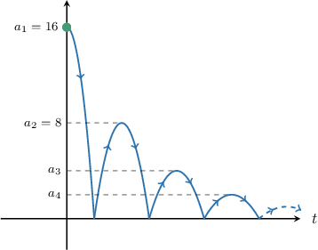
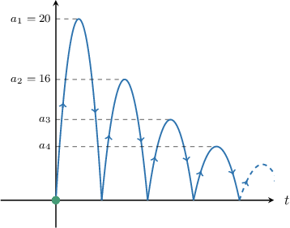

# Modeling With Geometric Series

Source: https://www.mathacademy.com/topics/1019?courseId=101
Topic ID: 1019

## Prerequisites

- [Solving Geometric Series Problems Using Exponential Equations and Inequalities](./1018-solving-geometric-series-problems-using-exponential-equations-and-inequalities.md)

## Lesson

### Introduction

We can use geometric series to model real-world problems and make predictions.

For example, suppose a company analyzes the number of subscribers to its latest streaming service. It has the following data:

- $300$ users subscribed in the first month

- $600$ users subscribed in the second month

- $1\,200$ users subscribed in the third month

If this trend continues, how many subscribers in total can the company expect by the $12$th month?

To model this situation, let $a_n$ be the number of users that subscribed in the $n$th month. Then, we have

$$

a_1=300, \qquad a_2=600, \qquad a_3=1\,200, \qquad \ldots

$$

Notice that there is a common ratio between the terms of the sequence, since

$$

r = \dfrac{a_2}{a_1} = \dfrac{a_3}{a_2}=2.

$$

Therefore, this is a geometric sequence with first term $a_1 = 300$ and common ratio $r=2.$

To predict the total number of subscribers by the end of the $12$th month, we need to sum the number of users that subscribed between the $1$st and $12$th months. For this, we use the formula

$$

S_N = a_1\bigg(\dfrac{1-r^N}{1-r} \bigg).

$$

Substituting $a_1 = 300, r = 2,$ and $N=12$ into the above, we get

$$

\begin{aligned}𝑆_{12} & =𝑎_{1}(\frac{1−𝑟^{12}}{1−𝑟}) \\ & =300(\frac{1−2^{12}}{1−2}) \\ & =1\,228\,500.\end{aligned}

$$

Therefore, the service can expect a total of $1\,228\,500$ subscribers by month $12.$

### Example: Calculating a Partial Sum Given in Context

#### Question

Logan installs antivirus software to repair the infected files on his computer. The software repairs $900$ files in the first minute, a further $600$ files in the second minute, a further $400$ in the third minute, and so on. Assuming this trend continues, how many files in total would have been repaired by the end of the ninth minute? Round your answer to the nearest integer.

#### Explanation

Let $a_n$ be the number of files repaired in the $n$th minute. Then, we have

$$

a_1=900, \qquad a_2=600, \qquad a_3=400, \qquad \ldots

$$

Notice that this is a geometric sequence with a common ratio $r=\dfrac23,$ since

$$

\dfrac23 = \dfrac{a_2}{a_1} = \dfrac{a_3}{a_2}.

$$

To calculate the total number of files repaired by the ninth minute, we use the formula

$$

S_N = a_1\left(\dfrac{1-r^N}{1-r} \right).

$$

Substituting $a_1 = 900, r = \dfrac23,$ and $N=9$ into the above, we get

$$

\begin{aligned}𝑆_{𝑛} & =𝑎_{1}(\frac{1−𝑟^{𝑁}}{1−𝑟}) \\ 𝑆_{9} & =𝑎_{1}(\frac{1−𝑟^{9}}{1−𝑟}) \\ & =900⋅\frac{1−(\frac{2}{3})^{9}}{3} \\ & =900⋅\frac{1−(\frac{2}{3})^{9}}{3} \\ & =3⋅900⋅(1−(\frac{2}{3})^{9}) \\ & ≈2\,630.\end{aligned}

$$

Therefore, a total of $2\,630$ files would have been repaired by the end of the ninth minute.

### Example: Finding the Number of Terms Required for a Partial Sum To Exceed a Given Value

#### Question

Emily is being sponsored to cycle $300$ miles over several days. She cycles $20$ miles on the first day, increasing her distance by $10\%$ per day after that. On which day will Emily finish her sponsored cycle?

#### Explanation

Let $a_n$ be the number of miles that Emily cycles on day $n.$ Since Emily's distance increases by $10\%$ per day, and she cycles $20$ miles on the first day, we have the following:

$$

\begin{aligned}𝑎_{1} & =20 \\ 𝑎_{2} & =𝑎_{1}+𝑎_{1}⋅(0.1) \\ & =20+20⋅(0.1) \\ & =20⋅(1.1) \\ 𝑎_{3} & =𝑎_{2}+𝑎_{2}⋅(0.1) \\ & =20⋅(1.1)+20⋅(1.1)⋅(0.1) \\ & =20⋅(1.1)⋅(1+0.1) \\ & =20⋅(1.1)^{2}\end{aligned}

$$

From here, we can deduce that

$$

a_n = 20\cdot (1.1)^{n-1},

$$

which is a geometric sequence with $a_1 = 20$ and $r=1.1.$

The sum of the first $N$ terms of a geometric sequence is given by

$$

S_N = a_1\left(\dfrac{1-r^N}{1-r} \right).

$$

We want to know how long will it take Emily to finish. Therefore, we need to solve the equation $S_N \geq 300\mathbin{:}$

$$

\begin{aligned} S_N & \geq 300 \\20\left(\dfrac{1-1.1^N}{1-1.1}\right) & \geq 300 \\\[5pt] \dfrac{1-1.1^N}{1-1.1} & \geq 15 \\\[5pt] \dfrac{1-1.1^N}{-0.1} & \geq 15 \\\[5pt] \dfrac{1.1^N-1}{0.1} & \geq 15\\\[5pt] 1.1^N -1 & \geq 1.5 \\\[5pt] 1.1^N & \geq 2.5 \\\[5pt] \log\left(1.1^N\right) &\geq \log(2.5) \\\[5pt] N \log(1.1) & \geq \log(2.5) \\\[5pt] N & \geq \dfrac{\log(2.5)}{\log(1.1)} \\\[5pt] N & \geq 9.614 \end{aligned}

$$

Therefore, Emily will finish on the $10$th day.

### Modeling Bouncing Balls

One particular type of geometric series modeling problem involves bouncing balls. Let's walk though an example of this type of problem.

A ball is dropped from a height of $16$ meters. Then, it bounces to a height of $8$ meters and continues to bounce to heights that follow a geometric sequence. Assuming that the ball's motion is vertical throughout, what is the total distance the ball travels between when it is dropped and when it hits the ground for the fourth time?

Let's start by visualizing how the height of the ball changes with time $t\mathbin{:}$

Let $a_n$ denote the maximum height of the ball between the $(n-1)$th and $n$th bounces. Then, we have

$$

a_1 = 16, \qquad a_2 = 8, \qquad \ldots

$$

We're told that $a_n$ is geometric. The common ratio is

$$

r = \dfrac{a_2}{a_1} = \dfrac{8}{16} = \dfrac12.

$$

We break down the motion of the ball as follows:

- Before the first bounce, the ball travels $a_1$ meters.

- Between the $1$st and $2$nd bounce, the ball travels $a_2 + a_2 = 2a_2$ meters.

- Between the $2$nd and $3$rd bounce, the ball travels $a_3 + a_3 = 2a_3$ meters.

- Between the $3$rd and $4$th bounce, the ball travels $a_4 + a_4 = 2a_4$ meters.

Therefore, the total distance $d$ traveled between when the ball is dropped and when it hits the ground for the fourth time is given by

$$

\begin{aligned}𝑑 & =𝑎_{1}+2𝑎_{2}+2𝑎_{3}+2𝑎_{4} \\ & =\underset{=𝑎_{1}}{\underset{}{2𝑎_{1}−𝑎_{1}}}+2𝑎_{2}+2𝑎_{3}+2𝑎_{4} \\ & =2𝑎_{1}+2𝑎_{2}+2𝑎_{3}+2𝑎_{4}−𝑎_{1} \\ & =2(𝑎_{1}+𝑎_{2}+𝑎_{3}+𝑎_{4})−𝑎_{1} \\ & =2𝑆_{4}−𝑎_{1},\end{aligned}

$$

where $S_4$ is the sum of the first $4$ terms of the geometric sequence.

To calculate $S_4,$ we use the formula

$$

S_N = a_1\left(\dfrac{1-r^N}{1-r} \right).

$$

Substituting $a_1 = 16, r = \dfrac12,$ and $N=4$ into the above, we get

$$

\begin{aligned}𝑆_{4} & =16\frac{1−(\frac{1}{2})^{4}}{2} \\ & =16⋅\frac{15}{8} \\ & =30.\end{aligned}

$$

Therefore, the ball travels a total distance of

$$

d = 2 \cdot 30 - 16 = 44 \,\textrm m.

$$

### Example: Modeling a Bouncing Ball

#### Question

A ball is kicked vertically into the air and reaches a height of $20$ meters. It returns to the ground, bounces, and then reaches a height of $16$ meters. The ball continues to bounce to heights that follow a geometric sequence. Assuming that the ball's motion is vertical throughout, calculate the total distance traveled by the ball from when it was first kicked and the fourth bounce. Round your answer to one decimal place.

#### Explanation

Let $a_n$ denote the maximum height of the ball between the $(n-1)$th and $n$th bounces. Then, we have

$$

a_1 = 20, \qquad a_2 = 16, \qquad \ldots

$$

The diagram below shows how the height of the ball changes with time $t.$

We're told that $a_n$ is geometric. The common ratio is

$$

r = \dfrac{a_2}{a_1} = \dfrac{16}{20} = \dfrac45.

$$

We break down the motion of the ball as follows:

- Before the first bounce, the ball travels $a_1+a_1 = 2a_1$ meters.

- Between the $1$st and $2$nd bounce, the ball travels $a_2 + a_2 = 2a_2$ meters.

- Between the $2$nd and $3$rd bounce, the ball travels $a_3 + a_3 = 2a_3$ meters.

- Between the $3$rd and $4$th bounce, the ball travels $a_4 + a_4 = 2a_4$ meters.

Therefore, the total distance $d$ traveled between when the ball is first kicked and when it hits the ground for the fourth time is given by

$$

\begin{aligned}𝑑 & =2𝑎_{1}+2𝑎_{2}+2𝑎_{3}+2𝑎_{4} \\ & =2(𝑎_{1}+𝑎_{2}+𝑎_{3}+𝑎_{4}) \\ & =2𝑆_{4},\end{aligned}

$$

where $S_4$ is the sum of the first $4$ terms of the geometric sequence.

To calculate $S_4,$ we use the formula

$$

S_N = a_1\left(\dfrac{1-r^N}{1-r} \right).

$$

Substituting $a_1 = 20, r = \dfrac45,$ and $N=4$ into the above, we get

$$

\begin{aligned}𝑆_{4} & =20\frac{1−(\frac{4}{5})^{4}}{5} \\ & =20⋅\frac{369}{125} \\ & =\frac{1\,476}{25}.\end{aligned}

$$

Therefore, the ball travels a total distance of

$$

d = 2 \cdot \dfrac{1\,476}{25} \approx 118.1\,\textrm m

$$

rounded to one decimal place.
