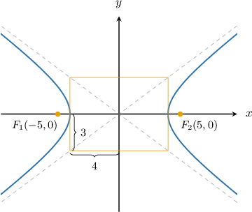
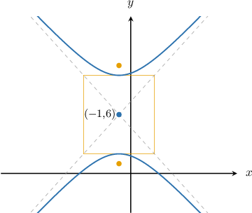
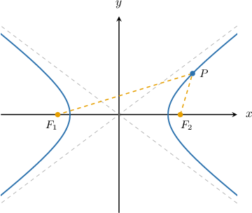
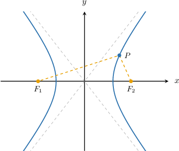

# Foci of Hyperbolas

Source: https://www.mathacademy.com/topics/1030?courseId=101
Topic ID: 1030

## Prerequisites

- [The Distance Formula](../../../traditional/lessons/geometry/459-the-distance-formula.md)
- [Adding and Subtracting Radicals](../../../../middle-school/lessons/grade-8/484-adding-and-subtracting-radicals.md)
- [Conjugate Axes of Hyperbolas](./3768-conjugate-axes-of-hyperbolas.md)

## Lesson

### Introduction

Consider the horizontal hyperbola centered at the origin with semi-transverse axis $a=4$ and semi-conjugate axis $b=3,$ as shown below.

The points $F_1(-5,0)$ and $F_2(5,0)$ are two special points, called the **foci** of the hyperbola. For a horizontal hyperbola, the foci must lie on the horizontal axis of the hyperbola.

The distance between the hyperbola's center and each focus is called the **focal length** and is usually denoted $c.$ The formula for the focal length of a hyperbola is

$$

c = \sqrt{a^2+b^2},

$$

where $a$ is the semi-transverse axis and $b$ is the semi-conjugate axis. This formula works for both horizontal *and* vertical hyperbolas.

For our hyperbola, we already know that the focal length is $5.$ But let's check to see that the formula gives the same result:

$$

\begin{aligned}𝑐 & =\sqrt{√𝑎^{2}+𝑏^{2}} \\ & =\sqrt{√4^{2}+3^{2}} \\ & =\sqrt{√16+9} \\ & =\sqrt{√25} \\ & =5\,✓\end{aligned}

$$

The foci of a hyperbola are important because they have a particular property, the point-foci property. We'll discuss this later in the lesson. But for now, let's focus on learning how to calculate the foci of a hyperbola.

### Calculating the Foci of a Hyperbola

The focal length $c$ of a hyperbola is given by

$$

c = \sqrt{a^2 + b^2},

$$

where $a$ is the semi-transverse axis and $b$ is the semi-conjugate axis of the hyperbola.

To find the coordinates of the foci of a hyperbola centered at $(h,k),$ there are two possible cases:

- For a *horizontal* hyperbola, the foci lie along the *horizontal* axis at a distance $c$ from the center, as shown below. Therefore, the coordinates of the foci are $(h\pm c, k).$

- For a *vertical* hyperbola, the foci lie along the *vertical* axis at a distance $c$ from the center, as shown below. Therefore, the coordinates of the foci are $(h, k\pm c).$

### Example: Calculating the Foci From a Hyperbola's Graph

#### Question

Find the coordinates of the foci of the hyperbola shown above, given that the auxiliary rectangle is $6$ units long and $8$ units high.

#### Explanation

For the vertical hyperbola

$$

\dfrac{(y-k)^2}{a^2} - \dfrac{(x-h)^2}{b^2} = 1

$$

the foci are at the points $(h, k \pm c),$ where $c = \sqrt{a^2 + b^2}$ is the focal length.

From the diagram, we see that the center of the hyperbola is at

$$

(h,k) = (-1,6),

$$

and the semi-transverse and semi-conjugate axes are given by

$$

a=\dfrac{8}{2}=4,\qquad b=\dfrac{6}{2}=3.

$$

Now, computing the focal length, we get

$$

\begin{aligned}𝑐 & =\sqrt{√𝑎^{2}+𝑏^{2}} \\ & =\sqrt{√4^{2}+3^{2}} \\ & =5.\end{aligned}

$$

Therefore, the coordinates of the foci are

$$

(h , k-c) = (-1,6-5) = (-1,1)

$$

and

$$

(h, k+c) = (-1,6+5) = (-1,11).

$$

### Example: Calculating the Foci From a Hyperbola's Equation

#### Question

Calculate the coordinates of the foci of the hyperbola $\dfrac {(x + 3)^2} {20} - \dfrac {(y - 1)^2} {16} =1.$

#### Explanation

For the horizontal hyperbola

$$

\dfrac{(x-h)^2}{a^2} - \dfrac{(y-k)^2}{b^2} = 1

$$

the foci are at the points $(h \pm c, k),$ where $c = \sqrt{a^2 + b^2}$ is the focal length.

In our case, we have

$$

h=-3, \qquad k=1, \qquad a^2 = 20, \qquad b^2 = 16.

$$

Now, computing the focal length, we get

$$

\begin{aligned}𝑐 & =\sqrt{√𝑎^{2}+𝑏^{2}} \\ & =\sqrt{√20+16} \\ & =6.\end{aligned}

$$

Therefore, the coordinates of the foci are

$$

(h - c, k) = (-3 - 6, 1) = (-9,1)

$$

and

$$

(h + c, k) = (-3 +6, 1) = (3,1).

$$

### Example: Calculating the Foci From an Equation Given in Nonstandard Form

#### Question

Calculate the coordinates of the foci of the hyperbola $-x^2+6x+20y^2+160y+291 = 0.$

#### Explanation

To rewrite the equation of the hyperbola in standard form, we need to group $x$ and $y$ terms and complete the squares as follows:

$$

\begin{aligned}−𝑥^{2}+6𝑥+20𝑦^{2}+160𝑦+291 & =0 \\ 20𝑦^{2}+160𝑦−𝑥^{2}+6𝑥 & =−291 \\ 20[𝑦^{2}+8𝑦]−[𝑥^{2}−6𝑥] & =−291 \\ 20[(𝑦+4)^{2}−16]−[(𝑥−3)^{2}−9] & =−291 \\ 20(𝑦+4)^{2}−320−(𝑥−3)^{2}+9 & =−291 \\ 20(𝑦+4)^{2}−(𝑥−3)^{2} & =−291+320−9 \\ 20(𝑦+4)^{2}−(𝑥−3)^{2} & =20\end{aligned}

$$

Then, we divide both sides of the equation by $20$ and simplify:

$$

\begin{aligned}\frac{20(𝑦+4)^{2}}{20}−\frac{(𝑥−3)^{2}}{20} & =\frac{20}{20} \\ (𝑦+4)^{2}−\frac{(𝑥−3)^{2}}{20} & =1\end{aligned}

$$

For the vertical hyperbola

$$

\dfrac{(y-k)^2}{a^2} - \dfrac{(x-h)^2}{b^2} = 1

$$

the foci are at the points $(h, k \pm c),$ where $c = \sqrt{a^2 + b^2}$ is the focal length.

In our case, we have

$$

h=3, \qquad k=-4, \qquad a^2 = 1, \qquad b^2 = 20.

$$

Now, computing the focal length, we get

$$

\begin{aligned}𝑐 & =\sqrt{√𝑎^{2}+𝑏^{2}} \\ & =\sqrt{√1+20} \\ & =\sqrt{√21}.\end{aligned}

$$

Therefore, the coordinates of the foci are

$$

(h, k \pm c) = (3,-4 \pm \sqrt{21})

$$

### The Point-Foci Property

The foci of a hyperbola are important because they have a special property called the **point-foci** property:

*For any point on the hyperbola, the difference between the distances to each focus equals the length of the transverse axis.*

Consequently, we can use the foci to define a hyperbola uniquely. Consider the diagram below.

For a horizontal hyperbola, the point-foci property states that for *any* point $P$ on the hyperbola, we have

$$

|PF_1 - PF_2| = 2a,

$$

where $PF_1$ and $PF_2$ are the distances between a general point $P$ on the hyperbola and the foci $F_1$ and $F_2,$ respectively.

It's possible to use the point-foci property to find the equation of a hyperbola. However, we won't cover that here as the algebra is a little cumbersome.

### Example: Finding the Length of a Hyperbola's Semi-Transverse Axis From the Foci

#### Question

A horizontal hyperbola has foci $F_1(-1,0)$ and $F_2(5,0),$ and the point $P(-2, \sqrt{5})$ lies on the hyperbola. What is the length of the semi-transverse axis of this hyperbola?

#### Explanation

The point-foci property states that for any point on the hyperbola, the difference between the distances to each focus equals the length of the transverse axis.

Let $2a$ denote the length of the transverse axis of our horizontal hyperbola. Then, we have

$$

| P F_1 - P F_2 | = 2a.

$$

Now, let's compute the distance from the point $P$ to each focus:

$$

\begin{aligned}𝑃𝐹_{1} & =\sqrt{√(−1−(−2))^{2}+(0−\sqrt{√5})^{2}} \\ & =\sqrt{√1^{2}+(−\sqrt{√5})^{2}} \\ & =\sqrt{√1+5} \\ & =\sqrt{√6} \\ 𝑃𝐹_{2} & =\sqrt{√(5−(−2))^{2}+(0−\sqrt{√5})^{2}} \\ & =\sqrt{√(7)^{2}+(−\sqrt{√5})^{2}} \\ & =\sqrt{√49+5} \\ & =\sqrt{√54} \\ & =3\sqrt{√6}\end{aligned}

$$

Finally, we have

$$

\begin{aligned}|𝑃𝐹_{1}−𝑃𝐹_{2}|=2𝑎 \\ |\sqrt{√6}−3\sqrt{√6}|=2𝑎 \\ 2\sqrt{√6}=2𝑎 \\ \sqrt{√6}=𝑎.\end{aligned}

$$

Therefore, we conclude that the length of the semi-transverse axis is $\sqrt 6.$
