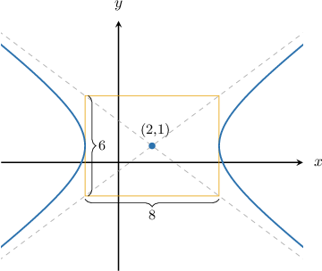
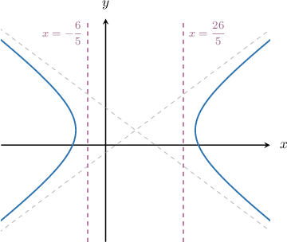
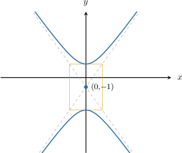
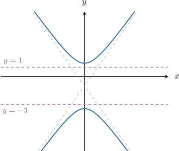
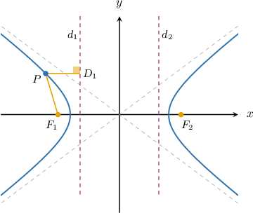

# Directrices of Hyperbolas

Source: https://www.mathacademy.com/topics/1033?courseId=101
Topic ID: 1033

## Prerequisites

- [Eccentricity and Vertices of Hyperbolas](./1031-eccentricity-and-vertices-of-hyperbolas.md)

## Lesson

### Introduction

Every hyperbola has a pair of parallel lines associated with it. These lines are the **directrices** of the hyperbola. A single line by itself is a **directrix**.

A pair of directrices (along with some other information) uniquely defines a hyperbola. We'll demonstrate how this works at the end of the lesson. But for now, let's get some practice at computing them.

The directrices of the *horizontal* hyperbola

$$

\dfrac{(x-h)^2}{a^2} - \dfrac{(y-k)^2}{b^2} = 1

$$

are the two *vertical* lines with the equations

$$

x = h \pm \dfrac{a^2}{c},

$$

where $c = \sqrt{a^2 + b^2}$ is the focal length of the hyperbola.

For example, consider the horizontal hyperbola below, where the auxiliary rectangle is $8$ units long and $6$ units high.

From the diagram, we see that the center of the hyperbola is

$$

(h,k) = (2,1),

$$

and that the semi-transverse and semi-conjugate axes are given by

$$

a=\dfrac{8}{2}=4, \qquad b=\dfrac{6}{2}=3.

$$

Computing the focal length, we get

$$

\begin{aligned}𝑐 & =\sqrt{𝑎^{2}+𝑏^{2}} \\ & =\sqrt{4^{2}+3^{2}} \\ & =\sqrt{25} \\ & =5.\end{aligned}

$$

Therefore, the equations of the directrices are as follows:

$$

\begin{aligned}𝑥 & =ℎ±\frac{𝑎^{2}}{𝑐} \\ 𝑥 & =2±\frac{4^{2}}{5} \\ 𝑥 & =2±\frac{16}{5} \\ 𝑥 & =−\frac{6}{5},\,\frac{26}{5}\end{aligned}

$$

The corresponding diagram is shown below.

Note that the directrices of a hyperbola never intersect it.

### Example: Finding the Directrices of a Horizontal Hyperbola

#### Question

Find the equations of the directrices of the hyperbola $\dfrac{x^2}{25}-\dfrac{y^2}{9}=1.$

#### Explanation

For the ** hyperbola

$$

\dfrac{(x-h)^2}{a^2} - \dfrac{(y-k)^2}{b^2} = 1

$$

the equations of the directrices are

$$

x = h \pm \dfrac{a^2}{c},

$$

where $c = \sqrt{a^2 + b^2}$ is the focal length.

In our case, we have

$$

h=0, \qquad k=0, \qquad a^2 = 25, \qquad b^2 = 9.

$$

Now, computing the focal length, we get

$$

\begin{aligned}𝑐 & =\sqrt{𝑎^{2}+𝑏^{2}} \\ & =\sqrt{25+9} \\ & =\sqrt{34}.\end{aligned}

$$

Therefore, the equations of the directrices are the following:

$$

\begin{aligned}𝑥 & =ℎ±\frac{𝑎^{2}}{𝑐} \\ 𝑥 & =0±\frac{5^{2}}{\sqrt{34}} \\ 𝑥 & =±\frac{25}{\sqrt{34}}\end{aligned}

$$

### Directrices of Vertical Hyperbolas

The directrices of the *vertical* hyperbola

$$

\dfrac{(y-k)^2}{a^2} - \dfrac{(x-h)^2}{b^2} = 1

$$

are the two *horizontal* lines with the equations

$$

y = k \pm \dfrac{a^2}{c},

$$

where $c = \sqrt{a^2 + b^2}$ is the focal length.

For example, consider the horizontal hyperbola below, where the auxiliary rectangle is $2\sqrt{3}$ units long and $2\sqrt{6}$ units high.

From the diagram, we see that the center of the hyperbola is

$$

(h,k) = (0,-1),

$$

and that the semi-transverse and semi-conjugate axes are

$$

a=\dfrac{2\sqrt{6}}{2}=\sqrt{6} \qquad b=\dfrac{2\sqrt{3}}{2}=\sqrt{3}.

$$

Computing the focal length, we get

$$

\begin{aligned}𝑐 & =\sqrt{𝑎^{2}+𝑏^{2}} \\ & =\sqrt{(\sqrt{6})^{2}+(\sqrt{3})^{2}} \\ & =\sqrt{9} \\ & =3.\end{aligned}

$$

Therefore, the equations of the directrices are:

$$

\begin{aligned}𝑦 & =𝑘±\frac{𝑎^{2}}{𝑐} \\ 𝑦 & =−1±\frac{(\sqrt{6})^{2}}{3} \\ 𝑦 & =−1±\frac{6}{3} \\ 𝑦 & =−1±2 \\ 𝑦 & =−3,\,1\end{aligned}

$$

The corresponding diagram is shown below.

### Example: Finding the Directrices of a Vertical Hyperbola

#### Question

Find the equations of the directrices of the hyperbola $\dfrac {(y - 2) ^ 2} {28} - \dfrac {(x + 3) ^ 2} {21} = 1.$

#### Explanation

For the ** hyperbola

$$

\dfrac{(y-k)^2}{a^2} - \dfrac{(x-h)^2}{b^2} = 1

$$

the equations of the directrices are

$$

y = k \pm \dfrac{a^2}{c},

$$

where $c = \sqrt{a^2 + b^2}$ is the focal length.

In our case, we have

$$

h=-3, \qquad k=2, \qquad a^2 = 28, \qquad b^2 = 21.

$$

Now, computing the focal length, we get

$$

\begin{aligned}𝑐 & =\sqrt{𝑎^{2}+𝑏^{2}} \\ & =\sqrt{28+21} \\ & =\sqrt{49} \\ & =7.\end{aligned}

$$

Therefore, the equations of the directrices are the following:

$$

\begin{aligned}𝑦 & =𝑘±\frac{𝑎^{2}}{𝑐} \\ 𝑦 & =2±\frac{28}{7} \\ 𝑦 & =2±4 \\ 𝑦 & =−2,\,6\end{aligned}

$$

### The Focus-Directrix Property of a Hyperbola

The directrices of a hyperbola have one important property, the **focus-directrix** property:

*The ratio of the distance from any point on a hyperbola to its focus and the distance from this point to the corresponding directrix equals the eccentricity of the hyperbola.*

Consider the horizontal hyperbola below, where the points $F_1$ and $F_2$ are the foci of the hyperbola, and $d_1$ and $d_2$ are the directrices.

Now consider a point $P$ on the *left* branch of the horizontal hyperbola shown below. The focus-directrix property states that

$$

\dfrac {PF_1} {PD_1} = e

$$

where $e$ is the eccentricity of the hyperbola.

Similarly, if $Q$ is a point on the *right* branch of the hyperbola, then

$$

\dfrac {QF_2} {QD_2} = e.

$$

A hyperbola (more precisely, one of its branches) can be uniquely determined using the focus-directrix property:

*Let $F$ be a point (focus) and let $d$ be a straight line (directrix) that does not pass through the focus. Also, let $e$ be a real number such that $e>1$ (eccentricity). Then, the corresponding hyperbola is the set of points in the plane for which the ratio of the distances to the focus and the directrix equals the eccentricity:*

$$

𝑃

$$
