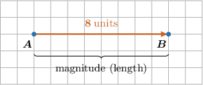
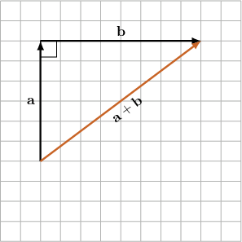
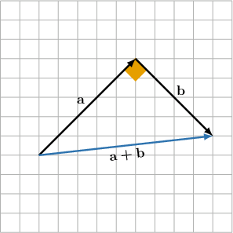
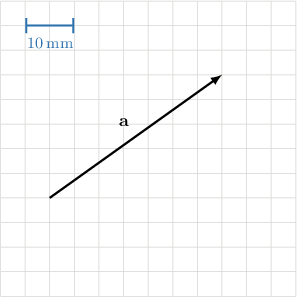
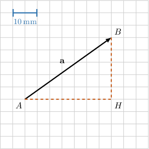
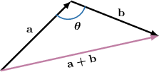
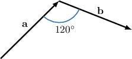
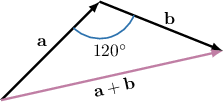
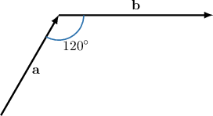
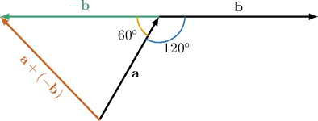

# The Magnitude of a Vector

Source: https://www.mathacademy.com/topics/1101?courseId=101
Topic ID: 1101

## Prerequisites

- [The Law of Cosines](./169-the-law-of-cosines.md)
- [The Triangle Law for the Addition of Two Vectors](./1100-the-triangle-law-for-the-addition-of-two-vectors.md)

## Lesson

### Introduction

Suppose we have a vector $\overrightarrow{AB}=\textbf{a}.$ We denote its **magnitude**, also known as its *modulus* or *length*, as $|\overrightarrow{AB}|$ or $|\textbf{a}|.$

For example, the vector below has a magnitude of $8,$ denoted $|\overrightarrow{AB}|=8.$

Now, let's consider the following situation. Suppose that the vector $\textbf{a}$ is directed vertically upwards and $|\textbf{a}|=6,$ while $\textbf{b}$ is directed horizontally to the right and $|\textbf{b}|=8.$ How can we find $|\textbf{a}+\textbf{b}|?$

First, we use the triangle law of addition to find the resultant $\textbf{a}+\textbf{b}\mathbin{:}$

Notice that we obtain a right triangle. So, we can use the Pythagorean theorem as follows:

$$

\begin{aligned}|𝐚+𝐛|^{2} & =|𝐚|^{2}+|𝐛|^{2} \\ & =6^{2}+8^{2} \\ & =100\end{aligned}

$$

Therefore,

$$

|\textbf{a}+\textbf{b}|=\sqrt{100}=10.

$$

**Important**: In the above calculation we wrote $|\mathbf{a}+\mathbf{b}|^2 = |\mathbf{a}|^2+|\mathbf{b}|^2$. This works only when the vectors $\mathbf{a}$ and $\mathbf{b}$ are at right angles, and the relationship is not true in general. We'll see how to deal with non-right-angled vectors soon.

### Example: Calculating the Magnitude of a Sum of Vectors Using the Pythagorean Theorem

#### Question

The vector $\mathbf{a}$ is directed due north-east and $|\mathbf{a}|=11.$ The vector $\mathbf{b}$ is directed due south-east and $|\mathbf{b}|=8.$ Find the exact value of $|\mathbf{a}+\textbf{b}|.$

#### Explanation

We use the triangle law of addition to find the sum $\mathbf{a}+\mathbf{b}\mathbin{:}$

Notice that we obtain a right triangle. So, we can use Pythagorean theorem as follows:

$$

\begin{aligned}|𝐚+𝐛|^{2} & =|𝐚|^{2}+|𝐛|^{2} \\ & =11^{2}+8^{2} \\ & =185\end{aligned}

$$

Therefore, $|\mathbf{a}+\textbf{b}|=\sqrt{185}.$

### Example: Identifying the Magnitude of a Vector From a Diagram

#### Question

Consider the picture shown below. Find the exact value of $|\mathbf{a}|.$

#### Explanation

In $\bigtriangleup AHB$ we have $\angle AHB = 90^\circ$, $AH=35\:\text{mm}$ and $BH=25\:\text{mm}.$ So, the Pythagorean theorem gives

$$

\begin{aligned}𝐴𝐵 & =\sqrt{𝐴𝐻^{2}+𝐵𝐻^{2}} \\ & =\sqrt{35^{2}+25^{2}} \\ & =\sqrt{1\,850} \\ & =5\sqrt{74}\,mm.\end{aligned}

$$

### Calculating the Magnitude of a Vector Using the Law of Cosines

When the triangle law for addition does *not* give a right triangle, we *cannot* use the Pythagorean theorem to compute the magnitude of the sum.

For example, using the triangle law to draw the sum $\mathbf{a}+\mathbf{b}$ for the vectors below, we do not get a right triangle. Instead, we get a triangle with an obtuse angle $\theta.$

We do not obtain a right triangle here, so we cannot use the Pythagorean theorem. However, we can use the law of cosines:

$$

\begin{aligned}|𝐚+𝐛|^{2} & =|𝐚|^{2}+|𝐛|^{2}−2|𝐚||𝐛|cos⁡𝜃\end{aligned}

$$

In general, given any two vectors that form a triangle using the triangle addition law, we can always use the law of cosines to compute the magnitude of the sum.

### A Worked Example

Consider the diagram above, where $|\mathbf{a}|=4$ and $|\mathbf{b}|=5.$ How can we find $|\mathbf{a+b}|?$

First, we use the triangle law of addition to find $\mathbf{a}+\mathbf{b}\mathbin{:}$

We do not obtain a right triangle here, so we cannot use the Pythagorean theorem. But we can use the law of cosines, as follows:

$$

\begin{aligned}|𝐚+𝐛|^{2} & =|𝐚|^{2}+|𝐛|^{2}−2|𝐚||𝐛|cos⁡(120^{∘}) \\ & =4^{2}+5^{2}−2⋅4⋅5⋅(−\frac{1}{2}) \\ & =16+25+20 \\ & =61\end{aligned}

$$

Therefore, $|\mathbf{a+b}|=\sqrt{61}.$

### Example: Calculating the Magnitude of a Sum of Vectors Using the Law of Cosines

#### Question

Consider the diagram shown above. If and, Find the exact value of

#### Explanation

We can interpret the subtraction as the addition

The vector has the same magnitude as and the direction that is opposite to We use the triangle law of addition to find and The resultant goes from the start of to the head of as shown below.

So, we can use the law of cosines as follows:

Hence,
