# Describing the Position Vector of a Point Using Known Vectors

Source: https://www.mathacademy.com/topics/1106?courseId=101
Topic ID: 1106

## Prerequisites

- [Problem Solving Using Vector Diagrams](./1102-problem-solving-using-vector-diagrams.md)
- [Linear Combinations of Vectors and Their Properties](./1105-linear-combinations-of-vectors-and-their-properties.md)

## Lesson

### Introduction

Given a fixed **origin** in the plane (often denoted), and another point the vector is called the **position vector** of the point

So, the position vector tells us how to move from the origin to the point.

For example, suppose and How can we find the position vector in terms of and

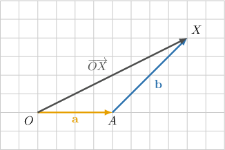

From the diagram, we can trace a path from to by first moving from to and then from to Therefore,

Since and we get

So, to find a position vector, we can trace a convenient path from the origin to the point and add the vectors along that path.

### Writing a Position Vector Using Known Vectors

Now let's look at a slightly more complicated diagram.

Suppose we have two vectors and and a parallelogram where How can we find the position vector in terms of and

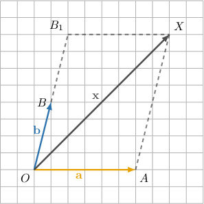

As before, we trace a path from the origin to the point From the diagram, we can write

We know that

Also, since is a parallelogram, opposite sides are equal and parallel. So,

Substituting these into the expression for we get

So, even when the path uses translated copies of known vectors, we can still find the position vector by expressing each part of the path in terms of the known vectors and then adding.

Now we will use the same path-tracing idea in a slightly different way. Instead of only writing a position vector, we will also use vector paths to identify unknown coefficients in linear combinations of known vectors.

### Example: Finding a Scalar Factor in a Linear Combination

#### Question

Consider the picture below.

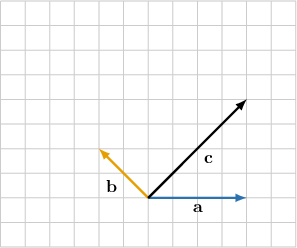

Given that, find

#### Explanation

Recall that when two known vectors are not parallel, a linear combination of them is unique. So, once we rewrite in terms of and we can match coefficients to determine the unknown scalar.

To find we want to match the expression

We are given that one of the components is So, we first draw the vector from the origin. Then we complete the path to the point

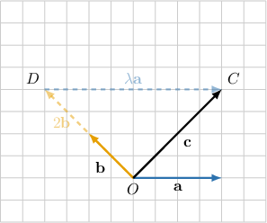

Note that in, we have:

- and have the same direction

Hence,

Additionally,

Consequently,

Since the linear combination can only be written in one way. Equating the coefficients of we get:

### Vectors in Opposite Directions

We can still find a position vector by tracing a path from the origin to the point and adding the vectors along that path.

However, if one part of the path points in the opposite direction to a known vector, then we write it as a **negative** multiple of that vector.

For example, consider the picture below.

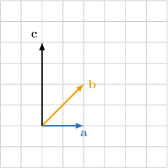

We are given that and we are asked to find

To find we want to match the expression

Let be the origin, and let and end at points and as shown in the diagram below.

Since one term in the vector sum is we first draw the vector from the origin. Then we complete the path to the point

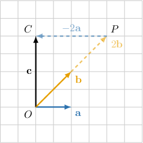

Let be the endpoint of the vector Then

From the construction, we have

Also, the vector has length but points in the opposite direction to Therefore,

Substituting these into the expression for we get

Consequently,

Since the linear combination can only be written in one way. Equating the coefficients of we get

### Example: Finding a Scalar Factor When Direction Reverses

#### Question

Consider the picture below.

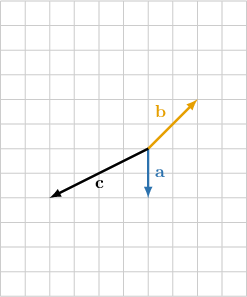

Given that find

#### Explanation

To find we want to match the expression

We are given that one of the components is So, we first draw the vector from the origin. Then we complete the path to the point

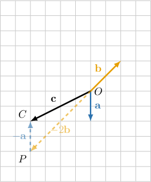

Let be the endpoint of the vector Then

In we have:

- and have opposite directions

Hence,

Similarly,

- and have opposite directions

Hence,

Additionally,

Consequently,

Since the linear combination can only be written in one way. Equating the coefficients of we get

### Example: Finding Two Scalar Factors in a Linear Combination

#### Question

Consider the picture below. Given that $\mathbf{m}=\lambda\mathbf{n}+\mu\mathbf{k}$, find $\lambda$ and $\mu$.

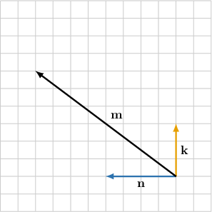

#### Explanation

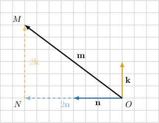

In $\bigtriangleup ONM$ shown above, we have:

- $ON=2|\mathbf{n}|$;

- $\overrightarrow{ON}$ and $\mathbf{n}$ have the same direction

Hence, $\overrightarrow{ON}=2\mathbf{n}$.

Similarly:

- $NM=2|\mathbf{k}|$

- $\overrightarrow{NM}$ and $\mathbf{k}$ have the same direction

Hence, $\overrightarrow{NM}=2\mathbf{k}$.

Additionally,

$$

\begin{aligned}𝐦 & =\overset{𝑂𝑁}{}+\overset{𝑁𝑀}{} \\ & =2𝐧+2𝐤.\end{aligned}

$$

Consequently, $\mathbf{m}=\lambda\mathbf{n}+\mu\mathbf{k}=2\mathbf{n}+2\mathbf{k}$.

Since $\mathbf{n} \nparallel \mathbf{k},$ the linear combination can only be written in one way. Equating the coefficients of $\mathbf{n}$ and $\mathbf{k}$, we get:

- $\lambda=2$ and $\mu=2$

### Example: Expressing a Vector That Satisfies a Ratio in Terms of Known Vectors

#### Question

Consider the following diagram, where $\overrightarrow{OA}=\mathbf{a},$ $\overrightarrow{OB}=\mathbf{b},$ and $X$ divides $AB$ in the ratio $3:1.$ Find $\overrightarrow{OX}.$

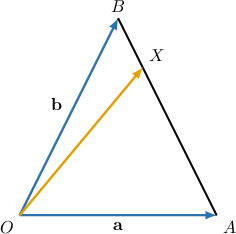

#### Explanation

From the diagram, we see that

$$

\overrightarrow{OX} = \overrightarrow{OA}+\overrightarrow{AX}.

$$

We're told that $\overrightarrow{OA} = \mathbf{a},$ so we just need to work out $\overrightarrow{AX}.$

First, from $\triangle OAB,$ we have

$$

\begin{aligned}\overset{𝐴𝐵}{} & =\overset{𝐴𝑂}{}+\overset{𝑂𝐵}{} \\ & =−\overset{𝑂𝐴}{}+\overset{𝑂𝐵}{} \\ & =−𝐚+𝐛 \\ & =𝐛−𝐚.\end{aligned}

$$

Since $AX:XB=3:1,$ we have

$$

\overrightarrow{AX}=\dfrac{3}{4}\overrightarrow{AB}=\dfrac{3}{4}(\mathbf{b}-\mathbf{a}).

$$

Therefore,

$$

\begin{aligned}\overset{𝑂𝑋}{} & =\overset{𝑂𝐴}{}+\overset{𝐴𝑋}{} \\ & =𝐚+\frac{3}{4}(𝐛−𝐚) \\ & =\frac{1}{4}𝐚+\frac{3}{4}𝐛.\end{aligned}

$$
