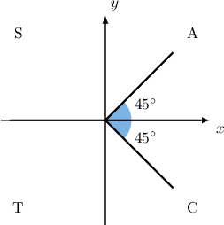
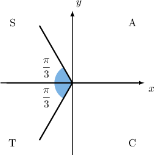
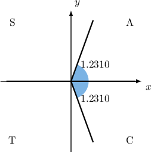
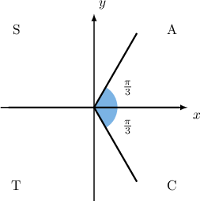

# Elementary Trigonometric Equations Containing Secant

Source: https://www.mathacademy.com/topics/1565?courseId=101
Topic ID: 1565

## Prerequisites

- [Elementary Trigonometric Equations Containing Cosine](./914-elementary-trigonometric-equations-containing-cosine.md)
- [Graphing Secant and Cosecant](../../../traditional/lessons/algebra-ii/1573-graphing-secant-and-cosecant.md)

## Lesson

### Introduction

Suppose we want to solve the equation

$$

\sec x={\sqrt{2}}, \qquad 0^\circ\leq x < 360^\circ.

$$

Most calculators don't have a $\textrm{arcsec}{x}$ button, so we can't get a principal value immediately. However, by rewriting the equation in terms of $\cos{x}$, we can get a principal value:

$$

\begin{aligned}sec⁡𝑥 & =\sqrt{√2} \\ \frac{1}{cos⁡𝑥} & =\sqrt{√2} \\ cos⁡𝑥 & =\frac{1}{\sqrt{√2}}\end{aligned}

$$

Now, we can proceed as usual. Our principal value is

$$

x = \arccos \left(\dfrac{1}{\sqrt{2}} \right)= 45^\circ.

$$

Since $45^\circ$ lies inside the required domain, our first solution is $x_1=45^\circ.$ It lies in the first quadrant and has a reference angle $\theta_R = 45^\circ.$

Since $\cos{x} > 0,$ the second solution must lie in the fourth quadrant, and it also has a reference angle $\theta_R = 45^\circ.$

Since the second solution $x_2$ lies in the $4$th quadrant, we can find it using the reference angle as follows:

$$

x_2 = 360^\circ - 45^\circ = 315^\circ .

$$

So, the solutions are $x=45^\circ, 315^\circ.$

### Example: Solving a Trigonometric Equation Involving Secant with Special Angles

#### Question

Given that $x_1$ and $x_2$ are the solutions to the equation $2\sec x+4=0$ for $0 \leq x < 2\pi,$ what is the value of $x_1\cdot x_2?$

#### Explanation

First, we rearrange the equation, isolating $\sec x\mathbin{:}$

$$

\begin{aligned}2sec⁡𝑥+4 & =0 \\ 2sec⁡𝑥 & =−4 \\ sec⁡𝑥 & =−2\end{aligned}

$$

Recall that $\sec x = \dfrac{1}{\cos x}.$ Therefore, the given equation is equivalent to

$$

\cos x = \dfrac{1}{(-2)}=-\dfrac{1}{2}.

$$

Now, we find the principal value:

$$

x = \arccos \left( -\dfrac{1}{2} \right)= \dfrac{2\pi}{3}

$$

Since $\dfrac{2\pi}{3}$ lies inside the required domain, our first solution is $x_1 = \dfrac{2\pi}{3}.$

Our first solution lies in the second quadrant and has a reference angle of $\theta_R = \dfrac{\pi}{3}.$ Since $\cos{x} < 0,$ the second solution must lie in the third quadrant, and it also has a reference angle $\theta_R = \dfrac{\pi}{3}.$

Since the second solution $x_2$ lies in the $3$rd quadrant, we can find it using the reference angle as follows:

$$

\begin{aligned}𝑥_{2} & =𝜋+𝜃_{𝑅} \\ & =𝜋+\frac{𝜋}{3} \\ & =\frac{4𝜋}{3}\end{aligned}

$$

So, the solutions are $\dfrac{2\pi}{3}, \dfrac{4\pi}{3}.$

Finally,

$$

x_1 \cdot x_2 = \dfrac{2\pi}{3} \cdot \dfrac{4\pi}{3} = \dfrac{8\pi^2}{9}.

$$

### Example: Solving a Trigonometric Equation Involving Secant with Non-Special Angles

#### Question

Given that $x_1$ and $x_2$ are the solutions to the equation $\sec x= 3$ for $0 \leq x < 2\pi,$ what is the value of $x_1\cdot x_2,$ rounded to one decimal place?

#### Explanation

Recall that $\sec x = \dfrac{1}{\cos x}.$ Therefore, the given equation is equivalent to

$$

\cos x = \dfrac{1}{3}.

$$

First, we find the principal value:

$$

\begin{aligned}𝑥=arccos⁡(\frac{1}{3})=1.230\,959…≈1.231\,0\end{aligned}

$$

Since $1.231\,0$ lies inside the specified domain, our first solution is $x_1 = 1.231\,0.$

Our first solution lies in the first quadrant and has a reference angle of $\theta_R = 1.231\,0.$ Since $\cos{x} > 0,$ the second solution must lie in the fourth quadrant, and it also has a reference angle $\theta_R = 1.231\,0.$

Since the second solution $x_2$ lies in the $4$th quadrant, we can find it using the reference angle as follows:

$$

\begin{aligned}𝑥_{2} & =2𝜋−𝜃_{𝑅} \\ & =2𝜋−1.231\,0 \\ & =5.052\,2\end{aligned}

$$

Finally,

$$

x_1\cdot x_2 \approx 1.231\,0 \cdot 5.052\,2 \approx 6.2

$$

rounded to one decimal place.

### Solving a Trigonometric Equation Involving Secant Under a Modified Domain

We can solve an equation involving secant over any desired domain. For example, suppose that we want to solve the equation

$$

\sec x = 2, \qquad -2\pi < x \leq 2\pi.

$$

We can proceed as usual. Recall that $\sec x = \dfrac{1}{\cos x}.$ Therefore, the given equation is equivalent to

$$

\cos x = \dfrac{1}{2}.

$$

Now, we find the principal value:

$$

x = \arccos \left(\dfrac{1}{2} \right)= \dfrac{\pi}{3}

$$

Since $\dfrac{\pi}{3}$ lies inside the required domain, our first solution is ${\color{red}x_1}=\dfrac{\pi}{3}.$ It is in the first quadrant and has a reference angle $\theta_R = \dfrac{\pi}{3}.$

Since $\cos{x} > 0,$ the second solution must lie in the fourth quadrant, and it also has a reference angle $\theta_R = \dfrac{\pi}{3}.$

Since the second solution $\color{blue}x_2$ lies in the $4$th quadrant, we can find it using the reference angle as follows:

$$

{\color{blue}x_2} = 2\pi - \dfrac{\pi}{3} = \dfrac{5\pi}{3}

$$

However, we're not done yet. The domain $-2\pi < x \leq 2\pi$ is larger than one period, so there are more than two solutions.

To get the remaining solutions in the desired domain, we need to find angles that are coterminal with ${\color{red}x_1}$ or ${\color{blue}x_2}.$ So, we subtract integer multiples of $2\pi$ until all possible solutions are found:

$$

\begin{aligned} x_3 & = {\color{red}x_1} -2\pi = \dfrac{\pi}{3}- 2\pi= -\dfrac{5\pi}{3},\\x_4 &= {\color{blue}x_2} -2\pi = \dfrac{5\pi}{3}- 2\pi= -\dfrac{\pi}{3}.\end{aligned}

$$

Adding or subtracting any more multiples of $2\pi$ would result in solutions outside the desired domain. So, we have found all the solutions.

Therefore, the solutions are $x = \pm \dfrac{\pi}{3}, \pm \dfrac{5\pi}{3}.$

### Example: Solving a Trigonometric Equation Involving Secant Under a Modified Domain

#### Question

Given that $x_1$ and $x_2$ are the solutions to the equation $\sec x={\sqrt{2}}$ for $-180^\circ \leq x < 180^\circ,$ what is the numerical value of $x_1\cdot x_2?$

#### Explanation

Recall that $\sec x = \dfrac{1}{\cos x}.$ Therefore the given equation is equivalent to

$$

\cos{x} = \frac{1}{\sqrt{2}}=\dfrac{\sqrt{2}}{2}.

$$

First, we find the principal value:

$$

\begin{aligned}𝑥=arccos⁡(\frac{1}{\sqrt{√2}})=45^{∘}\end{aligned}

$$

Since $45^\circ$ lies inside the required domain, our first solution is $x_1 = 45^\circ.$

Our first solution lies in the first quadrant and has a reference angle of $\theta_R = 45^\circ.$ Since $\cos{x} > 0,$ the second solution must lie in the fourth quadrant, and it also has a reference angle $\theta_R = 45^\circ.$

A second solution $X$ lies in the $4$th quadrant, and we can find it using the reference angle as follows:

$$

\begin{aligned}𝑋 & =360^{∘}−𝜃_{𝑅} \\ & =360^{∘}−45^{∘} \\ & =315^{∘}\end{aligned}

$$

However, this value is not in the required domain. To get the second solution $x_2$ that's within the given domain, we subtract $360^\circ\mathbin{:}$

$$

x_2 = 315^\circ - 360^\circ = -45^\circ.

$$

So, the solutions are $x=45^\circ,-45^\circ.$

Finally,

$$

x_1\cdot x_2 = 45\cdot (-45)=-2\,025.

$$

### Equations Involving the Secant Function With No Solutions

Are there any solutions to the equation

$$

\sec{x} = \dfrac{1}{5}, \qquad 0 \leq x < 2\pi?

$$

Recall that $\sec{x}= \dfrac{1}{\cos{x}}.$ Therefore, the given equation is equivalent to

$$

\cos{x} = 5.

$$

This equation has no solution because we always have $-1 \leq \cos{x} \leq 1,$ and the number $5$ is outside of this range. Therefore, $\sec{x} = \dfrac{1}{5}$ has no solution.

In general, when $-1 < a < 1,$ there are no values of $x$ such that $\sec x = a.$

### Example: Identifying Equations With No Solutions

#### Question

Which of the following equations has no solutions for $0\leq x \lt 2\pi?$

1. $\sec x = -1$

2. $\sec x = 2$

3. $\sec x = \dfrac 1 3$

#### Explanation

Recall that the range of $\sec x$ for $0\leq x \lt 2\pi$ is given by

$$

\sec x \in (-\infty, -1] \cup [1,\infty).

$$

So, the equation $\sec x = k$ has no solutions for $k\in (-1,1).$

Therefore, of the given equations, only equation III has no solutions.
