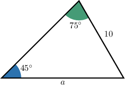
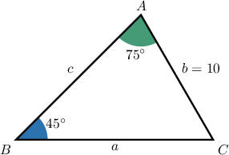
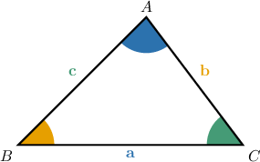
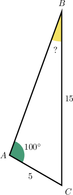
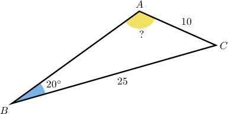
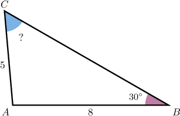
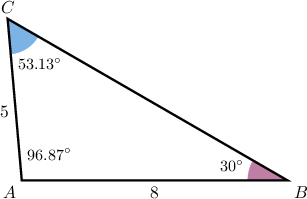
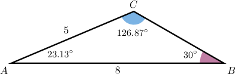
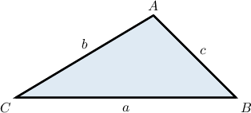
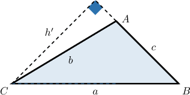

# The Law of Sines

Source: https://www.mathacademy.com/topics/168?courseId=101
Topic ID: 168

## Prerequisites

- [Calculating Side Lengths of Right Triangles Using Trigonometry](../../../traditional/lessons/geometry/629-calculating-side-lengths-of-right-triangles-using-trigonometry.md)
- [Calculating Reference Angles](../../../traditional/lessons/algebra-ii/1456-calculating-reference-angles.md)

## Lesson

### Introduction

Suppose we have the following triangle, where

- Side $a$ is *opposite* angle $A$

- Side $b$ is *opposite* angle $B$

- Side $c$ is *opposite* angle $C.$

The **law of sines** states that

$$

\dfrac{a}{\sin{A}} = \dfrac{b}{\sin{B}} = \dfrac{c}{\sin{C}}.

$$

We'll prove this result at the end of the lesson.

We can use the law of sines to find an unknown side of the triangle. Let's see an example.

### Example: Determining the Length of a Side of a Triangle Using the Law of Sines

#### Question

Consider the triangle below

Calculate the length of the side

#### Explanation

First, let's label all of the vertices and sides of our triangle.

The law of sines states that

In this case, we have and consequently

To solve for we multiply both sides by to give

Now, and both rounded to five decimal places to avoid rounding error. This gives rounded to two decimal places.

### Using the Law of Sines to Calculate an Acute Angle

Let's again consider the following triangle:

The **law of sines** states that

$$

\frac{a}{\sin{A}} = \frac{b}{\sin{B}} = \frac{c}{\sin{C}}.

$$

We can flip the fractions *upside down* to get another formula

$$

\frac{\sin{A}}{a} = \frac{\sin{B}}{b} = \frac{\sin{C}}{c}.

$$

We can use this to find an unknown angle of the triangle.

### Example: Determining the Measure of an Acute Angle in a Triangle Using the Law of Sines

#### Question

Calculate the angle rounding your answer to two decimal places.

#### Explanation

The law of sines states that

In this case, we have and therefore rounded to five decimal places.

Therefore, rounded to two decimal places.

### Calculating an Obtuse Angle Using the Law of Sines

Let's again consider the following triangle:

The **law of sines** states that

$$

\frac{\sin{A}}{a} = \frac{\sin{B}}{b} = \frac{\sin{C}}{c}.

$$

We can use the law of sines to find an unknown acute angle of the triangle, but we must *be careful* when using the law of sines to calculate an **obtuse** angle.

The calculator will *always* give an acute angle. If we're trying to find an obtuse angle, we need to subtract our answer from $180^\circ.$

### Example: Determining the Measure of an Obtuse Angle in a Triangle Using the Law of Sines

#### Question

Given that is obtuse, calculate its measure.

#### Explanation

The law of sines states that

In this case, we have and therefore rounded to five decimal places. This gives rounded to decimal places.

But this is less than To get the true value of we subtract our answer from

### The Case When Multiple Triangles are Possible

Even if we are given the measure of an angle and two sides of a triangle, it is sometimes possible for two different triangles to satisfy those criteria.

For example, suppose we are told that in $\triangle ABC,$ we have $m\angle A = 30^\circ,$ $a=4$ and $b=5.$

There are two different triangles that satisfy these criteria.

- In one triangle, $\angle B$ is obtuse and $c$ is short:

- In the other triangle, $\angle B$ is acute and $c$ is long:

According to the law of sines, we have the following:

$$

\begin{aligned}\frac{sin⁡𝐴}{𝑎} & =\frac{sin⁡𝐵}{𝑏} \\ \frac{sin⁡30^{∘}}{4} & =\frac{sin⁡𝐵}{5} \\ sin⁡𝐵 & =5⋅\frac{sin⁡30^{∘}}{4} \\ sin⁡𝐵 & =5⋅\frac{0.5}{4} \\ sin⁡𝐵 & =0.625\end{aligned}

$$

One solution to the above equation is

$$

\begin{aligned}𝐵 & =arcsin⁡(0.625) \\ & =38.68^{∘}.\end{aligned}

$$

This solution corresponds to the second triangle, where $\angle B$ is acute.

However, this is not the only solution. Another solution is given by

$$

\begin{aligned}𝐵 & =180^{∘}−arcsin⁡(0.625) \\ & =180^{∘}−38.68^{∘} \\ & =141.32^{∘}.\end{aligned}

$$

This solution corresponds to the first triangle, where $\angle B$ is obtuse.

### Example: Applying the Law of Sines when Multiple Triangles are Possible

#### Question

In we have and Which of the following statements ** be true?

1. is acute

2. rounded to decimal places

3. rounded to decimal places

#### Explanation

The following triangle illustrates the information given.

The law of sines states that

In this case, we have and therefore

This gives rounded to decimal places.

In this case, we have

However, another solution to is given by

In this case, we have

So, there are two possible triangles, with the following angle measures:

In conclusion, the correct answer is "I and III only."

### Deriving the Law of Sines

Let's now derive the law of sines.

Consider $\triangle ABC$ with sides of lengths $a,b,$ and $c,$ as shown below. Let's assume $\angle A$ is obtuse.

Let's add the height perpendicular to $\overline{BC},$ shown below, and let's assume that the length of this height equals $h.$

Using elementary trigonometry, we have that

$$

\dfrac{h}{b} = \sin C,\qquad \dfrac{h}{c} = \sin B

$$

which gives

$$

h = b\sin C,\qquad h = c\sin B.

$$

Equating the two expressions for $h$ gives

$$

b\sin C = c\sin B.

$$

Dividing this equation by $\sin B\sin C$ yields

$$

\begin{aligned}𝑏sin⁡𝐶 & =𝑐sin⁡𝐵 \\ \frac{𝑏sin⁡𝐶}{sin⁡𝐵sin⁡𝐶} & =\frac{𝑐sin⁡𝐵}{sin⁡𝐵sin⁡𝐶} \\ \frac{𝑏sin⁡𝐶}{sin⁡𝐵sin⁡𝐶} & =\frac{𝑐sin⁡𝐵}{sin⁡𝐵sin⁡𝐶} \\ \frac{𝑏}{sin⁡𝐵} & =\frac{𝑐}{sin⁡𝐶}.\end{aligned}

$$

We can also draw a height of length $h'$ perpendicular to the side $AB.$

According to the diagram, we have

$$

\dfrac{h'}{a} = \sin B,\qquad \dfrac{h'}{b} = \sin (180^\circ - A)

$$

which gives

$$

h' = a\sin B,\qquad h' = b\sin (180^\circ - A).

$$

Equating the two expressions for $h'$ gives

$$

a\sin B = b\sin (180^\circ - A).

$$

It can be shown that $\sin (180^\circ - A) = \sin A$ (this essentially states that the sine function is symmetric about $A = 90^\circ,$ which you'll explore in more detail in another lesson). Therefore,

$$

a\sin B = b\sin A.

$$

Dividing this equation by $\sin A\sin B$ yields

$$

\dfrac{a}{\sin A} = \dfrac{b}{\sin B}.

$$

Finally, combining this with our previous result, we get

$$

\dfrac{a}{\sin A} = \dfrac{b}{\sin B} = \dfrac{c}{\sin C}

$$

as required.

Here, we considered the case of an obtuse triangle, where one of the heights we considered lies outside the triangle. The law of sines also applies to acute triangles; the proof is similar.
