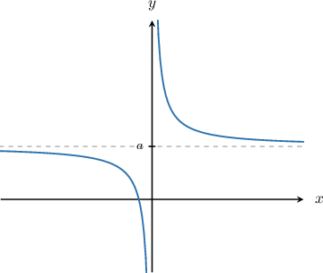
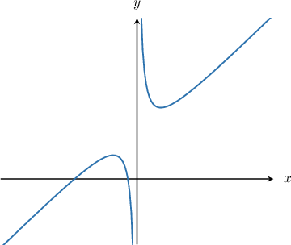
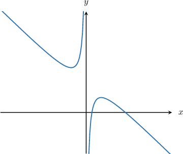

# End Behavior of Rational Functions

Source: https://www.mathacademy.com/topics/1720?courseId=101
Topic ID: 1720

## Prerequisites

- [Horizontal Asymptotes of Rational Functions](./808-horizontal-asymptotes-of-rational-functions.md)
- [End Behavior of Polynomials](./2050-end-behavior-of-polynomials.md)

## Lesson

### Introduction

Describing the end behavior of a rational function $f(x)$ means that we wish to write a statement that explains how the function behaves as $x\to\pm\infty.$

In general, there are three possibilities as $x\to \infty$ in the case of rational functions:

1. $f(x)$ approaches a finite number. In this case, we write $f(x)\to a$ as $x\to\infty$ for some real number $a.$

1. $f(x)$ continues increasing without bound toward $\infty.$ In this case, we write $f(x)\to \infty$ as $x\to\infty.$

1. $f(x)$ continues decreasing without bound toward $-\infty.$ In this case, we write $f(x)\to -\infty$ as $x\to\infty.$

The same idea is true for $x\to-\infty.$ Note that the same rational function may have different end behaviors for $x\to\infty$ and $x\to-\infty.$

### Finding the End Behavior of a Rational Function

Finding the end behavior of a rational function is similar to finding its horizontal asymptotes. That is, we divide each term of the function by the dominant term in the denominator. Then, we find the end behavior of the individual terms as $x\to\pm\infty.$

To demonstrate, let's find the end behavior as $x\to\infty$ of the rational function

$$

f(x) = \dfrac{4x^2- x}{2x^3+3}.

$$

Recall that the dominant term in the denominator is its leading term of the polynomial in the denominator, without the leading coefficient. In this case, the dominant term is $x^3.$

Dividing each term by $x^3$ and simplifying, we get the following:

$$

\begin{aligned}𝑓(𝑥) & =\frac{4𝑥^{2}−𝑥}{2𝑥^{3}+3} \\ & =\frac{(\frac{4𝑥^{2}}{𝑥^{3}}−\frac{𝑥}{𝑥^{3}})}{𝑥^{3}} \\ & =\frac{(\frac{4}{𝑥}−\frac{1}{𝑥^{2}})}{𝑥}\end{aligned}

$$

We now consider the end behavior of each term separately. As $x$ approaches $\infty,$ the terms $\dfrac{4}{x},$ $\dfrac{1}{x^2},$ and $\dfrac{3}{x^3}$ become very small. Therefore, as $x\to +\infty,$ we have

$$

\begin{aligned}𝑓(𝑥) & =\frac{(\frac{4}{𝑥}−\frac{1}{𝑥^{2}})}{𝑥} \\ & ⟶\frac{0−0}{2+0} \\ & =\frac{0}{2} \\ & =0.\end{aligned}

$$

Therefore, we conclude that $f(x) \rightarrow 0$ as $x \rightarrow \infty.$

### Example: Determining the End Behavior When the Degree of the Denominator Is Greatest

#### Question

Given that $f(x) = \dfrac{x^2+ 2x}{7x^4-1} \to a$ as $x \to -\infty$, what is the value of $a?$

#### Explanation

To find the end behavior of a rational function, we divide each term of the function by the dominant term in the denominator. Then, we find the function's end behavior by considering the end behavior of the individual terms.

Since the highest power of $x$ in the denominator is $4,$ the dominant term is $x^4.$

Now, dividing each term by $x^4,$ we get

$$

\begin{aligned}𝑓(𝑥) & =\frac{𝑥^{2}+2𝑥}{7𝑥^{4}−1} \\ & =\frac{(\frac{𝑥^{2}}{𝑥^{4}}+\frac{2𝑥}{𝑥^{4}})}{𝑥^{4}} \\ & =\frac{(\frac{1}{𝑥^{2}}+\frac{2}{𝑥^{3}})}{𝑥^{2}}\end{aligned}

$$

As $x$ approaches $-\infty,$ the terms $\dfrac{1}{x^2}, \dfrac{2}{x^3},$ and $\dfrac{1}{x^4}$ become very small. So, as $x \rightarrow -\infty,$ we have

$$

\begin{aligned}𝑓(𝑥) & =\frac{(\frac{1}{𝑥^{2}}+\frac{2}{𝑥^{3}})}{𝑥^{2}} \\ & ⟶\frac{0+0}{7−0} \\ & =\frac{0}{7} \\ & =0.\end{aligned}

$$

Therefore, $f(x) \rightarrow 0$ as $x \rightarrow -\infty,$ which means that $a=0.$

### Example: Determining the End Behavior When the Degrees of the Numerator and Denominator are Equal

#### Question

Given that $f(x) = \dfrac{x^2-5x}{2x^2-1} \to a$ as $x \to \infty$, what is the value of $a?$

#### Explanation

To find the end behavior of a rational function, we divide each term of the function by the dominant term in the denominator. Then, we find the function's end behavior by considering the end behavior of the individual terms.

Since the highest power of $x$ in the denominator is $2,$ the dominant term is $x^2.$

Now, dividing each term by $x^2,$ we get

$$

\begin{aligned}𝑓(𝑥) & =\frac{𝑥^{2}−5𝑥}{2𝑥^{2}−1} \\ & =\frac{(\frac{𝑥^{2}}{𝑥^{2}}−\frac{5𝑥}{𝑥^{2}})}{𝑥^{2}} \\ & =\frac{(1−\frac{5}{𝑥})}{𝑥}.\end{aligned}

$$

As $x$ approaches $\infty,$ the terms $\dfrac{5}{x}$ and $\dfrac{1}{x^2}$ become very small. So, as $x\to \infty,$ we have

$$

\begin{aligned}𝑓(𝑥) & =\frac{(1−\frac{5}{𝑥})}{𝑥} \\ & ⟶\frac{1−0}{2−0} \\ & =\frac{1}{2}.\end{aligned}

$$

Therefore, $f(x) \to \dfrac{1}{2}$ as $x\to \infty,$ which means that $a=\dfrac12.$

### Example: Determining the End Behavior When the Degree of the Numerator is Greatest

#### Question

Given that $f(x) = \dfrac{2x^3}{x^2-1}\to a$ as $x \rightarrow \infty,$ what is $a?$

#### Explanation

To find the end behavior of a rational function, we divide each term of the function by the dominant term in the denominator. Then, we find the function's end behavior by considering the end behavior of the individual terms.

Since the highest power of $x$ in the denominator is $2,$ the dominant term is $x^2.$

Now, dividing each term by $x^2,$ we get

$$

\begin{aligned}𝑓(𝑥) & =\frac{2𝑥^{3}}{𝑥^{2}−1} \\ & =\frac{(\frac{2𝑥^{3}}{𝑥^{2}})}{𝑥^{2}} \\ & =\frac{2𝑥}{(1−\frac{1}{𝑥^{2}})}.\end{aligned}

$$

As $x$ approaches $\infty,$ the term $\dfrac{1}{x^2}$ becomes very small, whereas $2x$ becomes very large. So, as $x$ approaches $+\infty,$ we have

$$

\begin{aligned}𝑓(𝑥) & =\frac{2𝑥}{1−\frac{1}{𝑥^{2}}} \\ & ≈\frac{2𝑥}{1−0} \\ & =2𝑥\end{aligned}

$$

Therefore, as $x \rightarrow \infty,$ we get $f(x)\approx 2x\to \infty.$
