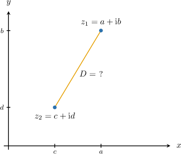
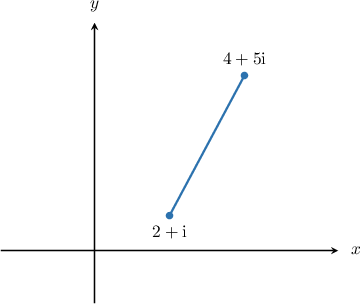
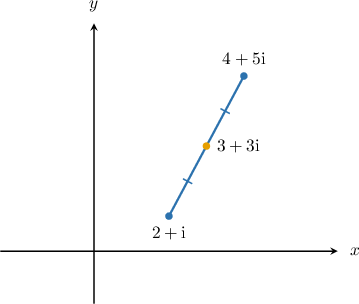
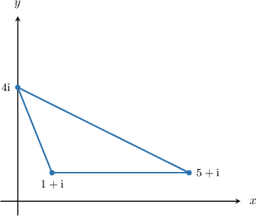
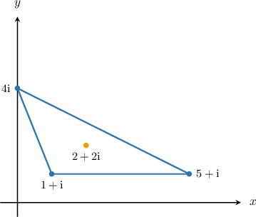

# Geometry in the Complex Plane

Source: https://www.mathacademy.com/topics/2035?courseId=101
Topic ID: 2035

## Prerequisites

- [Adding and Subtracting Complex Numbers](../../../traditional/lessons/algebra-ii/31-adding-and-subtracting-complex-numbers.md)
- [The Magnitude of a Complex Number](./34-the-magnitude-of-a-complex-number.md)
- [Midpoints in the Coordinate Plane](../../../traditional/lessons/geometry/485-midpoints-in-the-coordinate-plane.md)
- [The Mean of a Data Set](../../../../middle-school/lessons/grade-6/2479-the-mean-of-a-data-set.md)

## Lesson

### Introduction

Consider the complex numbers $z_1$ and $z_2,$ given by

$$

z_1=a+\textrm i b , \qquad z_2=c+\textrm i d.

$$

Suppose we wish to compute the distance between these two numbers in the complex plane.

By the distance formula, the distance $D$ between these two complex numbers is given by

$$

D = \sqrt{(a-c)^2+(b-d)^2}.

$$

However, notice that

$$

\begin{aligned}𝑧_{1}−𝑧_{2} & =(𝑎+𝑏i)−(𝑐+𝑑i) \\ & =(𝑎−𝑐)+(𝑏−𝑑)i,\end{aligned}

$$

and therefore,

$$

|z_1 - z_2 | = \sqrt{(a-c)^2+(b-d)^2} .

$$

To summarize, the distance between two numbers in the complex plane equals the modulus of the difference between the numbers:

$$

D = |z_1-z_2| = \sqrt{(a-c)^2 + (b-d)^2}

$$

### A Concrete Example

Let's compute the distance between the following complex numbers:

$$

\begin{aligned}𝑧_{1}=1+i,\,𝑧_{2}=2+3i\end{aligned}

$$

Computing the difference, we obtain

$$

\begin{aligned}𝑧_{1}−𝑧_{2} & =(1+i)−(2+3i) \\ & =−1−2i.\end{aligned}

$$

Therefore, the distance between the numbers is

$$

\begin{aligned}|𝑧_{1}−𝑧_{2}| & =|−1−2i| \\ & =\sqrt{√(−1)^{2}+(−2)^{2}} \\ & =\sqrt{√5}.\end{aligned}

$$

### Example: Finding the Distance Between Numbers in the Complex Plane

#### Question

What is the distance between the numbers $z_1=12+12\textrm{i}$ and $z_2=-4\textrm{i}$ in the complex plane?

#### Explanation

The distance between two numbers in the complex plane equals the modulus of difference between the numbers.

Computing the difference, we obtain

$$

\begin{aligned}𝑧_{1}−𝑧_{2} & =(12+12i)−(−4i) \\ & =12+16i.\end{aligned}

$$

Therefore, the distance between the numbers is

$$

\begin{aligned}|12+16i| & =\sqrt{√(12)^{2}+(16)^{2}} \\ & =\sqrt{√400} \\ & =20.\end{aligned}

$$

### The Midpoint of a Line Segment in the Complex Plane

Given two complex numbers

$$

z_1 = a+\textrm i b, \qquad z_2 = c+\textrm i d,

$$

we can calculate the number corresponding to the midpoint of the line segment joining $z_1$ and $z_2$ by taking the average of the two numbers:

$$

\dfrac{z_1 + z_2}{2} = \left( \dfrac{a+c}{2} \right) + \textrm i\left( \dfrac{b+d}{2} \right)

$$

Notice that this formula is analogous to the midpoint formula in the cartesian plane. In the case of complex numbers $z_1$ and $z_2,$ we take the average of the real and imaginary parts of the two numbers.

For example, let's calculate the midpoint of the segment with endpoints $z_1 = 2+\textrm i$ and $z_2 = 4+5\textrm i.$

The midpoint is given by

$$

\begin{aligned}\frac{𝑧_{1}+𝑧_{2}}{2} & =\frac{(2+i)+(4+5i)}{2} \\ & =\frac{6+6i}{2} \\ & =3+3i.\end{aligned}

$$

Our line segment and its midpoint are shown below.

### Example: Finding the Midpoint of a Line Segment in the Complex Plane

#### Question

What number corresponds to the midpoint of the line segment that connects the numbers $z_1=2+3\textrm{i}$ and $z_2=-6+3\textrm{i}$ in the complex plane?

#### Explanation

Given two complex numbers

$$

z_1 = a+\textrm i b, \qquad z_2 = c+\textrm i d,

$$

we can calculate the number corresponding to the midpoint of the line segment joining $z_1$ and $z_2$ by taking the average of the two numbers:

$$

\dfrac{z_1 + z_2}{2}

$$

Therefore, the midpoint is given by

$$

\begin{aligned}\frac{𝑧_{1}+𝑧_{2}}{2} & =\frac{(2+3i)+(−6+3i)}{2} \\ & =\frac{−4+6i}{2} \\ & =−2+3i.\end{aligned}

$$

### The Centroid of a Triangle

A **median** of a triangle is a line segment that connects a vertex of the triangle with the midpoint of the opposite side. Every triangle has precisely three medians, one for each vertex.

It can be shown that the medians intersect at a single point inside the triangle. This point of intersection is called the **centroid** (or center) of the triangle.

Given three complex numbers $z_1, z_2,$ and $z_3$ in the complex plane, the number corresponding to the centroid of the triangle with vertices $z_1, z_2, z_3$ is the average of these numbers:

$$

\dfrac{z_1+z_2+z_3}{3}

$$

For example, let's calculate the number corresponding to the centroid of the triangle with vertices

$$

\begin{aligned}𝑧_{1}=1+i,\,𝑧_{2}=5+i,\,𝑧_{3}=4i.\end{aligned}

$$

Our triangle is shown below.

The location of the centroid corresponds to the complex number

$$

\begin{aligned}\frac{𝑧_{1}+𝑧_{2}+𝑧_{3}}{3} & =\frac{(1+i)+(5+i)+(4i)}{3} \\ & =\frac{6+6i}{3} \\ & =2+2i.\end{aligned}

$$

Our triangle and its centroid are shown below.

### Example: Finding the Centroid of a Triangle in the Complex Plane

#### Question

Given a triangle in the complex plane with vertices $z_1=-2+3\textrm{i},$ $z_1=5+7\textrm{i},$ and $z_3=3+\textrm{i},$ find the number corresponding to the triangle's centroid.

#### Explanation

We can calculate the centroid of a triangle in the complex plane by taking the average of the numbers corresponding to the triangle's vertices.

Therefore, the centroid corresponds to

$$

\begin{aligned}\frac{𝑧_{1}+𝑧_{2}+𝑧_{3}}{3} & =\frac{(−2+3i)+(5+7i)+(3+i)}{3} \\ & =\frac{6+11i}{3} \\ & =2+\frac{11}{3}i.\end{aligned}

$$
