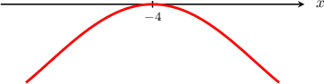
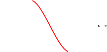
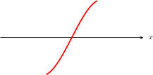
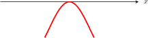
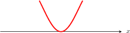
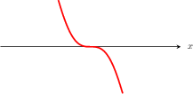
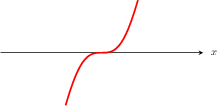
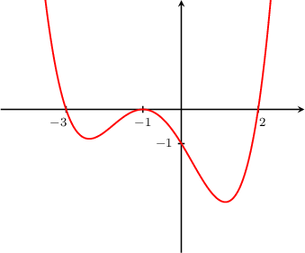
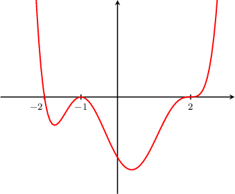
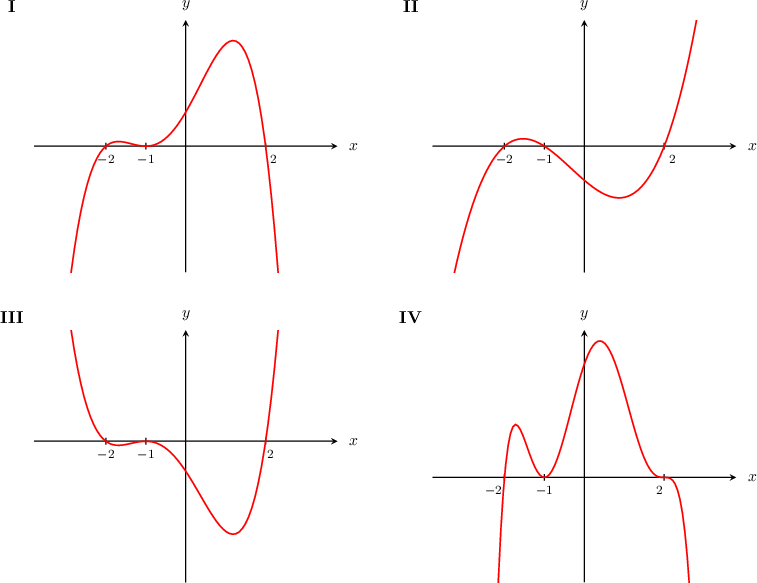

# Graphing General Polynomials

Source: https://www.mathacademy.com/topics/2049?courseId=101
Topic ID: 2049

## Prerequisites

- [End Behavior of Polynomials](./2050-end-behavior-of-polynomials.md)

## Lesson

### Introduction

It's possible to determine information regarding the multiplicities of the roots of a polynomial from its graph. We summarize all possible cases in the table below:

div.graphic {margin-top: 0px; margin-bottom: 0px; text-align: center;}

Note the following:

- The graph is **tangent** to the $x$-axis at multiple roots. This means that if $x=a$ is a multiple root, then the graph of the polynomial is parallel to the $x$-axis at this point.

- If the multiplicity of a root $x=a$ is *even*, the graph just touches the $x$-axis and reverses direction at $x=a.$

- If the multiplicity of a root $x=a$ is *odd* (including a simple root of multiplicity $1$), the graph crosses the $x$-axis at $x=a.$

- The graph of the polynomial is *never* tangent to the $x$-axis at simple roots.

### Example: Identifying Multiplicity of a Root Given a Graph

#### Question

A part of the graph of a polynomial $p(x)$ is given above. Which of the following statements is true?

- $x=-4$ is a multiple root of odd multiplicity

- $x=-4$ is a multiple root of even multiplicity

- $x=-4$ is a simple root

#### Explanation

div.graphic {margin-top: 0px; margin-bottom: 0px; text-align: center;}

It's possible to determine information regarding the multiplicities of the roots of a polynomial from its graph.

- If the graph intersects the $x$-axis but is ** tangent to the $x$-axis at $x=a,$ we have a ** root $x=a.$

- If the graph is ** to the $x$-axis at $x=a,$ we have a ** root $x=a.$ Furthermore: If the graph touches the $x$-axis and reverses direction at $x=a,$ the multiplicity of a root $x=a$ is **. If the graph crosses the $x$-axis at $x=a,$ the multiplicity of a root $x=a$ is **.

In our case, the graph is ** to the $x$-axis at $x=-4.$ So, $x=-4$ is a ** root.

Furthermore, the graph touches the $x$-axis and reverses direction at $x=-4.$ So, $x=-4$ has ** multiplicity.

Therefore, $x=-4$ is a multiple root of even multiplicity.

### Example: Identifying True Statements Regarding the Graph of a Given Polynomial

#### Question

The graph of a polynomial $p(x)$ is shown above. Which of the following statements are true?

1. $x = -1$ is a root of even multiplicity.

2. $x=-3$ and $x=2$ are simple roots.

3. $p(x)\to-\infty$ as $x\to-\infty.$

#### Explanation

Let's analyze each statement in turn.

- Statement I is true. The root $x = -1$ has an even multiplicity because at $x = -1$ the graph just touches the $x$-axis and reverses direction.

- Statement II is true. The roots $x = -3$ and $x=2$ are simple roots because the graph crosses the $x$-axis at the points, but the curve isn't tangent to the $x$-axis at these points.

- Statement III is false. As $x$ moves left in the negative direction towards $-\infty,$ the $y$ value moves up in the positive direction towards $\infty.$

Therefore, the correct answer is "I and II only".

### Example: Identifying the Factored Polynomial Shown in a Graph

#### Question

Which of the following could be the equation of the polynomial above?

1. $y=(x+2)(x+1)^2(x-2)$

2. $y=(x+2)^3(x+1)^2(x-2)$

3. $y=(x+2)(x+1)^2(x-2)^3$

#### Explanation

First, we notice that the function has precisely three distinct roots, $x=-2,$ $x=-1,$ and $x=2.$

Based on the graph, we can make the following conclusions about the multiplicities:

- Since the graph is ** tangent to the $x$-axis at $x =-2,$ this root is a simple root (the multiplicity equals $1$).

- Since the graph just touches the $x$-axis and reverses direction at $x =-1,$ this root has even multiplicity.

- Since the graph passes through $x = 2,$ this root has odd multiplicity, and since the graph is tangent to the $x$-axis at $x=2,$ the multiplicity must be greater than one.

From the given options, the only possible equation is $y= (x+2)(x+1)^2(x-2)^3.$

### Example: Identifying the Graph of a Factored Polynomial

#### Question

Which of the above could be the graph of $y = (x+2)(x+1)^2(x-2)?$

#### Explanation

Based on the factored equation, we can make the following conclusions about the graph:

- Since the multiplicity of the roots $x=\pm 2$ is $1,$ which is odd, the graph must cross the $x$-axis at these points. Moreover, because $x=\pm 2$ are simple roots, the graph must ** be tangent to the $x$-axis at these points.

- Since the multiplicity of the root $x=-1$ is $2,$ which is even, the graph just touches the $x$-axis and reverses direction at this point.

Only the graphs $\textbf{I}$ and $\textbf{III}$ satisfy these conditions.

To choose between these two graphs, we need to consider the end behavior. Since the leading coefficient is positive, as $x$ approaches $\infty,$ $y$ approaches $\infty.$

Only graph $\textbf{III}$ displays this end behavior. Therefore, the correct answer is ****.
