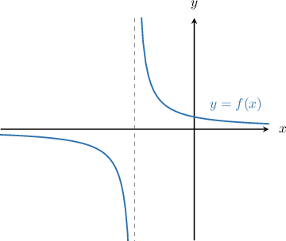
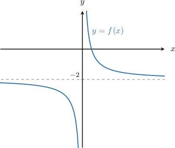
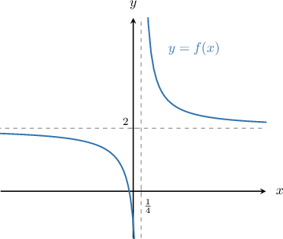

# Domain and Range of Transformed Reciprocal Functions

Source: https://www.mathacademy.com/topics/2082?courseId=101
Topic ID: 2082

## Prerequisites

- [Combining Graph Transformations of Reciprocal Functions](./455-combining-graph-transformations-of-reciprocal-functions.md)

## Lesson

### Introduction

When we transform the reciprocal function $y= \dfrac{1}{x},$ its domain might be modified as well.

For example, the diagram below shows the graph of the transformed reciprocal function $f(x) = \dfrac{1}{x+2}.$

A reciprocal function is defined for all values of $x$ except for those that make the denominator zero. To find the domain, we must exclude all values of $x$ that make the denominator zero.

Setting the denominator of the reciprocal function above equal to zero and solving, we get

$$

\begin{aligned}𝑥+2 & =0 \\ 𝑥 & =−2.\end{aligned}

$$

Therefore, the domain of the function is $x\in(-\infty, -2) \cup (-2, +\infty).$

### Example: Finding the Domain of a Transformed Reciprocal Function

#### Question

What is the domain of the function $f(x) = \dfrac{3}{2-x}+1?$

#### Explanation

A reciprocal function is defined for all values of $x$ except those that make the denominator zero. To find the domain, we must exclude all values of $x$ that make the denominator zero.

Setting the denominator equal to zero and solving, we get

$$

\begin{aligned}2−𝑥 & =0 \\ 𝑥 & =2.\end{aligned}

$$

Therefore, the domain is $x \in (-\infty,2) \cup (2,\infty).$

### Example: Solving for an Unknown Constant in a Transformed Reciprocal Function Given the Domain

#### Question

The domain of the function $f(x) = \dfrac{5}{2x-a}+3$ is $(-\infty,3) \cup (3,+\infty).$ What is the value of $a?$

#### Explanation

A reciprocal function is defined for all values of $x$ except for those that make the denominator zero. So, to find the domain, we must exclude all values that make the denominator zero.

Setting the denominator equal to zero and solving, we get

$$

\begin{aligned}2𝑥−𝑎 & =0 \\ 2𝑥 & =𝑎 \\ 𝑥 & =\frac{𝑎}{2}.\end{aligned}

$$

So, the point that must be excluded from the domain is $x = \dfrac{a}{2}.$

On the other hand, we can see that $x=3$ is excluded from the domain. Equating this to $\dfrac{a}{2},$ we get

$$

\begin{aligned}\frac{𝑎}{2} & =3 \\ 𝑎 & =6.\end{aligned}

$$

### The Range of a Transformed Reciprocal Function

When we transform the reciprocal function $y=\dfrac1x,$ we might also modify its range.

For example, consider the graph of the transformed reciprocal function $f(x) = \dfrac1x -2,$ shown below.

Notice that the function has the horizontal asymptote $y=-2.$

The function $y=f(x)$ can attain any $y$-value with the exception of the $y$-value of the horizontal asymptote. Therefore, to compute its range, we take the interval $(-\infty,\infty)$ and exclude the $y$-value of the asymptote.

Therefore, the range of $y = f(x)$ is

$$

f(x)\in (-\infty, -2) \cup (-2,\infty).

$$

In general, a transformed reciprocal function of the form

$$

f(x) = \dfrac{a}{bx+c} + d

$$

has the horizontal asymptote $y=d,$ and therefore its range is

$$

f(x) \in (-\infty, d)\cup (d,\infty).

$$

### Example: Finding the Range of a Transformed Reciprocal Function

#### Question

Find the range of the function $f(x)=\dfrac{3}{4x-1}+2.$

#### Explanation

A transformed reciprocal function of the form

$$

f(x) = \dfrac{a}{bx+c} + d

$$

has the horizontal asymptote $y=d,$ and therefore, its range is

$$

f(x) \in (-\infty, d)\cup (d,\infty).

$$

In our case, $d = 2.$ Therefore, the horizontal asymptote is $y = 2,$ and the range of the function is

$$

f(x) \in (-\infty, 2) \cup (2, \infty).

$$

The graph $y=f(x)$ is shown below.

