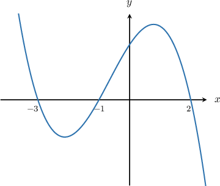
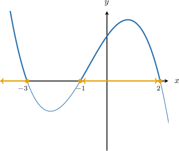
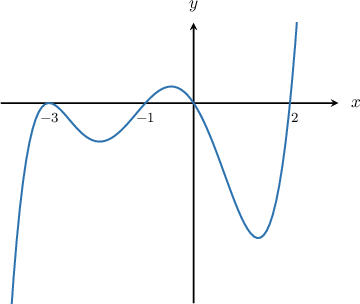
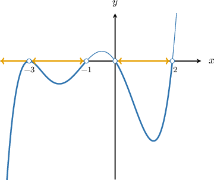
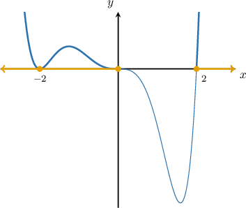
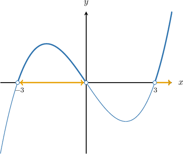

# Solving Polynomial Inequalities Using a Graphical Method

Source: https://www.mathacademy.com/topics/2147?courseId=101
Topic ID: 2147

## Prerequisites

- [Graphing General Polynomials](./2049-graphing-general-polynomials.md)
- [Solving Quadratic Inequalities Using the Graphical Method](./3833-solving-quadratic-inequalities-using-the-graphical-method.md)

## Lesson

### Introduction

One way of solving polynomial inequalities is to use a graphical method.

For example, suppose we want to solve the inequality $p(x) \geq 0$ where $y = p(x)$ is a polynomial whose graph is sketched below:

Solving the inequality $p(x) \geq 0$ means finding the intervals where the graph of $p(x)$ is above the $x$-axis or touching the $x$-axis. These parts of the graph of $p(x)$ are shown below:

We see that the function lies on or above the $x$-axis on the intervals

$$

(-\infty, -3] \quad \text{and}\quad [-1,2].

$$

Therefore, the solution to the inequality $p(x) \geq 0$ is

$$

x \in (-\infty, -3] \cup [-1,2].

$$

### Example: Solving a Polynomial Inequality Using a Given Graph

#### Question

Given the sketch of the polynomial $y = p(x)$ shown above, find the solution to $p(x) < 0$.

#### Explanation

To solve the inequality $p(x) < 0,$ we need to find the values of $x$ for which the curve $y=p(x)$ lies below the $x$-axis. These intervals are shown below.

Based on the graph, the solution is

$$

x \in (-\infty, -3) \cup (-3, -1) \cup (0,2).

$$

**** Notice that this is a strict inequality, so we do not include the roots in our solution.

### Example: Solving a Factored Polynomial Inequality

#### Question

Given the polynomial $P(x) = x^3(x+2)^2(x-2),$ find the solution of $P(x) \geq 0.$

#### Explanation

To solve the inequality $P(x) \geq 0,$ we need to find the values of $x$ for which the curve $y=P(x)$ lies above the $x$-axis or touches this axis.

The roots of the polynomial $P(x) = x^3(x+2)^2(x-2)$ are $x=0$ and $x= \pm{2},$ where

- $x=-2$ has multiplicity $2,$

- $x=0$ has multiplicity $3,$ and

- $x=2$ is a simple root.

Also, $P(x)$ is a polynomial of degree $6$ with a positive leading coefficient. So, we can graph the curve as follows:

Since we are interested in solving $P(x) \geq 0,$ we look for the parts of the curve that are above the $x$-axis or touching the $x$-axis.

Based on the graph, the solution is $x \in (-\infty,0] \cup [2, \infty).$

### Example: Solving a Polynomial Inequality Containing No Constant Term

#### Question

Given $f(x) = x^3 - 9x,$ solve $f(x) \gt 0.$

#### Explanation

To solve the inequality $f(x) \gt 0,$ we need to find the values of $x$ for which the curve $y = f(x)$ lies above the $x$-axis.

First, we factor the polynomial $f(x){:}$

$$

\begin{aligned}𝑓(𝑥) & =𝑥^{3}−9𝑥 \\ & =𝑥(𝑥^{2}−9) \\ & =𝑥(𝑥+3)(𝑥−3)\end{aligned}

$$

The roots of the polynomial $f(x) = x^3 - 9x$ are $x= - 3,$ $x=0,$ and $x = 3,$ which are all simple roots.

So, we can graph the curve as follows:

Since we are interested in solving $f(x) \gt 0,$ we look for the part of the curve that is above the $x$-axis.

Based on the graph, the solution is

$$

x \in (-3,0) \cup (3,\infty).

$$
