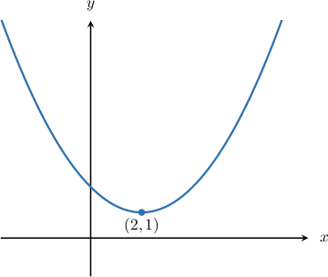
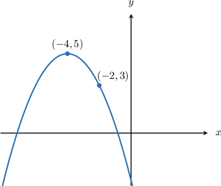
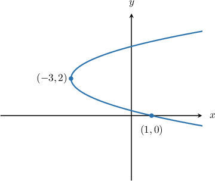

# Parametric Equations of Parabolas Centered at (h,k)

Source: https://www.mathacademy.com/topics/2837?courseId=101
Topic ID: 2837

## Prerequisites

- [Parametric Equations of Parabolas](./875-parametric-equations-of-parabolas.md)

## Lesson

### Introduction

The parametric equations of a *vertical* parabola that has its vertex at $(h,k)$ are

$$

x-h = 2pt, \qquad y-k = pt^2, \qquad t \in (-\infty, \infty),

$$

where $p$ is constant.

For instance, the parabola

$$

x-2 = 2t,\quad y-1 = t^2,\quad t \in (-\infty, \infty)

$$

has its vertex at $(h,k) = (2,1)$ and has $p = 1.$ A sketch of this parabola is shown below.

### Example: Parametrizing a Vertical Parabola

#### Question

What set of parametric equations, defined for $t\in(-\infty, \infty),$ generates the parabola shown below?

#### Explanation

The diagram shows that the parabola is vertical, has its vertex at $(-4,5),$ and passes through the point $(-2,3).$

The parametric equations of a vertical parabola that has its vertex at $(h,k)$ are

$$

x - h = 2pt, \qquad y - k = pt^2,

$$

where $p$ is constant.

In our case, $(h,k) = (-4,5),$ and so we have

$$

x + 4 = 2pt, \qquad y - 5 = pt^2.

$$

Since the parabola passes through $(-2, 3),$ we can substitute $x=-2$ and $y=3$ into the parametric equations to obtain a system of equations. This gives

$$

\begin{aligned}2=2𝑝𝑡 \\ −2=𝑝𝑡^{2}.\end{aligned}

$$

Solving the first equation for $t,$ we have

$$

\begin{aligned}2 & =2𝑝𝑡 \\ 1 & =𝑝𝑡 \\ 𝑡 & =\frac{1}{𝑝}.\end{aligned}

$$

Substituting this into the second equation and solving for $p,$ we get

$$

\begin{aligned}−2 & =𝑝(\frac{1}{𝑝})^{2} \\ −2 & =\frac{1}{𝑝} \\ 𝑝 & =−\frac{1}{2}.\end{aligned}

$$

Therefore, the parametric equations of the parabola are

$$

x + 4 = 2\left(-\dfrac12\right)t, \qquad y - 5 = \left(-\dfrac12\right)t^2 ,

$$

which simplify to

$$

x + 4 = -t, \qquad y - 5 = -\dfrac12t^2 .

$$

### Parametric Equations of Horizontal Parabolas

The parametric equations of a *horizontal* parabola that has its vertex at $(h,k)$ are

$$

x-h = pt^2, \qquad y-k = 2pt, \qquad t \in (-\infty, \infty),

$$

where $p$ is constant.

### Example: Parametrizing a Horizontal Parabola

#### Question

What set of parametric equations, defined for $t\in(-\infty,\infty),$ generates the parabola shown below?

#### Explanation

The diagram shows that the parabola is horizontal, has its vertex at $(-3,2),$ and passes through the point $(1,0).$

The parametric equations of a horizontal parabola that has its vertex at $(h,k)$ are

$$

x - h = pt^2, \qquad y - k = 2pt,

$$

where $p$ is constant.

In our case, $(h,k) = (-3,2),$ and so we have

$$

x+3 = pt^2, \qquad y-2 = 2pt.

$$

Since the parabola passes through $(1,0),$ we can substitute $x=1$ and $y=0$ into the parametric equations to obtain a system of equations. This gives

$$

\begin{aligned}4=𝑝𝑡^{2} \\ −2=2𝑝𝑡.\end{aligned}

$$

Solving the second equation for $t,$ we have

$$

\begin{aligned}−2 & =2𝑝𝑡 \\ 𝑡 & =−\frac{1}{𝑝}.\end{aligned}

$$

Substituting this into the first equation and solving for $p,$ we get

$$

\begin{aligned}4 & =𝑝(−\frac{1}{𝑝})^{2} \\ 4 & =𝑝⋅\frac{1}{𝑝^{2}} \\ 4 & =\frac{1}{𝑝} \\ 𝑝 & =\frac{1}{4}.\end{aligned}

$$

Therefore, the parametric equations of the parabola are

$$

x+3 = \left(\dfrac{1}{4}\right)t^2, \qquad y -2 = 2\left(\dfrac{1}{4}\right)t ,

$$

which simplify to

$$

x+3 = \dfrac{1}{4}t^2, \qquad y -2= \dfrac{1}{2}t .

$$

### Example: Finding the Cartesian Equation of Parabola Given Its Parametric Equations

#### Question

Find the Cartesian equation of the parabola defined by the parametric equations

$$

x-1 = -2t^2, \qquad y+1 = -4t, \qquad t\in(-\infty, \infty).

$$

#### Explanation

First, let's make $t$ the subject of the parametric equations. This gives

$$

\begin{aligned}𝑡^{2} & =−\frac{𝑥−1}{2},\,𝑡=−\frac{𝑦+1}{4}.\end{aligned}

$$

Squaring both sides of the second equation, we have

$$

\begin{aligned}𝑡^{2} & =(−\frac{𝑦+1}{4})^{2} \\ & =\frac{(𝑦+1)^{2}}{16}.\end{aligned}

$$

We can now eliminate the parameter $t$ by substituting the above into the equation $t^2 = -\dfrac{x-1}{2}$ and rearranging to find the Cartesian equation of the parabola, as follows:

$$

\begin{aligned}\frac{(𝑦+1)^{2}}{16} & =−\frac{𝑥−1}{2} \\ (𝑦+1)^{2} & =16⋅(−\frac{𝑥−1}{2}) \\ (𝑦+1)^{2} & =−8(𝑥−1)\end{aligned}

$$

### Justification That the Parametric Equations Describe a Parabola

Let's recall the parametric equations of a vertical parabola that has its vertex at $(h,k){:}$

$$

x-h = 2pt, \qquad y-k = pt^2, \qquad t\in(-\infty,\infty).

$$

How can we be sure that these equations describe a parabola?

First, let's make $t$ the subject of the parametric equations:

$$

\begin{aligned}𝑥−ℎ & =2𝑝𝑡 & ⟹ & & 𝑡 & =\frac{𝑥−ℎ}{2𝑝} \\ 𝑦−𝑘 & =𝑝𝑡^{2} & ⟹ & & 𝑡^{2} & =\frac{𝑦−𝑘}{𝑝}\end{aligned}

$$

Squaring the first equation above, we have

$$

\begin{aligned}𝑡^{2} & =(\frac{𝑥−ℎ}{2𝑝})^{2} \\ 𝑡^{2} & =\frac{(𝑥−ℎ)^{2}}{4𝑝^{2}}.\end{aligned}

$$

Now, substituting in the second equation $t^2 = \dfrac{y-k}{p},$ we can eliminate the parameter $t$ and rearrange to find the Cartesian equation:

$$

\begin{aligned}𝑡^{2} & =\frac{(𝑥−ℎ)^{2}}{4𝑝^{2}} \\ \frac{𝑦−𝑘}{𝑝} & =\frac{(𝑥−ℎ)^{2}}{4𝑝^{2}} \\ \frac{𝑦−𝑘}{𝑝}⋅4𝑝^{2} & =(𝑥−ℎ)^{2} \\ (𝑥−ℎ)^{2} & =4𝑝(𝑦−𝑘)\end{aligned}

$$

This is the Cartesian equation of a vertical parabola with vertex $(h,k).$ Therefore, the parametric equations do indeed describe a vertical parabola.

If we did the same for the parametric equations of a horizontal parabola that has its vertex at $(h,k),$ we would obtain the Cartesian equation of a horizontal parabola, namely $(y-k)^2 = 4p(x-h).$
