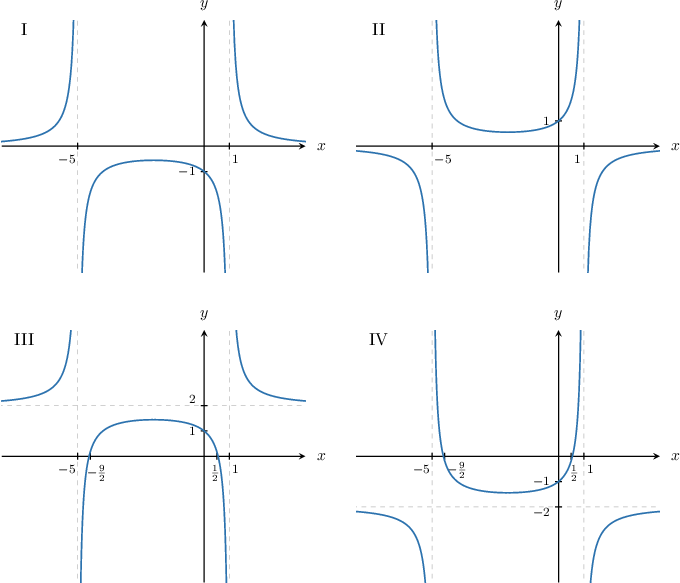
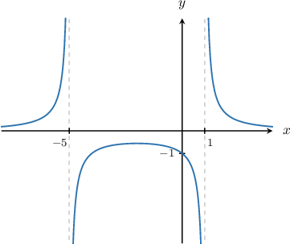
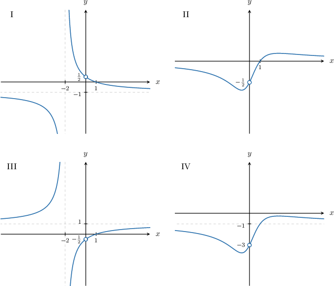
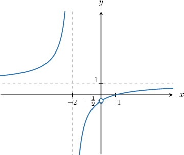
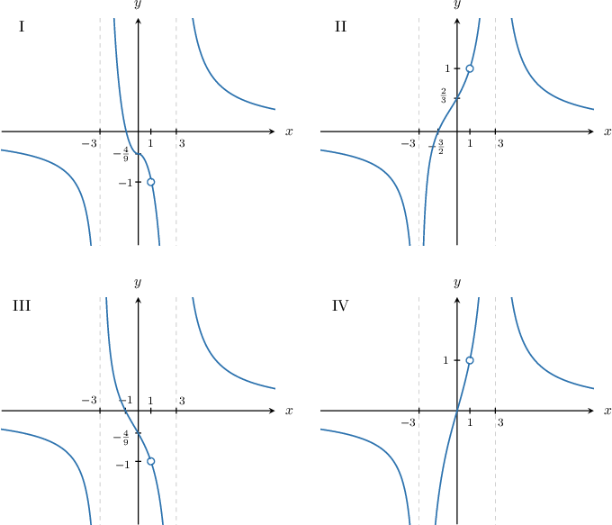
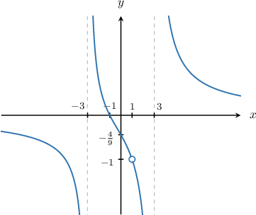

# Identifying the Graph of a Rational Function

Source: https://www.mathacademy.com/topics/3686?courseId=101
Topic ID: 3686

## Prerequisites

- [End Behavior of Rational Functions](./1720-end-behavior-of-rational-functions.md)
- [Locating Holes in Rational Functions](./1817-locating-holes-in-rational-functions.md)

## Lesson

### Introduction

A common type of problem is to match a given rational function $f(x)$ with its graph.

To solve these types of problems, we determine the properties of the given function and then eliminate any options that do not have the desired properties.

When referring to the properties of rational functions, we usually mean the following:

- $x$- and $y$-intercepts

- vertical and horizontal asymptotes

- holes of the function

Let's see some examples.

### Example: Identifying the Graph of a Rational Function That Does Not Contain Holes

#### Question

Which of the following is the graph of the function $y = \dfrac{5}{x^2+4x-5}?$

**

#### Explanation

First, we denote $f(x) = \dfrac{5}{x^2+4x-5}.$

To determine the correct graph, we follow four steps:

- **** We find the $y$-intercept. To do this, we evaluate $f(0)\mathbin{:}$ So, the $y$-intercept is $(0,-1).$

- **** We find the $x$-intercepts. To do this, we set the numerator equal to zero and solve for $x.$ In this case, the numerator is a constant, and so there are no $x$-intercepts.

- **** We find the vertical asymptotes. To do this, we need to set the denominator equal to zero and solve for $x\mathbin{:}$ Therefore, the vertical asymptotes are $x=-5$ and $x=1.$

- **** We find the horizontal asymptotes. To do this, we divide numerator and denominator by the dominant term in the denominator, which is $x^2$ in this case: Now, as $|x|$ gets very large, $\dfrac{5}{x^2}$ and $\dfrac{4}{x}$ become very small. Therefore, as $|x|\to\infty,$ we have So, the horizontal asymptote is $y = 0.$

Finally, among the options given, only graph I satisfies the above conditions:

### Example: Identifying the Graph of a Given Rational Function Containing One Hole

#### Question

Which of the following is the graph of the function $y = \dfrac{x^2 - x}{x^2 + 2x}?$

**

#### Explanation

First, we denote

$$

f(x) = \dfrac{x^2 - x}{x^2 + 2x} = \dfrac{x(x - 1)}{x(x+2)}.

$$

Notice that the numerator and denominator both have $x$ as a common factor. Setting this common factor equal to zero and solving for $x$ gives

$$

\%x - 2 = 0\qquad\Longrightarrow\qquad x= 2. x = 0.

$$

Therefore, the function has a hole at $x=0.$

To find the $y$-coordinate of the hole, we find the reduced rational function $F(x)$ and evaluate it at the $x$-coordinate of the hole.

Finding the reduced rational function $F(x),$ we get

$$

\begin{aligned}𝐹(𝑥) & =\frac{𝑥(𝑥−1)}{𝑥(𝑥+2)} \\ & =\frac{𝑥(𝑥−1)}{𝑥(𝑥+2)} \\ & =\frac{𝑥−1}{𝑥+2}.\end{aligned}

$$

The $y$-coordinate of the hole is given by

$$

\begin{aligned}𝐹(0) & =\frac{0−1}{0+2} \\ & =−\frac{1}{2}.\end{aligned}

$$

So, the coordinates of the hole are $\left(0,-\dfrac{1}{2}\right).$

Now, to determine the correct graph, we follow four steps with the reduced rational function $F(x){:}$

- **** We find the $y$-intercept. However, since $x=0$ is a hole, there is no $y$-intercept.

- **** We find the $x$-intercepts. To do this, we set the numerator equal to zero and solve for $x{:}$ So, the $x$-intercept is $(1,0).$

- **** We find the vertical asymptotes. To do this, we need to set the denominator equal to zero and solve for $x\mathbin{:}$ Therefore, the vertical asymptote is $x=-2.$

- **** We find the horizontal asymptotes. To do this, we divide numerator and denominator by the dominant term in the denominator, which is $x$ in this case: Now, as $|x|$ gets very large, $\dfrac{1}{x}$ and $\dfrac{2}{x}$ becomes very small. Therefore, as $|x|\to\infty,$ we have So, the horizontal asymptote is $y = 1.$

Finally, among the options given, only graph III satisfies the above conditions:

### Example: Identifying a Rational Function Containing a Cubic Denominator

#### Question

Which of the following is the graph of the function $y =\dfrac{4x^2-4}{x^3-x^2-9x+9}?$

**

#### Explanation

First, we define the function $f(x)$ and factor the numerator and denominator.

$$

\begin{aligned}𝑓(𝑥) & =\frac{4𝑥^{2}−4}{𝑥^{3}−𝑥^{2}−9𝑥+9} \\ & =\frac{4(𝑥^{2}−1)}{𝑥^{2}(𝑥−1)−9(𝑥−1)} \\ & =\frac{4(𝑥−1)(𝑥+1)}{(𝑥−1)(𝑥^{2}−9)} \\ & =\frac{4(𝑥−1)(𝑥+1)}{(𝑥−1)(𝑥+3)(𝑥−3)}\end{aligned}

$$

Notice that the numerator and denominator both have $(x-1)$ as a common factor. Setting this common factor equal to zero and solving for $x$ gives

$$

x - 1 = 0\quad\Longrightarrow\quad x= 1.

$$

Therefore, the function has a hole at $x=1.$

To find the $y$-coordinate of the hole, we find the reduced rational function $F(x)$ and evaluate it at the $x$-coordinate of the hole.

Finding the reduced rational function $F(x),$ we get

$$

\begin{aligned}𝐹(𝑥) & =\frac{4(𝑥−1)(𝑥+1)}{(𝑥−1)(𝑥+3)(𝑥−3)} \\ & =\frac{4(𝑥−1)(𝑥+1)}{(𝑥−1)(𝑥+3)(𝑥−3)} \\ & =\frac{4(𝑥+1)}{(𝑥+3)(𝑥−3)}.\end{aligned}

$$

The $y$-coordinate of the hole is given by

$$

\begin{aligned}𝐹(1) & =\frac{4(1+1)}{(1+3)(1−3)} \\ & =\frac{8}{−8} \\ & =−1.\end{aligned}

$$

So, the coordinates of the hole are $(1,-1).$

Now, to determine the correct graph, we follow four steps with the reduced rational function $F(x){:}$

- **** We find the $y$-intercept. To do this, we evaluate $F(0){:}$ So, the $y$-intercept is $\left(0,-\dfrac{4}{9}\right).$

- **** We find the $x$-intercepts. To do this, we set the numerator equal to zero and solve for $x{:}$ So, the $x$-intercept is $(-1,0).$

- **** We find the vertical asymptotes. To do this, we set the denominator equal to zero and solve for $x\mathbin{:}$ Therefore, the vertical asymptotes are $x=-3$ and $x=3.$

- **** We find the horizontal asymptotes. To do this, we divide numerator and denominator by the dominant term in the denominator, which is $x^2$ in this case: Now, as $|x|$ gets very large, $\dfrac{4}{x},$ $\dfrac{4}{x^2},$ and $\dfrac{9}{x^2}$ becomes very small. Therefore, as $|x|\to\infty,$ we have So, the horizontal asymptote is $y = 0.$

Finally, among the options given, only graph III satisfies the above conditions:

