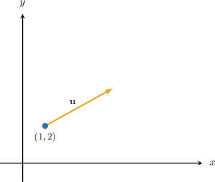
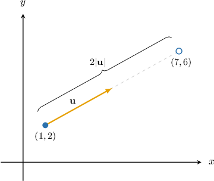
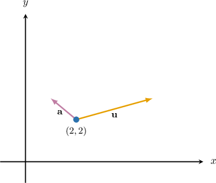
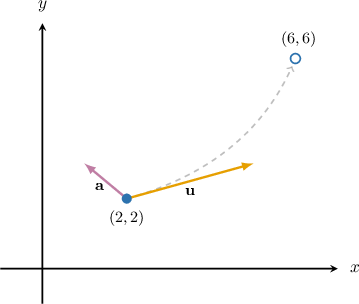

# Calculating Displacement for Plane Motion

Source: https://www.mathacademy.com/topics/3767?courseId=101
Topic ID: 3767

## Prerequisites

- [Modeling Downwards Vertical Motion](../../../traditional/lessons/algebra-i/688-modeling-downwards-vertical-motion.md)
- [Velocity and Acceleration for Plane Motion](./2036-velocity-and-acceleration-for-plane-motion.md)

## Lesson

### Introduction

If a particle moves with *constant* velocity $\mathbf{u},$ the position vector of the particle at time $t$ can be found using

$$

\mathbf{r} = \mathbf{r}_0 + \mathbf{u} t,

$$

where $\mathbf{r}_0$ is the position of the particle when $t=0$ (i.e., the **initial position**).

Notice that the term $\mathbf u t$ on the right-hand has units of $\textrm{speed} \cdot \textrm{time},$ so we can think of this formula as being analogous to $\textrm{distance} = \textrm{speed} \cdot \textrm{time}.$

Suppose a particle moves with a constant velocity of $(3\mathbf{i} + 2\mathbf{j}) \: \textrm{m/s},$ and its initial position is $(\mathbf{i} + 2\mathbf{j}) \: \textrm{m}.$ A sketch of this situation is shown below.

Let's calculate the position vector of the particle after $2$ seconds. In our case, we have

$$

\mathbf{r}_0 = \mathbf{i} + 2\mathbf{j}, \qquad \mathbf u = 3\mathbf{i} + 2\mathbf{j}.

$$

Therefore, the position vector of the particle after $t = 2 \: \textrm{s}$ is

$$

\begin{aligned}𝐫 & =𝐫_{0}+𝐮𝑡 \\ & =(𝐢+2𝐣)+(3𝐢+2𝐣)(2) \\ & =(𝐢+2𝐣)+(6𝐢+4𝐣) \\ & =(7𝐢+6𝐣)\,m.\end{aligned}

$$

So, the particle is located at the point $(7,6)$ after $2$ seconds, as shown below.

Notice the distance covered by the particle equals $2 |\mathbf{u}|$ because the particle is translated by the vector $\mathbf u$ every second for two seconds.

### Example: Calculating the Position Vector of a Particle Moving With Constant Velocity

#### Question

A particle starts moving from the point with position vector $(3\mathbf{j} - \mathbf{i}) \: \textrm{mi}$ with a constant velocity of $(\mathbf{i} - \mathbf{j}) \: \textrm{mi/h}.$ Find the position vector of the particle after $2$ hours.

#### Explanation

If a particle moves with constant velocity $\mathbf{u},$ the position vector of the particle at time $t$ can be found using

$$

\mathbf{r} = \mathbf{r}_0 + \mathbf{u} t,

$$

where $\mathbf{r}_0$ is the initial position of the particle.

In our case, we have

$$

\mathbf{r}_0 = 3\mathbf{j} - \mathbf{i}, \qquad \mathbf u = \mathbf{i} - \mathbf{j}.

$$

Therefore, the position vector of the particle after $t = 2 \: \textrm{h}$ is

$$

\begin{aligned}𝐫 & =𝐫_{0}+𝐮𝑡 \\ & =(3𝐣−𝐢)+(𝐢−𝐣)(2) \\ & =(−𝐢+3𝐣)+(2𝐢−2𝐣) \\ & =(𝐢+𝐣)\,mi.\end{aligned}

$$

### Particles Moving With Constant Acceleration

Recall that when a particle moves along a straight line with *constant* acceleration $a$ and initial velocity $u,$ we can calculate its displacement $s$ at time $t$ using the formula

$$

s = ut + \dfrac12 a t^2.

$$

There is an analogous formula that works for planar motion. If a particle moves with constant acceleration $\mathbf{a},$ the position vector of the particle at time $t$ can be found using

$$

\mathbf{r} = \mathbf{r}_0 + \mathbf{u} t + \dfrac12 \mathbf{a} t^2,

$$

where $\mathbf{r}_0$ is the initial position of the particle and $\mathbf{u}$ is its initial velocity.

For example, suppose a particle starts moving from the point with position vector $(2\mathbf{i} + 2\mathbf{j}) \: \textrm{m}$ with acceleration of $(-\mathbf{i} + \mathbf{j})\,\textrm{m/s}^2$ and an initial velocity of $(3\mathbf{i} +\mathbf{j}) \: \textrm{m/s}.$ What will be the position vector of the particle after $2$ seconds?

In our case, we have

$$

\mathbf{r}_0 = 2\mathbf i + 2\mathbf j, \qquad \mathbf u = 3\mathbf{i} + \mathbf{j}, \qquad \mathbf a = -\mathbf{i} + \mathbf{j}.

$$

Therefore, the position vector of the particle after $t = 2 \, \textrm{s}$ is

$$

\begin{aligned}𝐫 & =(2𝐢+2\,𝐣)+(3𝐢+𝐣)(2)+\frac{1}{2}(−𝐢+𝐣)(2)^{2} \\ & =(2𝐢+2\,𝐣)+(6𝐢+2𝐣)+2(−𝐢+𝐣) \\ & =(2𝐢+2\,𝐣)+(6𝐢+2𝐣)+(−2𝐢+2𝐣) \\ & =(6𝐢+6𝐣)\,m.\end{aligned}

$$

So, the particle is located at the point $(6,6)$ after $2$ seconds, as shown below.

**Watch out!** The trajectory (path) of a particle that moves with nonzero acceleration in the plane is not necessarily a straight line!

### Example: Calculating the Position Vector of a Particle Moving With Constant Acceleration

#### Question

A particle starts moving from the point with position vector $(4\mathbf{i} - \mathbf{j})\,\textrm{cm}$ with an acceleration of $(\mathbf{i} + 3\mathbf{j}) \, \textrm{cm/min}^2$ and an initial velocity of $(\mathbf{i} + \mathbf{j}) \: \textrm{cm/min}.$ Find the position vector of the particle after $4$ minutes.

#### Explanation

If a particle moves with constant acceleration $\mathbf{a},$ the position vector of the particle at time $t$ can be found using

$$

\mathbf{r} = \mathbf{r}_0 + \mathbf{u} t + \dfrac12 \mathbf{a} t^2,

$$

where $\mathbf{r}_0$ is the initial position of the particle and $\mathbf{u}$ is its initial velocity.

In our case, we have

$$

\mathbf{r}_0 = 4\mathbf i - \mathbf j , \qquad \mathbf u = \mathbf{i} +\mathbf{j}, \qquad \mathbf a = \mathbf{i} + 3\mathbf{j}.

$$

Therefore, the position vector of the particle after $t = 4 \, \textrm{min}$ is

$$

\begin{aligned}𝐫 & =(4𝐢−𝐣)+(𝐢+𝐣)(4)+\frac{1}{2}(𝐢+3𝐣)(4)^{2} \\ & =(4𝐢−𝐣)+(4𝐢+4𝐣)+8(𝐢+3𝐣) \\ & =(8𝐢+3𝐣)+(8𝐢+24𝐣) \\ & =(16𝐢+27𝐣)\,cm.\end{aligned}

$$

### Example: Calculating the Distance Between a Particle and the Origin

#### Question

A particle moves from the origin with an acceleration of $(\mathbf{i} +\mathbf{j}) \, \textrm{cm/s}^2$ and an initial velocity of $(-\mathbf{i}-2\mathbf{j}) \: \textrm{cm/s}.$ Find the distance from the particle to the origin after $6$ seconds.

#### Explanation

If a particle moves with constant acceleration $\mathbf{a},$ the position vector of the particle at time $t$ can be found using

$$

\mathbf{r} = \mathbf{r}_0 + \mathbf{u} t + \dfrac12 \mathbf{a} t^2,

$$

where $\mathbf{r}_0$ is the initial position of the particle and $\mathbf{u}$ is its initial velocity.

In our case, we have

$$

\mathbf{r}_0 = 0\mathbf i +0 \mathbf j , \qquad \mathbf u = -\mathbf{i}-2\mathbf{j}, \qquad \mathbf a = \mathbf{i} +\mathbf{j}.

$$

Therefore, the position vector of the particle after $t = 6 \, \textrm{s}$ is

$$

\begin{aligned}𝐫 & =(0𝐢+0𝐣)+(−𝐢−2𝐣)(6)+\frac{1}{2}(𝐢+𝐣)(6)^{2} \\ & =(−6𝐢−12𝐣)+18(𝐢+𝐣) \\ & =(−6𝐢−12𝐣)+(18𝐢+18𝐣) \\ & =(12𝐢+6𝐣)\,cm.\end{aligned}

$$

Finally, the distance from the particle to the origin at this time is

$$

\begin{aligned}|𝐫| & =|12𝐢+6𝐣| \\ & =\sqrt{√12^{2}+6^{2}} \\ & =\sqrt{√144+36} \\ & =\sqrt{√180} \\ & =6\sqrt{√5}\,cm.\end{aligned}

$$
