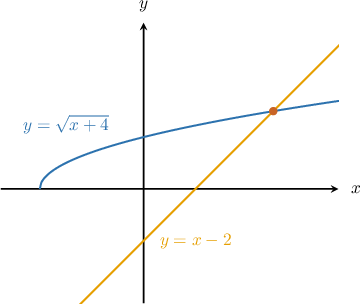
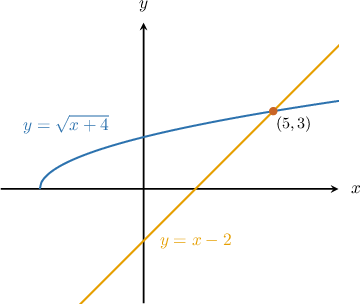
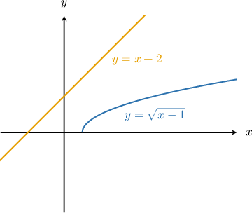
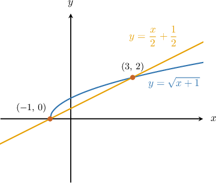

# Finding Intersections of Lines and Radical Functions

Source: https://www.mathacademy.com/topics/411?courseId=101
Topic ID: 411

## Prerequisites

- [Solving Systems of Nonlinear Equations Using Graphs](../../../traditional/lessons/algebra-i/101-solving-systems-of-nonlinear-equations-using-graphs.md)
- [Calculating the Intersection of Two Lines](../../../traditional/lessons/algebra-i/408-calculating-the-intersection-of-two-lines.md)
- [Graphing the Square Root Function](./2038-graphing-the-square-root-function.md)
- [Solving Advanced Radical Equations](../../../traditional/lessons/algebra-ii/2118-solving-advanced-radical-equations.md)

## Lesson

### Introduction

Suppose we want to find the points where the line $y=x-2$ intersects the radical function $y=\sqrt{x+4}.$ From the graph below, we can see that there is one point of intersection. Let's calculate its coordinates!

An intersection point is a common solution of the equations $y=x-2$ and $y=\sqrt{x+4}.$ In other words, to get the coordinates of the intersection points, we have to solve the following system of equations:

$$

\begin{aligned}𝑦=\sqrt{𝑥+4} \\ 𝑦=𝑥−2\end{aligned}

$$

Setting the equations equal to one another and then solving for $x,$ we get:

$$

\begin{aligned}\sqrt{𝑥+4} & =𝑥−2 \\ 𝑥+4 & =(𝑥−2)^{2} \\ 𝑥+4 & =𝑥^{2}−4𝑥+4 \\ 𝑥^{2}−5𝑥 & =0 \\ 𝑥(𝑥−5) & =0 \\ 𝑥 & =0,5\end{aligned}

$$

Since we're dealing with square roots, we need to plug each of these solutions back into $\sqrt{x+4}=x-2$ to check whether it satisfies the original equation.

- For $x=0,$ we have so $x=0$ is not a solution of $\sqrt{x+4}=x-2.$

- For $x=5,$ we have so $x=5$ is indeed a solution of $\sqrt{x+4}=x-2.$

We found that $x=5$ is the only solution of $\sqrt{x+4}=x-2.$ We now calculate the $y$-coordinate of the intersection by plugging $x=5$ in one of the two original curves. Let's choose the line, since it's simpler:

$$

\begin{aligned}𝑦 & =𝑥−2 \\ & =5−2 \\ & =3\end{aligned}

$$

Therefore, we conclude that the point of intersection is $(5,3).$

Let's label this point in our sketch:

### Example: The Intersection of a Line and a Radical Function: Case of One or No Solutions

#### Question

Find the point(s) of intersection of the curves $y=\sqrt{x-1}$ and $y=x+2.$

#### Explanation

We need to solve the following system:

$$

\begin{aligned}𝑦=\sqrt{𝑥−1} \\ 𝑦=𝑥+2\end{aligned}

$$

Setting the equations equal to one another and then solving for $x,$ we get:

$$

\begin{aligned}\sqrt{𝑥−1} & =𝑥+2 \\ 𝑥−1 & =(𝑥+2)^{2} \\ 𝑥−1 & =𝑥^{2}+4𝑥+4 \\ 𝑥^{2}+3𝑥+5 & =0\end{aligned}

$$

Then, we use the quadratic formula:

$$

\begin{aligned}𝑥 & =\frac{−3±\sqrt{3^{2}−4(1)(5)}}{2(1)} \\ & =\frac{−3±\sqrt{9−20}}{2} \\ & =\frac{−3±\sqrt{−11}}{2}\end{aligned}

$$

The square root of a negative number is not a real number, so there are no real solutions. Consequently, the line $y=x+2$ does not intersect the radical function $y=\sqrt{x-1}.$

A sketch of the situation is shown below.

### Example: The Intersection of a Line and a Radical Function: Case of Two Solutions

#### Question

Find the point(s) of intersection of the curves $y=\sqrt {x+1}$ and $y=\dfrac{x}{2}+\dfrac{1}{2}.$

#### Explanation

We need to solve the following system:

$$

\begin{aligned}𝑦=\sqrt{𝑥+1} \\ 𝑦=\frac{𝑥}{2}+\frac{1}{2}\end{aligned}

$$

Setting the equations equal to one another and then solving for $x,$ we get:

$$

\begin{aligned}\sqrt{𝑥+1} & =\frac{𝑥}{2}+\frac{1}{2} \\ 𝑥+1 & =(\frac{𝑥}{2}+\frac{1}{2})^{2} \\ 𝑥+1 & =\frac{𝑥^{2}}{4}+\frac{𝑥}{2}+\frac{1}{4} \\ 4𝑥+4 & =𝑥^{2}+2𝑥+1 \\ 𝑥^{2}−2𝑥−3 & =0 \\ (𝑥+1)(𝑥−3) & =0 \\ 𝑥 & =−1,3\end{aligned}

$$

Since we're dealing with square roots, we need to plug each of these solutions back into $\sqrt {x+1}=\dfrac{x}{2}+\dfrac{1}{2}$ to check whether it satisfies the original equation.

- For $x=-1,$ we have so $x=-1$ is indeed a solution of $\sqrt {x+1}=\dfrac{x}{2}+\dfrac{1}{2}.$

- For $x=3,$ we have so $x=3$ is indeed a solution of $\sqrt {x+1}=\dfrac{x}{2}+\dfrac{1}{2}.$

We found that both $x=-1$ and $x=3$ are solutions of $\sqrt {x+1}=\dfrac{x}{2}+\dfrac{1}{2}.$ To find the $y$-coordinates of the intersection points, we plug these values into either curve. Let's choose the radical curve, since it looks simpler.

- Substituting $x=-1,$ we get so one point of intersection is $(-1,0).$

- Substituting $x=3,$ we get so the other point of intersection is $(3,2).$

Therefore, we conclude that the points of intersection of the two curves are $(-1,0)$ and $(3,2).$

A sketch of the situation is shown below.

