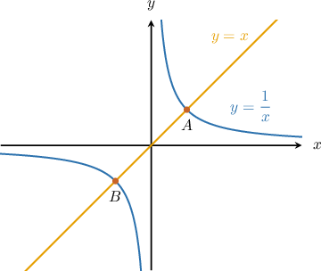
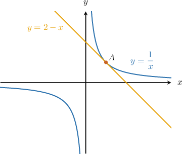
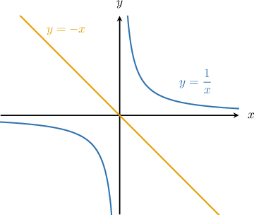
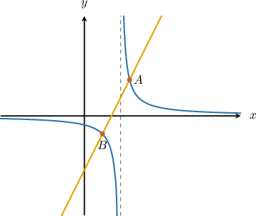
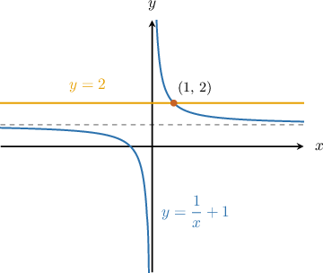
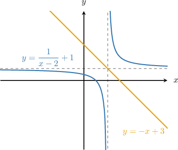

# Finding Intersections of Lines and Reciprocal Functions

Source: https://www.mathacademy.com/topics/434?courseId=101
Topic ID: 434

## Prerequisites

- [Solving Systems of Nonlinear Equations Using Graphs](../../../traditional/lessons/algebra-i/101-solving-systems-of-nonlinear-equations-using-graphs.md)
- [Calculating the Intersection of Two Lines](../../../traditional/lessons/algebra-i/408-calculating-the-intersection-of-two-lines.md)
- [The Discriminant of a Quadratic Equation](../../../traditional/lessons/algebra-i/425-the-discriminant-of-a-quadratic-equation.md)
- [Combining Graph Transformations of Reciprocal Functions](./455-combining-graph-transformations-of-reciprocal-functions.md)
- [Solving Rational Equations Using Cross-Multiplication](../../../traditional/lessons/algebra-i/698-solving-rational-equations-using-cross-multiplication.md)
- [Solving Quadratic Equations with Leading Coefficients by Factoring](../../../traditional/lessons/algebra-i/1422-solving-quadratic-equations-with-leading-coefficients-by-factoring.md)

## Lesson

### Introduction

When considering the intersection of a line and a reciprocal function, three possibilities can occur.

The first possibility is that there are two intersection points, as illustrated in the example below.

The second possibility is that there is only one intersection point. For example:

The final possibility is that there are no intersection points. For example:

Typically, when computing the points of intersection of a reciprocal function and a line, we have to solve a system of two equations. In the first graph that was shown above, this system was

$$

\begin{aligned}𝑦=𝑥 \\ 𝑦=\frac{1}{𝑥}\,.\end{aligned}

$$

This system of equations can (usually) be transformed into a single rational equation, which can itself be converted into a quadratic equation. For the above system, we have

$$

x = \dfrac{1}{x} \quad \Rightarrow \quad x^2 = 1.

$$

By solving the quadratic equation, we can find the intersection points. And like quadratic equations, there can be two, one, or no real solutions. In this case, there are two solutions:

$$

x^2 = 1 \quad \Rightarrow \quad x = \pm 1

$$

### Example: Finding the Intersection Points in the Case of Two Solutions

#### Question

Find the points where the line $y=2x-3$ and the curve $y=\dfrac{1}{x-2}$ intersect (shown as the points $A$ and $B$ above).

#### Explanation

We need to solve the following system of equations:

$$

\begin{aligned}𝑦=2𝑥−3 \\ 𝑦=\frac{1}{𝑥−2}\end{aligned}

$$

Setting the equations equal and then solving for $x,$ we get the following:

$$

\begin{aligned}2𝑥−3 & =\frac{1}{𝑥−2} \\ (𝑥−2)(2𝑥−3) & =1 \\ 2𝑥^{2}−7𝑥+6 & =1 \\ 2𝑥^{2}−7𝑥+5 & =0 \\ (𝑥−1)(2𝑥−5) & =0 \\ 𝑥 & =1,\frac{5}{2}\end{aligned}

$$

So, the $x$-coordinates of the intersection points are $x=1$ and $x=\dfrac{5}{2}.$ To find the $y$-coordinates of the intersection points, we plug these values into either curve. Let's choose the first equation.

- First, substituting $x=1,$ we get so one point of intersection is $(1,-1).$

- Then, substituting $x=\dfrac{5}{2},$ we get so the other point of intersection is $\left(\dfrac{5}{2}, 2 \right).$

Therefore, the points of intersection are $(1,-1)$ and $\left(\dfrac{5}{2}, 2 \right).$

### Intersections of Lines and Reciprocal Functions at One or No Points

Let's now turn our attention to the cases where a line and a reciprocal function intersect at either one point or no points.

For example, suppose that we want to find where the curve $y=\dfrac{1}{x}+1$ and the line $y=2$ intersect. To do this, we need to solve the following system of equations:

$$

\begin{aligned}𝑦=\frac{1}{𝑥}+1 \\ 𝑦=2\end{aligned}

$$

Setting the equations equal and solving for $x,$ we get the following:

$$

\begin{aligned}\frac{1}{𝑥}+1 & =2 \\ \frac{1}{𝑥} & =1 \\ 𝑥 & =1\end{aligned}

$$

To find the corresponding $y$-coordinate, we plug $x=1$ into either equation. Let's choose the first equation.

$$

\begin{aligned}𝑦 & =\frac{1}{𝑥}+1 \\ & =\frac{1}{1}+1 \\ & =2\end{aligned}

$$

Therefore, the intersection point is $\left(1,\,2 \right)$.

A sketch of the situation is shown below.

### Example: Finding the Intersection Points in the Case of One or No Solutions

#### Question

Find the points of intersection, if any, of the curve $y=\dfrac{1}{x-2}+1$ and the line $y=-x+3.$

#### Explanation

We need to solve the following system of equations:

$$

\begin{aligned}𝑦=\frac{1}{𝑥−2}+1 \\ 𝑦=−𝑥+3\end{aligned}

$$

Setting the equations equal to one another simplifying, we get a quadratic equation:

$$

\begin{aligned}\frac{1}{𝑥−2}+1 & =−𝑥+3 \\ \frac{1}{𝑥−2} & =−𝑥+2 \\ 1 & =(−𝑥+2)(𝑥−2) \\ 1 & =−𝑥^{2}+4𝑥−4 \\ 𝑥^{2}−4𝑥+5 & =0\end{aligned}

$$

Then, we use the quadratic formula:

$$

\begin{aligned}𝑥 & =\frac{4±\sqrt{√(−4)^{2}−4(1)(5)}}{2(1)} \\ & =\frac{4±\sqrt{√16−20}}{2} \\ & =\frac{4±\sqrt{√−4}}{2}\end{aligned}

$$

The square root of a negative number is not a real number, so there are no real solutions. Consequently, the line $y=-x+3$ does not intersect the reciprocal function $y=\dfrac{1}{x-2}+1.$

A sketch of the situation is shown below.

### Example: Finding the Range of a Parameter Given Two, One, or No Intersection Points

#### Question

The line $y=2x+3$ does not intersect the reciprocal function $y=\dfrac{k}{x+3}$, where $k \neq 0$. What is the range of possible values of $k?$

#### Explanation

To determine whether the line $y=2x+3$ intersects the reciprocal function $y=\dfrac{k}{x+3},$ we need to solve the following system of equations for the two curves:

$$

\begin{aligned}𝑦=\frac{𝑘}{𝑥+3} \\ 𝑦=2𝑥+3\end{aligned}

$$

Setting the equations equal to one another and simplifying, we get a quadratic equation:

$$

\begin{aligned}\frac{𝑘}{𝑥+3} & =2𝑥+3 \\ 𝑘 & =(2𝑥+3)(𝑥+3) \\ 𝑘 & =2𝑥^{2}+9𝑥+9 \\ 2𝑥^{2}+9𝑥+9−𝑘 & =0\end{aligned}

$$

Then, we use the quadratic formula:

$$

\begin{aligned}𝑥 & =\frac{−9±\sqrt{√9^{2}−4(2)(9−𝑘)}}{2(2)} \\ & =\frac{−9±\sqrt{√81−72+8𝑘}}{4} \\ & =\frac{−9±\sqrt{√9+8𝑘}}{4}\end{aligned}

$$

For the line ** to intersect the reciprocal function, the quadratic formula above must ** give any real solutions.

So, the expression inside the square root must be negative:

$$

\begin{aligned}9+8𝑘 & <0 \\ 8𝑘 & <−9 \\ 𝑘 & <−\frac{9}{8}\end{aligned}

$$

Therefore, the range of possible values of $k$ is $k<-\dfrac{9}{8}.$
