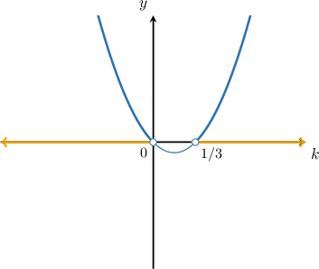
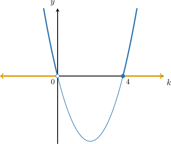
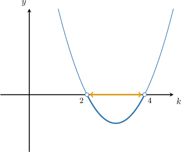

# Determining Unknown Parameters in Quadratic Equations: Advanced Cases

Source: https://www.mathacademy.com/topics/6307?courseId=101
Topic ID: 6307

## Prerequisites

- [Solving Quadratic Inequalities Using the Graphical Method](./3833-solving-quadratic-inequalities-using-the-graphical-method.md)
- [Determining Unknown Parameters in Quadratic Equations With No Real Solutions](./6289-determining-unknown-parameters-in-quadratic-equations-with-no-real-solutions.md)

## Lesson

### Introduction

In previous lessons, we learned how to determine conditions on unknown parameters in quadratic equations to force a particular number of solutions. As we saw, this process often involves solving a quadratic inequality.

In this lesson, we'll consider cases where the quadratic inequality that arises from these problems must be solved using a graphical method.

For example, for which values of $k$ does the equation

$$

3x^2-6kx+k=0

$$

have two distinct real solutions?

Recall that a quadratic equation has two distinct real solutions if its discriminant is positive: $\mathcal{D}>0.$

To compute the discriminant, we first note the equation's coefficients:

$$

a=3,\quad b=-6k,\quad c=k

$$

So, we require

$$

\begin{aligned}D & >0 \\ 𝑏^{2}−4𝑎𝑐 & >0 \\ (−6𝑘)^{2}−4(3)(𝑘) & >0 \\ 36𝑘^{2}−12𝑘 & >0 \\ 3𝑘^{2}−𝑘 & >0.\end{aligned}

$$

Now, let's consider the parabola $y=3k^2-k$ and find its solutions. We obtain

$$

\begin{aligned}3𝑘^{2}−𝑘 & =0 \\ 𝑘(3𝑘−1) & =0,\end{aligned}

$$

so the solutions are

$$

k=0\quad \text{and}\quad k=\dfrac{1}{3}.

$$

Since the leading coefficient is positive, the parabola opens upward. Therefore, we get the following graph:

We want $y = 3k^2 - k > 0,$ meaning that the graph lies above the $k$-axis. Based on the graph, the corresponding intervals are $(-\infty,0)$ or $\left(\dfrac{1}{3},\infty\right).$

Therefore, our equation has two distinct real solutions when $k \in (-\infty,0) \cup \left(\dfrac{1}{3},\infty\right).$

### Example: Determining Unknown Coefficients in Quadratic Equations With Real Solutions

#### Question

Given that $kx^2+kx+1= 0,$ where $k$ is a non-zero real number, find the values of $k$ for which the equation has real solutions.

#### Explanation

A quadratic equation has real solutions if it has two distinct real solutions ($\mathcal{D}>0$) or one distinct real solution ($\mathcal{D}=0$). Putting these conditions together, we must have $\mathcal{D} \geq 0.$

To compute the discriminant, first note the following coefficients: $a=k,$ $b=k,$ and $c=1.$ So, we require

$$

\begin{aligned}D & ≥0 \\ 𝑏^{2}−4𝑎𝑐 & ≥0 \\ 𝑘^{2}−4(𝑘)(1) & ≥0 \\ 𝑘^{2}−4𝑘 & ≥0.\end{aligned}

$$

Now, let's consider the parabola $y=k^2-4k$ and find its solutions. We obtain

$$

\begin{aligned}𝑘^{2}−4𝑘 & =0 \\ 𝑘(𝑘−4) & =0,\end{aligned}

$$

so the solutions are $k=0$ and $k=4.$ Since the leading coefficient is positive, the parabola opens upward. Therefore, we get the following graph:

We want $y = k^2 -4 k \geq 0,$ meaning that the graph lies above or intersect the $k$-axis. Based on the graph, the corresponding interval is $(-\infty, 0] \cup [4, \infty).$

Finally, taking into account that $k\neq 0,$ we have $k\in(-\infty, 0) \cup [4, \infty).$

### Example: Determining Unknown Coefficients in Quadratic Equations With No Real Solutions

#### Question

For which values of $k$ does the equation $2x^2-2kx+3k-4=0$ have no real solutions?

#### Explanation

To compute the discriminant, note the following coefficients: $a=2$, $b=-2k$ and $c=3k-4.$

So, we require

$$

\begin{aligned}D & <0 \\ 𝑏^{2}−4𝑎𝑐 & <0 \\ (−2𝑘)^{2}−4(2)(3𝑘−4) & <0 \\ 4𝑘^{2}−8(3𝑘−4) & <0 \\ 4𝑘^{2}−24𝑘+32 & <0 \\ 𝑘^{2}−6𝑘+8 & <0.\end{aligned}

$$

Now, let's consider the parabola $y=k^2 - 6k + 8$ and find its solutions. We obtain

$$

\begin{aligned}𝑘^{2}−6𝑘+8 & =0 \\ 𝑘^{2}−2𝑘−4𝑘+8 & =0 \\ 𝑘(𝑘−2)−4(𝑘−2) & =0 \\ (𝑘−2)(𝑘−4) & =0,\end{aligned}

$$

so the solutions are $k=2$ and $k=4.$ Since the leading coefficient is positive, the parabola opens upward. Therefore, we get the following graph:

We want $y =k^2 - 6k + 8 < 0,$ meaning that the graph lies below the $k$-axis. Based on the graph, the corresponding interval is $(2,4).$

Therefore, the given equation has no real solutions when $k \in (2, 4).$
