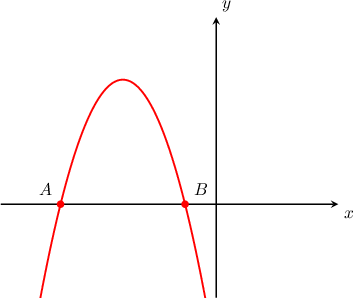

# Finding Intercepts of Curves Defined Parametrically

Source: https://www.mathacademy.com/topics/804?courseId=101
Topic ID: 804

## Prerequisites

- [Solving Radical Equations](../../../traditional/lessons/algebra-i/116-solving-radical-equations.md)
- [Roots of Rational Functions](./133-roots-of-rational-functions.md)
- [Graphing Curves Defined Parametrically](./803-graphing-curves-defined-parametrically.md)

## Lesson

### Introduction

To find the $x$-intercept of a parametric curve, we use the following two steps:

1. Set $y=0$ and solve for $t.$

2. Evaluate $x(t)$ at the corresponding values of $t.$

For example consider the following parametric curve:

$$

x=t-3, \quad y=4-t^2,\quad -\infty < t < \infty

$$

This curve is graphed below, and its $x$-intercepts are labeled as points $A$ and $B.$

To find coordinates of the $x$-intercepts $A$ and $B,$ first realize that the $y$-coordinate is zero at both $A$ and $B$. So, to find the coordinates of $A$ and $B$ we first set $y=0$ and solve for $t\mathbin{:}$

$$

\begin{aligned}𝑦 & =4−𝑡^{2} \\ 0 & =4−𝑡^{2} \\ 𝑡^{2} & =4 \\ 𝑡 & =±2\end{aligned}

$$

This gives us the corresponding $t$-values of $A$ and $B.$ To find the $x$-coordinates, we plug this result into the parametric equation $x=t-3.$

- For $t=2,$ we have $x=2-3 = -1.$

- For $t=-2,$ we have $x=-2-3 = -5.$

Therefore, the coodinates of $A$ are $(-5,0)$ and the coordinates of $B$ are $(-1,0).$

### Example: Finding the X-Intercepts of Parametric Curves

#### Question

A curve is defined parametrically as

$$

x=4+t, \quad y=2-t, \quad -\infty < t < \infty.

$$

Find the point of intersection of the curve with the $x$-axis.

#### Explanation

To find the $x$-intercept, we first set $y=0$ and solve for $t.$ We get

$$

\begin{aligned}𝑦 & =2−𝑡 \\ 0 & =2−𝑡 \\ 𝑡 & =2.\end{aligned}

$$

Then, we substitute our solution for $t$ into the equation $x=4+t.$

Substituting $t=2$ gives

$$

\begin{aligned}𝑥 & =4+𝑡 \\ 𝑥 & =4+(2)=6.\end{aligned}

$$

Therefore, the $x$-intercept is $(6,0).$

### Example: Finding the X-Intercepts of Parametric Curves Containing Radical or Reciprocal Functions

#### Question

A curve is defined parametrically by the equations $x=\dfrac{1}{t}, y=\sqrt{(t-2)(3t-1)}.$ What are the coordinates of the $x$-intercepts of the curve?

#### Explanation

To find the coordinates of the $x$-intercepts, we set $y=0$ and solve for $t.$

$$

\begin{aligned}𝑦 & =\sqrt{√(𝑡−2)(3𝑡−1)} \\ 0 & =\sqrt{√(𝑡−2)(3𝑡−1)} \\ 0 & =(𝑡−2)(3𝑡−1)\end{aligned}

$$

The right-hand side equals zero if one of the factors is zero.

- For the factor $(t-2)$, we have

- For the factor $(3t-1),$ we get

Then, we substitute our solutions for $t$ into the equation $x=\dfrac 1t.$

- Substituting $t=2$ gives

- Substituting $t=\dfrac{1}{3}$ gives

Therefore, the $x$-intercepts are $\left(\dfrac{1}{2},0\right)$ and $(3,0).$

### Finding the Y-Intercepts of Parametric Curves

Finding the $y$-intercept of a parametric curve is very similar to finding the $x$-intercept of a parametric curve. We use the following two steps:

1. Set $x=0$ and solve for $t.$

2. Evaluate $y(t)$ at the corresponding values of $t.$

### Example: Finding the Y-Intercepts of Parametric Curves

#### Question

A curve is defined parametrically as

$$

x=t-3,\quad y=4-t^2, \quad -\infty < t < \infty

$$

Find its point of intersection with the $y$-axis.

#### Explanation

To find the $y$-intercept, we first set $x=0$ and solve for $t\mathbin{:}$

$$

\begin{aligned}𝑥 & =0 \\ 𝑡−3 & =0 \\ 𝑡 & =3.\end{aligned}

$$

Then, we substitute our solution for $t$ into the equation $y=4-t^2.$ Substituting $t=3,$ we get

$$

\begin{aligned}𝑦 & =4−𝑡^{2} \\ & =4−3^{2} \\ & =4−9 \\ & =−5.\end{aligned}

$$

Therefore, the $y$-intercept is $(0,-5).$
