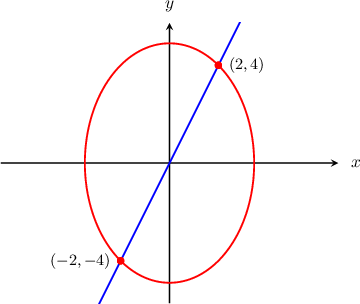
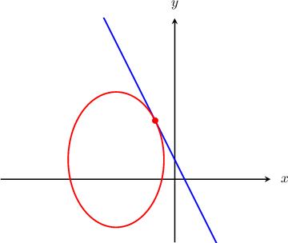
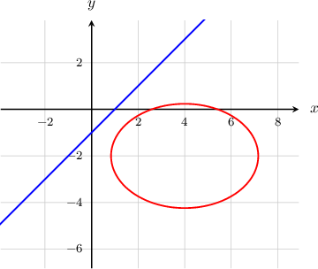

# Finding Intersections of Ellipses and Lines

Source: https://www.mathacademy.com/topics/851?courseId=101
Topic ID: 851

## Prerequisites

- [Equations of Ellipses Centered at a General Point](./849-equations-of-ellipses-centered-at-a-general-point.md)
- [Finding Intersections of Lines and Quadratic Functions](../../../traditional/lessons/algebra-i/6341-finding-intersections-of-lines-and-quadratic-functions.md)

## Lesson

### Introduction

Consider the ellipse $\dfrac{x^2}{12} + \dfrac{y^2}{24} = 1$ and line $y = 2x,$ sketched below. We can see from the diagram that the line and the ellipse intersect at $(2,4)$ and $(-2,-4).$

But how can we determine this mathematically, without relying on the graph?

To find the $x$-coordinates of the intersection points, we can substitute $y = 2x$ into the equation of the ellipse and solve the resulting equation for $x$ as follows:

$$

\begin{aligned}\frac{𝑥^{2}}{12}+\frac{𝑦^{2}}{24} & =1 \\ \frac{𝑥^{2}}{12}+\frac{(2𝑥)^{2}}{24} & =1 \\ \frac{𝑥^{2}}{12}+\frac{4𝑥^{2}}{24} & =1 \\ 2𝑥^{2}+4𝑥^{2} & =24 \\ 6𝑥^{2} & =24 \\ 𝑥^{2} & =4 \\ 𝑥 & =±2\end{aligned}

$$

Then, to find the $y$-coordinates of the intersection points, we can substitute $x = \pm 2$ into the equation of the line and compute the $y$-values.

- Substituting $x = -2,$ we get This tells us that one intersection point is $(-2, -4).$

- Substituting $x = 2,$ we get This tells us that the other intersection point is $(2, 4).$

So we find that the two intersection points are $(-2,-4)$ and $(2,4),$ which matches up perfectly with what we see in the graph.

### Example: Finding the Points of Intersection of an Ellipse and a Line: Two Points of Intersection

#### Question

Find the points where the ellipse $\dfrac{(x-2)^2}{4}+\dfrac{(y-1)^2}{16}=1$ intersects the line $y = -2x + 9.$

#### Explanation

Let's start by multiplying the equation of the ellipse by $16$ to remove the fractions. This isn't absolutely necessary, but it will make the equation simpler to work with after we substitute in the equation of the line.

$$

\begin{aligned}\frac{(𝑥−2)^{2}}{4}+\frac{(𝑦−1)^{2}}{16} & =1 \\ 16⋅(\frac{(𝑥−2)^{2}}{4}+\frac{(𝑦−1)^{2}}{16}) & =16⋅1 \\ 4(𝑥−2)^{2}+(𝑦−1)^{2} & =16\end{aligned}

$$

To find the points of intersection, we substitute $y =- 2x+9$ into the equation of the ellipse and solve for $x\mathbin{:}$

$$

\begin{aligned}4(𝑥−2)^{2}+(𝑦−1)^{2} & =16 \\ 4(𝑥−2)^{2}+(−2𝑥+9−1)^{2} & =16 \\ 4(𝑥−2)^{2}+(−2𝑥+8)^{2} & =16 \\ 4(𝑥^{2}−4𝑥+4)+4𝑥^{2}−32𝑥+64 & =16 \\ 4𝑥^{2}−16𝑥+16+4𝑥^{2}−32𝑥+64 & =16 \\ 8𝑥^{2}−48𝑥+64 & =0 \\ 𝑥^{2}−6𝑥+8 & =0 \\ (𝑥−2)(𝑥−4) & =0 \\ 𝑥 & =2,4\end{aligned}

$$

To find the corresponding $y$-values, we substitute $x=2,4$ into the equation of the line $y = -2x + 9.$

- Substituting $x=2,$ we get This tells us that the first point of intersection is $\left(2,5\right).$

- Substituting $x=4,$ we get This tells us that the second point of intersection is $\left(4,1\right).$

Therefore, the intersection points are $\left(2,5\right)$ and $\left(4,1\right).$

### Example: Finding the Points of Intersection of an Ellipse and a Line: One Point of Intersection

#### Question

Find the point where the ellipse $\dfrac{(x+3)^2}{6}+\dfrac{(y-1)^2}{12}=1$ intersects the line $y = -2x+1,$ shown above.

#### Explanation

We start by multiplying the equation of the ellipse by $12$ to remove the fractions:

$$

\begin{aligned}\frac{(𝑥+3)^{2}}{6}+\frac{(𝑦−1)^{2}}{12} & =1 \\ 12⋅(\frac{(𝑥+3)^{2}}{6}+\frac{(𝑦−1)^{2}}{12}) & =12⋅1 \\ 2(𝑥+3)^{2}+(𝑦−1)^{2} & =12\end{aligned}

$$

To find the point of intersection, we substitute $y = -2x+1$ into the equation of the ellipse and solve for $x$ by completing the square:

$$

\begin{aligned}2(𝑥+3)^{2}+(𝑦−1)^{2} & =12 \\ 2(𝑥+3)^{2}+(−2𝑥+1−1)^{2} & =12 \\ 2(𝑥+3)^{2}+4𝑥^{2} & =12 \\ 2(𝑥^{2}+6𝑥+9)+4𝑥^{2} & =12 \\ 2𝑥^{2}+12𝑥+18+4𝑥^{2} & =12 \\ 6𝑥^{2}+12𝑥+6 & =0 \\ 𝑥^{2}+2𝑥+1 & =0 \\ (𝑥+1)^{2} & =0 \\ 𝑥 & =−1\end{aligned}

$$

To find the corresponding $y$-value, we substitute $x=- 1$ into the equation of the line $y = -2 x+1.$ This gives

$$

\begin{aligned}𝑦 & =−2⋅(−1)+1=3.\end{aligned}

$$

So, the point of intersection is $\left(-1,3\right).$

### Example: Finding the Points of Intersection of an Ellipse and a Line: No Points of Intersection

#### Question

Find the points where the ellipse $\dfrac{(x-4)^2}{10}+\dfrac{(y+2)^2}{5} = 1$ intersects the line $y = x - 1.$

#### Explanation

We start by multiplying the equation of the ellipse by $10$ to remove the fractions:

$$

\begin{aligned}\frac{(𝑥−4)^{2}}{10}+\frac{(𝑦+2)^{2}}{5} & =1 \\ 10(\frac{(𝑥−4)^{2}}{10}+\frac{(𝑦+2)^{2}}{5}) & =10⋅1 \\ (𝑥−4)^{2}+2(𝑦+2)^{2} & =10\end{aligned}

$$

To find the points of intersection, we substitute $y = x-1$ into the equation of the ellipse and solve for $x\mathbin{:}$

$$

\begin{aligned}(𝑥−4)^{2}+2(𝑦+2)^{2} & =10 \\ (𝑥−4)^{2}+2(𝑥−1+2)^{2} & =10 \\ (𝑥−4)^{2}+2(𝑥+1)^{2} & =10 \\ 𝑥^{2}−8𝑥+16+2𝑥^{2}+4𝑥+2 & =10 \\ 3𝑥^{2}−4𝑥+8 & =0\end{aligned}

$$

If we compute the discriminant $\mathcal{D}$ of the above quadratic equation, then we get

$$

\begin{aligned}D & =(−4)^{2}−4⋅3⋅8 \\ & =16−96 \\ & =−80.\end{aligned}

$$

Since $\mathcal{D} = - 80 < 0,$ there are no real solutions of the equation $3x^2 - 4x + 8=0.$

Therefore, we conclude that the ellipse and the line do not intersect.

